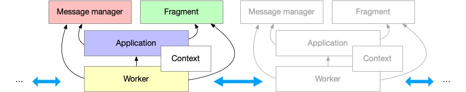

# Dev and Test

This guide will walk you through the process of understanding how the code is organized, 
identifying key functions and important code, and building and testing the analytical engine.

## Setup

For simplicity, we suggest you use a prebuilt docker image with necessary dependencies installed.

```bash
docker run --name dev -it --shm-size=4096m registry.cn-hongkong.aliyuncs.com/graphscope/graphscope-dev:latest
```

Alternatively, you can also manually install all dependencies on your local machine.
Please refer to [Dev Environment](../development/dev_guide.md#dev-environment) to find more options to get a dev environment.

After the environment is prepared, clone the repository and enter the `analatical_engine` directory of the repository.

```bash
git clone https://github.com/alibaba/GraphScope.git
cd analatical_engine
```

## Understanding the Codebase

Since the analytical engine inherits from GRAPE, it requires libgrape-lite as a dependency. 
Please note that the core functionalities of libgrape-lite, such as graph structures, graph partitioners, workers, 
communication between workers, and applications, are heavily reused in the analytical engine of GraphScope.

If you want to fully understand the analytcial engine, it is highly recommaned that you start from libgrape-lite.

The code located in the `analytical_engine` directory functions like extensions to libgrape-lite, thereby making it full-fledged with the following enhancements:

- K8s support to enable management by the GraphScope coordinator;
- Many built-in algorithms, while libgrape-lite's only ships with 6 analytical algorithms in LDBC Graphalytics Benchmark;
- Property graphs and their flatten/projected graphs support;
- Java support, thus making it possible to execute applications written for Giraph/GraphX on GraphScope.

The code is organized as follows:

- `apps` contains various built-in algorithms/applications.
- `core`: The core directory contains extensions to the libgrape-lite library and is organized in the same way as the [libgrape-lite](https://github.com/alibaba/libgrape-lite/tree/master/grape) directory. The extensions are located in the same directory as their base in libgrape-lite. More specifically,
    - `core/app` contains classes related to applications, which serve as base classes to inherit from when implementing new applications.
    - `core/communication` contains extension on communication layers.
    - `core/cuda` contains a suite of graph structure implementations and communications on the GPU for GPU-accelerated computations.
    - `core/fragment` contains the extended fragments and their loaders. e.g., mutable graph fragment. 
    - `core/io` more `io_adaptor`s.
    - `core/parallel` contains the parallel sub-layer for computation and communications, such as a helper class for parallel execution with threads and how message buffers are managed and synced between workers.
    - `core/serialization` extend the serialization in libgrape-lite to include property graphs.
    - `core/utils` contains utility functions and classes.
    - `core/vertex_map` contains some vertex_maps designed to manage the mapping between the original vertex ID and the internal identifier of a vertex.
    - `core/worker` contains the worker, which executes the applications locally and communicates with other workers.
- `frame` are used to wrap the libgrape-lite library for integration into GraphScope. This is necessary because libgrape-lite heavily relies on Templates to define applications and graphs, which is inadequate for loading **property** graphs and applications in GraphScope scenarios. Property graphs usually have multiple label and property types, which cannot be determined before loading. For this reason, GraphScope has implemented JIT technology to compile property graphs and their associated applications at runtime. These frames serve as wrappers to facilitate these tasks.
- `java` contains Java implementations. GraphScope supports implementing applications with Pregel/Giraph and GraphX APIs. In addition, existing Giraph/GraphX applications(jars) can be run on GraphScope without any modification. Read more about Java support [here](tutorial_dev_algo_java).
- `benchmarks` contains code related to performance testing and benchmarking.
- `cmake` contains CMake scripts for configuring the build.
- `test` contains test cases and scripts.

:::{figure-md}


Key components of libgrape-lite
:::   

The figure above illustrates the key components of libgrape-lite, (as well as analytical engine in GraphScope), and how they work. More specifically,

- `Fragment` is a partition of graph data and is a processing object for graphs on a computing node.
- `MessageMessager` manages communication strategies, takes responsible for managing message communication and state synchronization between fragments explicitly or implicitly.
- `Application` is the main logic of the user's application. In an application, the user can access the local `Fragment` or send/receive messages through the `MessageManager`. 
- `Worker`, a class that is responsible for loading the graph (`Fragment`), calling the application to compute on the local `Fragment`, and communicating with `Worker`s on other computing nodes through the `MessageManager`.

## Making Modifications

- You are encouraged to fork the repo and make modifications on your own fork.
- It is much easier to begin with a small change, such as revising a specific algorithm, adding a new algorithm, and then gradually move on to more complex changes. You are suggested to avoid large changes in a single commit.
- If you want to contribute to the repo, please refer to [Contributing to GraphScope](../development/contributing.md) to get more details.

## Building Analytical Engine

With `gs` command-line utility, you can build analytical engine of GraphScope with a single command.

```bash
# Clone a repo if needed
# git clone https://github.com/alibaba/graphscope
# cd graphscope
./gs make analytical
```

The code of analytical engine is a cmake project, with a `CMakeLists.txt` in the its root directory (`/analytical_engine`). After the building with `gs`, you may found the built artifacts in `analytical_engine/build/grape_engine`.

Together with the `grape_engine` are shared libraries, or there may have a bunch of test binaries if you choose to build the tests.

You could install it to a location by

```bash
./gs make analytical-install --install-prefix /usr/local
```

````{note}
The `CMakeLists.txt` of analytical engine is in `analytical_engine/CMakeLists.txt`.

Take a look at this file if you want to investigate more of the analytical engine or customize the building.
````

## Testing

The analytical engine has a suite of tests to ensure the correctness of the code, from unit tests to graph algorithm correctness tests. You could easily test with the new artifacts with a single command:

Here we set the working directory to local repo.
```bash
export GRAPHSCOPE_HOME=`pwd`
# Here the `pwd` is the root path of GraphScope repository
```
See more about `GRAPHSCOPE_HOME` in [run tests](../development/how_to_test.md#run-tests)

```bash
./gs test analytical
```

It would download the test dataset to the `/tmp/gstest` (if not exists) and run multiple algorithms against various graphs, and compare the result with the ground truth.
