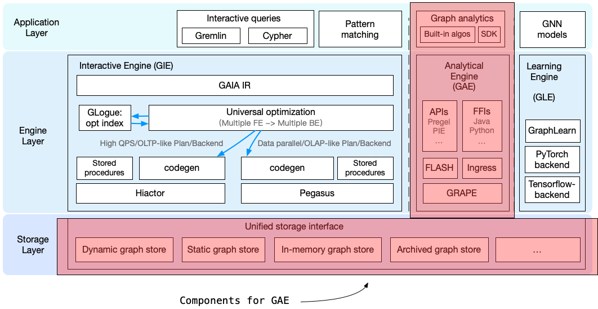

# Overview and Architecture

In GraphScope, Graph Analytical Engine (GAE) is responsible for handling various graph analytics algorithms. GAE derives from [GRAPE](https://dl.acm.org/doi/10.1145/3282488), a graph processing system proposed on SIGMOD 2017. GRAPE differs from prior systems in its ability to parallelize sequential graph algorithms as a whole. Different from other parallel graph processing systems which need to recast the existing sequential algorithm into [a new model](https://graphscope.io/docs/latest/analytical_engine/vertex_centric_models.html) (e.g., Pregel and GAS), in GRAPE, sequential algorithms can be easily “plugged into” with only minor changes and get parallelized to handle large graphs efficiently. In addition to the ease of programming, GRAPE is designed to be highly efficient and flexible, to cope the scale, variety and complexity from real-life graph applications. 

## Architecture

GAE is a full-fledged, in-production system for graph analytics algorithms over large scale graph data. As shown in the following figure, there exist three major layers in GAE, namely storage layer, engine layer and application layer. Next, we give an overview to each of them below.

:::{figure-md}

Architecture of GAE. 
:::

- Storage layer: Graph data in real-life is extremely large scale, and thus graph storage stores graph data in a distributed fashion. The graph storage consists of different graph formats with different features. Although there exist diverse types of graph storages, unified interfaces for graph storage are provided for GAE as well as other computation engines of GraphScope, and thus GAE does not care about how each type of graph storage is implemented.
- Engine layer: At the core of GAE is its engine layer. It is built on top of GRAPE, which provides many efficient graph-specific optimizations. Based on GRAPE, GAE offers three programming models for users (i.e., Pregel, PIE, and FLASH), and users can develop their own graph applications through user-friendly interfaces. The execution engine of GAE is written in C++ and supports other programming languages (i.e., Java and Python) through FFIs (Foreign Function Interfaces), allowing for better integration with other big data ecosystems. Additionally, GAE supports both batch and incremental computation patterns, giving users the freedom to choose the property computation pattern according to their demands.
- Application Layer: The application layer offers an application SDK that provides user-friendly interfaces for accessing graph structural/property data and communicating between different sub-graphs (fragments), so that users can easily develop their algorithms. Graph analytics algorithms can be directly written using the application SDK, but we have also built a built-in algorithm library consisting of common algorithms for various application domains to ease the development of new graph applications.

## Storage Layer

Similar to many graph processing systems, GraphScope represents graph data using the [property graph model](https://www.dataversity.net/what-is-a-property-graph/). To support large-scale graph data, GraphScope uses an [*edge-cut partitioning strategy*](https://graphscope.io/docs/latest/analytical_engine/key_concepts.html#edge-cut) to partition a graph into multiple sub-graphs (fragments).

The graph storage in GraphScope consists of multiple types of graph formats, with each format dedicated to a specific scenario. Some support real-time graph updates while others treat graph data as immutable data once created. Some store graph data in memory for better performance, while others support persistent storage. Fortunately, all these storages are integrated with GRIN, a unified graph storage interface defined by GraphScope. Therefore, the computation engines are not aware of the implementation differences of each storage. For more details about the graph storage interface, please check out our [introduction to GRIN](https://graphscope.io/docs/latest/storage_engine/grin.html).

## Engine Layer

There are four major components in the engine layer of GAE, which offers easy-to-use interfaces for graph algorithms.

### GRAPE Engine

The foundation of the engine layer in GAE is GRAPE, which offers core functions for graph analytics, including accessing vertices/edges of a sub-graph (fragment), visiting property data of vertices/edges, state synchronization between different fragments, and intermediate data management. Meanwhile, GRAPE applies many graph-level optimizations, such as indexing, compression, dynamic push/pull switching, pipelining, and load balancing, to achieve better performance. For more details about these optimizations, please refer to [this link](https://dl.acm.org/doi/10.1145/3282488).

### Programming Model APIs 

Currently, GAE supports APIs for three programming models: Pregel, PIE, and FLASH. [Pregel](https://graphscope.io/docs/latest/analytical_engine/vertex_centric_models.html#pregel-model) is a widely applied vertex-centric programming model in existing popular graph processing systems, such as GraphX and Giraph. [PIE](https://graphscope.io/docs/latest/analytical_engine/programming_model_pie.html) is proposed in GRAPE and can automatically parallelize existing sequential graph algorithms with some minor changes. [FLASH](https://graphscope.io/docs/latest/analytical_engine/flash.html) is a flexible programming model that can help users implement complex graph algorithms easily. Users can freely choose one of these three programming models according to their backgrounds and demands.

### FFIs

The GRAPE engine is written in C++ for better performance, and GAE also provides Python and Java interfaces through FFI (Foreign Function Interface). With Python, it is natural and easy for GraphScope to interoperate with other Python data processing systems such as Pandas and Mars. Based on an efficient FFI for Java and C++ called [fastFFI](https://github.com/alibaba/fastFFI), GAE allows users to write Java applications and run these applications on GAE directly. Please check out our tutorials on how to develop algorithms with Python and Java.

- [Tutorial: Develop Algorithms in Python](https://graphscope.io/docs/latest/analytical_engine/tutorial_dev_algo_python.html)
- [Tutorial: Develop your Algorithm in Java with PIE Model](https://graphscope.io/docs/latest/analytical_engine/tutorial_dev_algo_java.html)

### Incremental Computation Engine 

GAE also supports incremental computation over graph data via the [Ingress](http://vldb.org/pvldb/vol14/p1613-gong.pdf) engine, where we apply a batch algorithm to compute the result over the original graph *G* once, followed by employing an incremental algorithm to adjust the old result in response to the input changes $\Delta$*G* to *G*. To achieve this , based on the dynamic graph storage, we have implemented an *Ingress fragment* which can capture the changes between original and new graphs. Please check out [our detailed introduction to the Ingress engine](https://graphscope.io/docs/latest/analytical_engine/ingress.html) for more details.

## Application Layer

GAE provides C++, Python and Java SDKs for graph applications, where users can freely choose programming models, programming languages, and computation patterns (batch computation or incremental computation) to develop their own applications. GAE of GraphScope also provides [20 graph analytics algorithms](https://graphscope.io/docs/latest/analytical_engine/builtin_algorithms.html) as built-in algorithms, and users can directly invoke them. GraphScope is compatible with NetworkX APIs, and thus diverse kinds of [built-in algorithms in NetworkX](https://networkx.org/documentation/stable/reference/algorithms/index.html) can also be directly invoked by users. In total, over 100 build-in graph analytical algorithms can be directly executed over GraphScope. Additionally, the support for the Pregel model has been implemented in GAE, and graph algorithms implemented in Giraph or GraphX can also be directly run on GAE. Please refer to the following tutorials on how to run NetworkX/Giraph/GraphX applications on GAE.

- [Tutorial: Graph Operations with NetowrkX APIs](https://graphscope.io/docs/latest/analytical_engine/tutorial_networkx_operations.html)
- [Tutorial: Graph Algorithms with NetowrkX APIs](https://graphscope.io/docs/latest/analytical_engine/tutorial_networkx_algorithms.html)
- [Tutorial: Run Giraph Applications on GraphScope](https://graphscope.io/docs/latest/analytical_engine/tutorial_run_giraph_apps.html)
- [Tutorial: Run GraphX Applications on GraphScope](https://graphscope.io/docs/latest/analytical_engine/tutorial_run_graphx_apps.html)