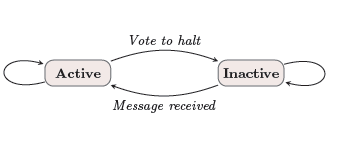

# Vertex-Centric Model

In a single machine environment, developers can easily implement graph analytics algorithms as they have a global view of the graph and can freely iterate through all vertices and edges. When the size of graph data grows beyond the memory capacity of a single machine, graph data must be partitioned to distributed memory, leading to the indivisibility of the whole graph structure. 

To allow developers to succinctly express graph analytics algorithms under such environment, the *vertex-centric programming model* have been developed. Specifically, a graph analytics algorithm iteratively executes a user-defined program over vertices of a graph. The user-defined vertex program
typically takes data from other vertices as input, and the
resultant output of a vertex is sent to other vertices. Vertex programs are
executed iteratively for a certain number of rounds, or until a convergence condition is
satiisfied. As opposed to *global* perspective of the graph, vertex-centric models
employ a local, vertex-oriented perspective.

The philosophy of vertex-centric model encourages many programming models, including the [Pregel model](https://research.google/pubs/pub37252/) proposed by Google and the [GAS model](https://www.usenix.org/conference/osdi12/technical-sessions/presentation/gonzalez). These programming models
have widely applied in various graph processing systems, such as Giraph, GraphX and PowerGraph.

## Pregel Model

Pregel was first introduced in a [SIGMOD paper](https://dl.acm.org/doi/10.1145/1807167.1807184) published by Google in 2010. A graph analytics algorithm with the Pregel model consists of a sequence of iterations(called *supersteps*).

> “During a superstep the framework invokes a user-defined function for each vertex, conceptually in parallel. The function specifies behavior at a single vertex *V* and a single superstep *S*. It can read messages sent to *V* in superstep *S − 1*, send messages to other vertices that will be received at superstep *S + 1*, and modify the state of *V* and its outgoing edges. Messages are typically sent along outgoing edges, but a message may be sent to any vertex whose identifier is known.”

:::{figure-md}



The Pregel model. 
:::

The iterations terminate until no messages are sent from any vertex, indicating a halt.

The vertex function can be invoked at each vertex in parallel, since individual vertices communicate via message-passing.

With the Pregel model, the vertex program of single source shortest paths (SSSP) is expressed as follows.

```python
def VertexProgramForSSSP():
    # receive and merge incoming messages
    incoming_msgs = ReceiveMessages()
    merged_msg = Reduce(incoming_msgs, MIN)
    
    # update vertex property
    if dist > merged_msg:
        dist = merged_msg
    
    # send messages to neighbors
    for neighbor in neighbors:
        if dist + edge_weight < neighbor_dist:
            SendMessage(neighbor, dist + edge_weight)
```

## Simulation of Pregel Model in Analytical Engine

As we proved in this [paper](https://dl.acm.org/doi/pdf/10.1145/3035918.3035942), the analytical engine of GraphScope is able to simulate the vertex centric models. We have implemented the support for Pregel model in the analytical engine, and you can use the Pregel APIs to write your own algorithms. In addition, if you already have your graph applications implemented in Giraph or GraphX, you can run them on GraphScope directly. Better still, the analytical engine can achieve better performance than Giraph and GraphX. 

Please refer to related tutorials.

- [Tutorial: Run Giraph Applications on GraphScope](https://graphscope.io/docs/latest/analytical_engine/tutorial_run_giraph_apps.html)
- [Tutorial: Run GraphX Applications on GraphScope](https://graphscope.io/docs/latest/analytical_engine/tutorial_run_graphx_apps.html)