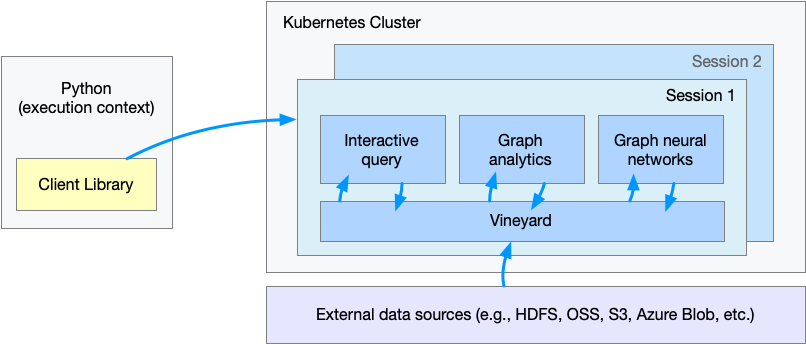

# Deploy GraphScope on K8s cluster

To processing large-scale graph distributedly, GraphScope is designed to be deployed on a Kubernetes(K8s) cluster. 

As shown in the figure, users deploy and manage the workloads of GraphScope through a python client, which communicates with the 
GraphScope engines on the K8s cluster through a gRPC service. 

:::{figure-md}



GraphScope on K8s.
:::

This document describes how to deploy GraphScope on a K8s cluster.

## Prerequisites

- Linux or macOS.
- Python 3.7 ~ 3.11.

## Install GraphScope Client
Different from the standalone mode, you only need to install the client package of GraphScope.

```bash
python3 -m pip install graphscope-client
```

````{tip}
Use Aliyun mirror to accelerate downloading if in need.

```bash
python3 -m pip install graphscope -i http://mirrors.aliyun.com/pypi/simple/ \
    --trusted-host=mirrors.aliyun.com
```
````

## Prepare a Kubernetes cluster

To deploy GraphScope on Kubernetes, you must have a kubernetes cluster.

````{tip}
If you already have a K8s cluster, just skip this section and continue on deploying.
````

We recommend using [minikube](https://minikube.sigs.k8s.io/docs/start/). 
Please follow the instructions of minikube to download an appropriate binary for your platform.

Then, start the minikube by

```bash
minikube start
```

On macOS, you can just use Docker Desktop, TODO(yuansi) continue?

Using this command to verify minikube is running. 

```bash
minikube status
```

The output should indicate that the cluster is running and the kubectl context is set to the minikube context.

TODO(siyuan), tell user that a kubeconfig file will generate, where, give a preview how the file looks like.


## Deploying GraphScope

### Launch with default parameters
The engines of GraphScope are distributed as a docker image. The graphscope python client will pull the image if they are not present. If you run GraphScope on a k8s cluster, make sure the cluster is able to access the public registry.

A session encapsulates the control and state of the GraphScope engines. It serves as the entrance in the python client to GraphScope. A session allows users to deploy and connect GraphScope on a k8s cluster.

```python
import graphscope

sess = graphscope.session()
```

TODO(siyuan), tell user, 
- as default, it will look for a kubeconfig file in ~/.kube/config, the file generated by minikube in the previous step will be used.

As shown above, a session can easily launch a cluster on k8s.

### Frequently used parameters

#### Specify the number of workers

#### Provide a kubeconfig file

#### Mount volumes

Sometimes users may want to use their dataset on the local disk, in this case, we provide options to mount a host directory to the cluster.

Assume we want to mount `~/test_data` in the host machine to `/testingdata` in pods, we can define a `dict` as follows, then pass it as `k8s_volumes` in session constructor.

Note that the host path is relative to the kubernetes node, that is, if you have a cluster created by a VM driver, then you need to copy that directory to the minikube VM, or mount that path to minikube VM. See more details [here](https://minikube.sigs.k8s.io/docs/handbook/mount/).

You could also create a cluster by [none driver](https://minikube.sigs.k8s.io/docs/drivers/none/). 

```bash
minikube start --driver=none
```

```python
import os
import graphscope

k8s_volumes = {
    "data": {
        "type": "hostPath",
        "field": {
            "path": os.path.expanduser("~/test_data/"),
            "type": "Directory"
        },
        "mounts": {
        "mountPath": "/testingdata"
        }
    }
}

sess = graphscope.session(k8s_volumes=k8s_volumes)
```

### Inspect the deployment

TODO(Siyuan): tell user the expection on the launching time, e.g., 2min?
Monitor the status of the deployment with the following command:

```bash
kubectl get pods
```

The output should show the status of the GraphScope pods. Wait until all pods are running before proceeding.

That's it! You now have a running instance of GraphScope in a Kubernetes cluster.

Then you could use GraphScope to analyze graphs as usual.
TODO(siyuan): give tutorial links.


~~More understands of the deployment~~

TODO(siyuan): select some and move this to the first paragraph.
A cluster on k8s contains a pod running the coordinator, and a `deployment` of GraphScope engines.

The coordinator in GraphScope is the endpoint of the backend. It manages the connections from python client via grpc, and takes responsibility for applying or releasing the pods for interactive, analytical and learning engines.

The image URIs for the engines are configurable, see more details in [Session](https://graphscope.io/docs/reference/session.html#session).


## Cleaning Up

When you are done with the GraphScope, you can delete the deployment by running this command.

```python
sess.close()
```

To stop and delete the minikube cluster, run:

```bash
minikube stop
minikube delete
```

TODO(siyuan): add commands to check the resources are safyly deleted, as we are usually asked.

TODO(siyuan): for the rest, maybe move them to debugging section?

## Commands for Debugging

Here is list with commands usually used for checking the status of the GraphScope deployment on K8s.

- Check the status of the pods in a specific namespace `kubectl get pods -n <namespace>`
- Get detailed information about a pod: `kubectl describe pod <pod-name> -n <namespace>`
- Check the logs of a container in a pod: `kubectl logs <pod-name> <container-name> -n <namespace>`
- Check the events related to a pod: `kubectl get events --field-selector involvedObject.name=<pod-name> -n <namespace>`
- Check the configuration of a resource: `kubectl get <resource-type> <resource-name> -o yaml -n <namespace>`

### Debugging Techniques
- Verify that the Docker image used in the deployment is correct and can be pulled by Kubernetes.
- Check the logs of the container in the pod to see if there are any error messages or warnings that could indicate the source of the problem.
- Increase the log level of the GraphScope components. This will produce more verbose output that may help pinpoint the source of the problem.
    ```python
    import graphscope
    graphscope.set_option(show_log=True)
    graphscope.set_option(log_level='DEBUG')
    ```
- Use kubectl exec to access a running container in a pod and run diagnostic commands inside it.
- Use kubectl port-forward to forward a port from a pod to your local machine and access the service directly from your browser or command line.
- Check the Kubernetes events to see if there are any events related to the pod that could explain the problem.
