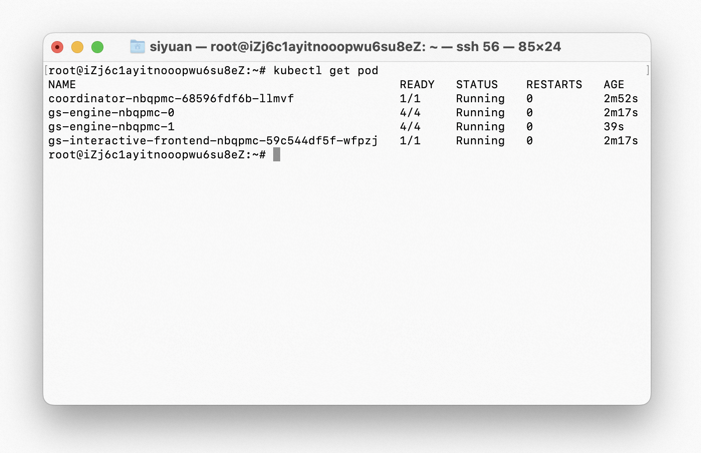

# Deploy GraphScope on K8s cluster

To processing large-scale graph distributedly, GraphScope is designed to be deployed on a Kubernetes(K8s) cluster. 

As shown in the figure, you could deploy and manage the workloads of GraphScope through a python client, which communicates with the 
GraphScope engines on the K8s cluster through a gRPC service. 

:::{figure-md}


GraphScope on K8s.
:::

A cluster on k8s contains a pod running the coordinator, and a `deployment` of GraphScope engines.

The coordinator in GraphScope is the endpoint of the backend. It manages the connections from python client via grpc, and takes responsibility for applying or releasing the pods for interactive, analytical and learning engines.

This document describes how to deploy GraphScope on a K8s cluster.

## Prerequisites

- Linux or macOS.
- Python 3.7 ~ 3.11.

## Install GraphScope Client
Different from the standalone mode, you only need to install the client package of GraphScope.

```bash
python3 -m pip install graphscope-client
```

````{tip}
Use Aliyun mirror to accelerate downloading if in need.

```bash
python3 -m pip install graphscope-client -i http://mirrors.aliyun.com/pypi/simple/ \
    --trusted-host=mirrors.aliyun.com
```
````

## Prepare a Kubernetes cluster

To deploy GraphScope on Kubernetes, you must have a kubernetes cluster.

````{tip}
If you already have a K8s cluster, just skip this section and continue on deploying.
````

We recommend using [minikube](https://minikube.sigs.k8s.io/docs/start/). 
Please follow the instructions of minikube to download an appropriate binary for your platform.

Then, start the minikube by

```bash
minikube start
```

On macOS, you can just use [Docker Desktop](https://docs.docker.com/desktop/kubernetes/), which includes a 
standalone Kubernetes server and client.

Using this command to verify minikube is running. 

```bash
minikube status
```

A normal status should look like this

:::{figure-md}


minikube status
:::

The output should show that the cluster is running, and the kubectl context is set to the minikube context. 
Once started, minikube generates a [kubeconfig](https://kubernetes.io/docs/concepts/configuration/organize-cluster-access-kubeconfig/) file for you to communicate and interact with the cluster. 

The default location of this file is `~/.kube/config`, which should look like this:

```yaml
apiVersion: v1
clusters:
- cluster:
    certificate-authority: /root/.minikube/ca.crt
    extensions:
    - extension:
        last-update: Thu, 16 Mar 2023 16:44:05 CST
        provider: minikube.sigs.k8s.io
        version: v1.28.0
      name: cluster_info
    server: https://172.21.67.111:8443
  name: minikube
contexts:
- context:
    cluster: minikube
    extensions:
    - extension:
        last-update: Thu, 16 Mar 2023 16:44:05 CST
        provider: minikube.sigs.k8s.io
        version: v1.28.0
      name: context_info
    namespace: default
    user: minikube
  name: minikube
current-context: minikube
kind: Config
preferences: {}
users:
- name: minikube
  user:
    client-certificate: /root/.minikube/profiles/minikube/client.crt
    client-key: /root/.minikube/profiles/minikube/client.key
```


## Deploying GraphScope

### Launch with default parameters
The engines of GraphScope are distributed as a docker image. The graphscope python client will pull the image if they are not present. If you run GraphScope on a k8s cluster, make sure the cluster is able to access the public registry.

A session encapsulates the control and state of the GraphScope engines. It serves as the entrance in the python client to GraphScope. A session allows you to deploy and connect GraphScope on a k8s cluster.

```python
import graphscope

sess = graphscope.session()
```
As default, it will look for a kubeconfig file in `~/.kube/config`, the file generated by minikube in the previous step will be used.

As shown above, a session can easily launch a cluster on k8s.

### Frequently used parameters

#### Customize image URI

Considering that you may want to use a different tag other than the default, or deploy in an intranet environment without internet access, they might need to customize the image URIs.

You can configure the image URIs for the engines using a set of image-related parameters. The default configurations are as follows:

```python
sess = graphscope.session(
    k8s_image_registry="registry.cn-hongkong.aliyuncs.com",
    k8s_image_repository="graphscope",   
    k8s_image_tag="0.20.0",
)
```

see more details in [Session](https://graphscope.io/docs/reference/session.html#session).

#### Specify the number of workers

GraphScope is designed to handle extremely large-scale graphs that cannot fit in the memory of a single worker. 
To process such graphs, you can increase the number of workers, as well as the CPU and memories of workers.

To achieve this, use the `num_workers` parameter:

```python
sess = graphscope.session(
    num_workers=4,
    k8s_engine_cpu=32,
    k8s_engine_mem="256Gi",
    vineyard_shared_mem="256Gi",
)
```

#### Provide a kubeconfig file other than default

If you want to deploy on a pre-existing cluster with a kubeconfig file located in a non-default location,
they can manually specify the path to the kubeconfig file as follows:

```python
sess = graphscope.session(k8s_client_config='/path/to/config')
```

#### Mount volumes

Sometimes you may want to use their dataset on the local disk, in this case, we provide options to mount a host directory to the cluster.

Assume we want to mount `~/test_data` in the host machine to `/testingdata` in pods, we can define a `dict` as follows, then pass it as `k8s_volumes` in session constructor.

Note that the host path is relative to the kubernetes node, that is, if you have a cluster created by a VM driver, then you need to copy that directory to the minikube VM, or mount that path to minikube VM. See more details [here](https://minikube.sigs.k8s.io/docs/handbook/mount/).

```python
import os
import graphscope

k8s_volumes = {
    "data": {
        "type": "hostPath",
        "field": {
            "path": os.path.expanduser("~/test_data/"),
            "type": "Directory"
        },
        "mounts": {
        "mountPath": "/testingdata"
        }
    }
}

sess = graphscope.session(k8s_volumes=k8s_volumes)
```

````{tip}
You could also create a cluster by [none driver](https://minikube.sigs.k8s.io/docs/drivers/none/). 

```bash
minikube start --driver=none
```
````

### Inspect the deployment

The launch time of GraphScope depends on the time it takes to pull the necessary Docker images. 
The pulling time is influenced by the network conditions. 
Once the images are pulled, you can expect GraphScope to be up and running in less than 10 seconds.

Monitor the status of the deployment with the following command:

```bash
kubectl get pods
```

The output should show the status of the GraphScope pods.  Here's an example

:::{figure-md}



Pods of GraphScope
:::

Wait until all pods are running before proceeding.

You can further inspect the status of pods using `kubectl describe pod <pod-name>`.

That's it! You now have a running instance of GraphScope in a Kubernetes cluster.

You can use GraphScope to analyze graphs as usual. 
Check out the [Getting Started](../overview/getting_started.md) guide for more information.


## Cleaning Up

When you have finished using GraphScope, you can remove the deployment by executing the following command.

```python
sess.close()
```

You can check if there are any remaining resources by:

```bash
kubectl get deployments
kubectl get statefulsets
kubectl get svc
```

If there are still resources left, you may need to delete them manually by:

```bash
kubectl delete deployment <deployment-name>
kubectl delete statefulsets <statefulsets-name>
kubectl delete svc <svc-name>
```

To stop and delete the minikube cluster, run:

```bash
minikube stop
minikube delete
```
