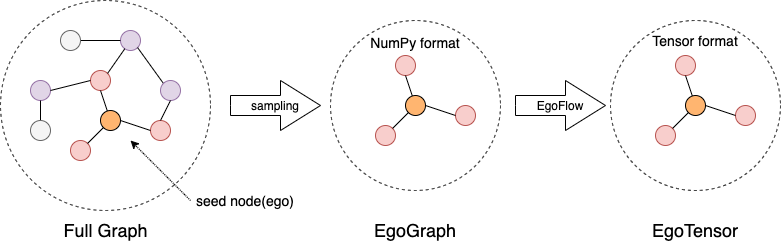

# Design of GLE

## Introduction

GLE (Graph Learning Engine) is a distributed framework to develop and implement graph neural networks at a large scale. GLE has been successfully applied in various scenarios such as network security, knowledge graph, and search recommendation. It facilitates sampling on batch graphs and enables offline or incremental GNN model training. GLE provides graph sampling operations with both Python and C++ interfaces, and a GSL (Graph Sampling Language) interface that is similar to Gremlin. GLE provides model development paradigms and processes for GNN models, and is compatible with TensorFlow and PyTorch. It offers data layer and model layer interfaces, as well as several model examples.

## Architecture

:::{figure-md}

## Graph Sampling

### Sampling
Graph sampling is an effective technique for managing large graphs and is widely used in programming paradigms represented by the GraphSAGE framework. Sampling reduces data size and facilitates efficient processing by Tensor-Based computing frameworks through data alignment.

Sampling requirements by users are abstracted and categorized into two classes of operations in GLE: Neighborhood Sampling and Negative Sampling. Neighborhood Sampling involves selecting one-hop or multi-hop neighboring vertices based on the input vertex to construct the perceptual field in GCN theory. Input for neighborhood sampling can be from the graph traversal output or other external data sources. Negative Sampling selects vertices that are not directly connected to the input vertices, and it is commonly used in unsupervised learning.

Different implementation strategies such as random and edge-weight are available for each sampling operation. We have accumulated over 10 sampling operators through practical production and have made the operator programming interface open to allow user customization to keep up with the ever-evolving GNN.

For sampling strategies, GL currently has support for the following sampling strategies, corresponding to the `strategy` parameters when generating `NeighborSampler` objects.

|strategy|description   |
|------|-----------|
|edge_weight	| Samples with probability with edge weights|
|random	| random_with_replacement|
|topk	|Return the neighbors with edge weight topK, if there are not enough neighbors, refer to the padding rule.|
|in_degree	|Probability sampling by vertex degree.|
|full	|Returns all neighbors, the expand_factor parameter does not work, the result object is SparseNodes or SparseEdges.|

For usage and interfaces of sampling, please check [the sampling part of GLE](https://graph-learn.readthedocs.io/en/latest/en/gl/graph/graph_operator/graph_sampling.html) for more details.

### Negative Sampling
**Negative sampling** refers to sampling vertices that have no direct edge relationship with a given vertex. Similar to neighbor sampling, negative sampling has different implementation strategies, such as random, in-degree of nodes, etc. As a common operator of GNN, negative sampling supports extensions and scenario-oriented customization. In addition, GLE provides the ability to negative sampling by specified attribute condition.

GLE currently supports the following negative sampling strategies, corresponding to the strategy argument when generating NegativeSampler objects.

|strategy	|description|
|------- | ------|
|random	|Random negative sampling, not guaranteed true-negative|
|in_degree	|Negative sampling with probability of vertex entry distribution, guaranteed true-negative|
|node_weight	|Negative sampling with probability of vertex weight, true-negative|

For usage and interfaces of negative sampling, please check [the negative sampling part of GLE](https://graph-learn.readthedocs.io/en/latest/en/gl/graph/graph_operator/negative_sampling.html) for more details.

### GSL Introduction
GLE abstracts sampling operations into a set of interfaces, called GSL (Graph Sampling Language). Generally, graph sampling consists of several categories as follows.

- Traversal type (Traverse), which obtains point or edge data of a batch from the graph.

- Relational (Neighborhood, Subgraph), which obtains the N-hop neighborhood of points or generates a subgraph composed of points for constructing training samples.

- Negative sampling (Negative), as opposed to relational, which is generally used in unsupervised training scenarios to generate negative example samples.

For example, for the heterogeneous graph scenario of “users clicking on products”, “randomly sample 64 users and sample 10 related products for each user by the weight of the edges”. This can be presented by GSL as 
`g.V("user").batch(64).outV("click").sample(10).by("edge_weight") `

GSL covers support for oversized graphs, heterogeneous graphs, and attribute graphs considering the characteristics of the actual graph data, and the syntax is designed close to the Gremlin form for easy understanding.

For more details, please check [the GSL part of GLE](https://graph-learn.readthedocs.io/en/latest/en/gl/graph/gsl.html).

## Model Paradigms
### Introduction
Most GNNs algorithms follow the computational paradigm of message passing or neighbor aggregation, and some frameworks and papers divide the message passing process into aggregate, update, etc. However, in practice, the computational process required by different GNNs algorithms is not exactly the same.

In practical industrial applications, the size of the graph is relatively large and the features on the nodes and edges of the graph are complex (there may be both discrete and continuous features), so it is not possible to perform message passing/neighbor aggregation directly on the original graph. A feasible and efficient approach is based on the idea of sampling, where a subgraph is first sampled from the graph and then computed based on the subgraph. After sampling out the subgraph, the node and edge features of that subgraph are preprocessed and uniformly processed into vectors, and then the computation of efficient message passing can be performed based on that subgraph.

To summarize, we summarize the paradigm of GNNs into 3 stages: subgraph sampling, feature preprocessing, and message passing.

1. **Subgraph sampling**: Subgraphs are obtained through GSL sampling provided by GraphLearn, which provides graph data traversal, neighbor sampling, negative sampling, and other functions.

2. **Feature preprocessing**: The original features of nodes and edges are preprocessed, such as vectorization (embedding lookup) of discrete features.

3. **Message passing**: Aggregation and update of features through topological relations of the graph.

According to the difference of neighbor sampling operator in subgraph sampling and NN operator in message passing, we organize the subgraph into EgoGraph or SubGraph format. EgoGraph consists of central object ego and its fixed-size neighbors, which is a dense organization format. SubGraph is a more general subgraph organization format, consisting of nodes, edges features and edge index (a two-dimensional array consisting of row index and column index of edges), generally using full neighbor. The conv layer based on SubGraph generally uses the sparse NN operator. EgoGraph refers to a subgraph composed of ego (central node) and k-hop neighbors; SubGraph refers to a generalized subgraph represented by nodes, edges and edge_index.

Next, we introduce two different computational paradigms based on EgoGraph and SubGraph.

### EgoGraph-based node-centric aggregation
EgoGraph consists of ego and neighbors, and the message aggregation path is determined by the potential relationship between ego and neighbors. k-hop neighbors only need to aggregate the messages of k+1-hop neighbors, and the whole message passing process is carried out along the directed meta-path from neighbors to themselves. In this approach, the number of sampled neighbor hops and the number of layers of the neural network need to be exactly the same. The following figure illustrates the computation of a 2-hop neighbor model of GNNs. The vector of original nodes is noted as h(0); the first layer forward process needs to aggregate 2-hop neighbors to 1-hop neighbors and 1-hop neighbors to itself, the types of different hop neighbors may be different, so the first layer needs two different conv layers (for homogeneous graphs, these two conv layers are the same), and the features of nodes after the first layer are updated to h(1) as the input of the second layer; at the second layer, it needs to aggregate the h(1) of 1-hop neighbors to update the ego node features, and the final output node features h(2) as the embedding of the final output ego node.

:::{figure-md}

### SubGraph-based graph message passing
Unlike EgoGraph, SubGraph contains the edge_index of the graph topology, so the message passing path (forward computation path) can be determined directly by the edge_index, and the implementation of the conv layer can be done directly by the edge_index and the nodes/edges data. In addition, SubGraph is fully compatible with the Data in PyG, so the model part of PyG can be reused.