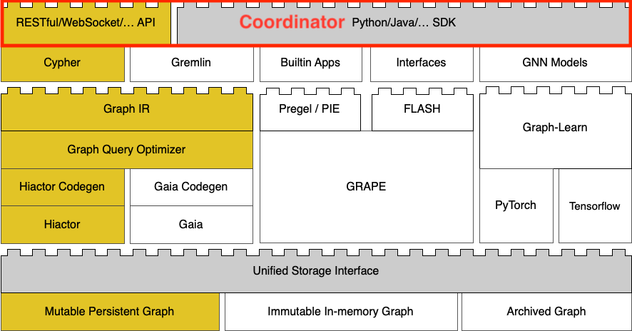

# Coordinator

The GraphScope Coordinator serves as a centralized entry point for users, providing a RESTful API that follows the Swagger specification. It supports multiple language SDKs, including Python, and offers a unified interface.

The purpose of the Coordinator is to abstract and standardize the underlying engines and storage systems, shielding users from their complexities. This allows users to interact with the GraphScope platform through a simplified and consistent set of APIs, making it easier for users to understand and utilize the functionalities provided by GraphScope.

:::{figure-md}



Flex Coordinator
:::

Explore Coordinator with following documents:

```{toctree} arguments
---
caption:
maxdepth: 2
---
coordinator/getting_started
coordinator/dev_guide
coordinator/restful_api
```
