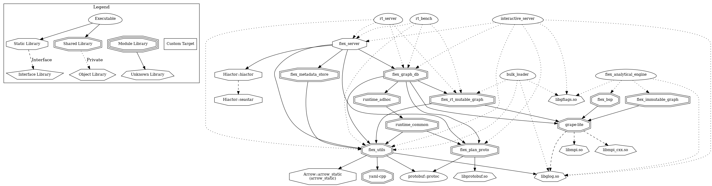

# Dev and Test

This document describes the organization of the source code for Interactive and provides instructions on how to build `Interactive` from source and run tests.

## Dev Environment

Before building `Interactive` from the source code, you need to set up a development environment with various dependencies. 
Here, we provide two options: installing all dependencies on the local machine or building it within the provided Docker image.

### Install Deps on Local

Interactive source code should be compatible with and installable on most modern Linux distributions, including Debian, RedHat, and Ubuntu (tested on Ubuntu 22.04), on both x86 and ARM platforms. If you encounter any issues during compilation or installation on your system, please open an issue on our [Github Repo](https://github.com/alibaba/graphscope).

```{note}
Interactive currently cannot be compiled from source on macOS, mainly due to some dependencies (seastar) being incompatible with macOS.
```

To install all dependencies on your local machine, run the following code with the command-line utility script `gsctl.py`.

```bash
python3 gsctl.py install-deps dev
```

### Develop on Docker Container

We provided a docker image `graphscope-dev` with all tools and dependencies included.

```bash
docker run -it registry.cn-hongkong.aliyuncs.com/graphscope/graphscope-dev:latest
```

Or you can open the codebase of GraphScope in [dev container](../../../development/dev_guide.md#develop-with-dev-containers).

## Understanding the Codebase

Interactive is composed of two parts, the execution engine and frontend compiler. 

### Interactive Query Engine

The Interactive Query Engine code is organized in the `flex` folder as follows:
- `codegen`: The binary `gen_code_from_plan` is built from this repository, capable of generating C++ code from a physical plan.
- `engines`:
    - `engines/graph_db`: Provides the interface and implementation of `GraphDB`, which manages graph storage.
    - `engines/hqps_db`: Includes the Graph Query Engine implementation, data structures, and physical operators.
    - `engines/http_server`: Incorporates the HTTP server based on Seastar httpd and defines actors in [hiactor](https://github.com/alibaba/hiactor).
- `interactive`: Contains product-related components.
    - `interactive/docker`: Dockerfile for Interactive.
    - `interactive/examples`: Graph definition examples and raw data.
    - `interactive/openapi/openapi_interactive`: OpenAPI specification for Interactive's RESTful API.
- `storages`:
    - `storages/metadata`: Implementation of the metadata store.
    - `storages/immutable_graph`: Implementation of immutable graph storage.
    - `storages/rt_mutable_graph`: Implementation of mutable graph storage based on `mutable_csr`.
- `tests`: Includes test cases and scripts.
- `third_party`: Contains third-party dependencies.
- `utils`: Utility classes and functions.


### Dependency Graph

Interactive follows the lego-like building concept of GraphScope Flex, comprising multiple modules. A dependency graph illustrates the relationships among these modules, although only a subset of third-party dependencies is included for clarity.


:::{figure-md}



Dependency Graph between modules
:::


### Compiler

The Compiler is crucial in Interactive as it converts graph queries written in graph query languages (Cypher/Gremlin) into physical query plans using GAIA IR.
The Compiler code is found in `interactive_engine/compiler`.
For additional details on the Compiler, refer to [this documentation](../../../interactive_engine/design_of_gie.md)

## Build Interactive

First, build the Interactive Query Engine.

```bash
git clone https://github.com/alibaba/GraphScope # or replace with your own forked repo
cd GraphScope 
git submodule update --init
cd flex
mkdir build && cd build
cmake ..
make -j
```

Then, build the Compiler.
```bash
cd interactive_engine
mvn clean package -DskipTests -Pexperimental
```

### CMake options

- `BUILD_TEST`: Indicates whether to build tests.  
- `BUILD_DOC`: Indicates whether to build Flex documentation.  
- `BUILD_ODPS_FRAGMENT_LOADER`: Enables support for loading graphs from ODPS tables.  
- `USE_PTHASH`: Indicates whether to use a perfect hash when building the vertex map.  
- `OPTIMIZE_FOR_HOST`: Determines if Flex should be optimized for performance on the current machine. Note that enabling this option may result in a binary that does not run on different platforms or CPU architectures.

## Testing

Numerous test cases have been created for Interactive, which can be referenced in the GitHub workflow[interactive.yaml](https://github.com/alibaba/GraphScope/blob/main/.github/workflows/interactive.yml).
Below is a basic test case for validating the accuracy of the SDK and interactive admin service.

Initially, a directory needs to be established as the Interactive workspace, then proceed to create a new graph named `modern_graph` and import data into the graph.

```bash
# Clone the testing data
export GS_TEST_DIR=/tmp/gstest
git clone -b master --single-branch --depth=1 https://github.com/GraphScope/gstest.git ${GS_TEST_DIR}

export GITHUB_WORKSPACE=/path/to/GraphScope
export FLEX_DATA_DIR=${GITHUB_WORKSPACE}/flex/interactive/examples/modern_graph
export TMP_INTERACTIVE_WORKSPACE=/tmp/interactive_workspace
cd ${GITHUB_WORKSPACE}/flex/build/

# Create interactive workspace
mkdir -p ${TMP_INTERACTIVE_WORKSPACE}
SCHEMA_FILE=${GITHUB_WORKSPACE}/flex/interactive/examples/modern_graph/graph.yaml
BULK_LOAD_FILE=${GITHUB_WORKSPACE}/flex/interactive/examples/modern_graph/bulk_load.yaml

# Create a directory to put modern_graph's schema.yaml and graph data
mkdir -p ${TMP_INTERACTIVE_WORKSPACE}/data/modern_graph/
cp ${SCHEMA_FILE} ${TMP_INTERACTIVE_WORKSPACE}/data/modern_graph/graph.yaml

# Load data to modern_graph
GLOG_v=10 ./bin/bulk_loader -g ${SCHEMA_FILE} -l ${BULK_LOAD_FILE} -d ${TMP_INTERACTIVE_WORKSPACE}/data/modern_graph/indices/
```

A workspace is akin to the data directory for a database, housing metadata and graph data. Here is an example.

```txt
/tmp/temp_workspace
├── data
│   ├── 1 -> /tmp/temp_workspace/data/modern_graph
│   ├── 2
│   └── modern_graph
└── METADATA
    ├── GRAPH_META
    ├── INDICES_LOCK
    ├── JOB_META
    ├── PLUGIN_META
    ├── PLUGINS_LOCK
    └── RUNNING_GRAPH
```

Subsequently, execute the `hqps_admin_test.sh` script to test the of the interactive admin service.

```bash
cd ${GITHUB_WORKSPACE}/flex/tests/hqps
# Change the default_graph field to 
bash hqps_admin_test.sh ${TMP_INTERACTIVE_WORKSPACE} ./interactive_config_test.yaml ${GS_TEST_DIR}
```

The `interactive_config_test.yaml` specifies the configuration for interactive services. 

```yaml 
directories:
  workspace: /tmp/interactive_workspace # The workspace to start service on.
log_level: INFO
default_graph: modern_graph # The graph to serve at the beginning
compute_engine:
  type: hiactor
  workers:
    - localhost:10000
  thread_num_per_worker: 1
  store:
    type: cpp-mcsr
  metadata_store:
    type: file 
compiler: # Configurations for the Graph Compiler
  planner: 
    is_on: true
    opt: RBO
    rules:
      - FilterIntoJoinRule
      - FilterMatchRule
      - NotMatchToAntiJoinRule
  meta:
    reader:
      schema:
        uri: http://localhost:7777/v1/service/status
        interval: 1000 # ms
      statistics:
        uri: http://localhost:7777/v1/graph/%s/statistics
        interval: 86400000 # ms
  endpoint:
    default_listen_address: localhost
    bolt_connector:
      disabled: false
      port: 7687
    gremlin_connector:
      disabled: false
      port: 8182
  query_timeout: 40000
  gremlin_script_language_name: antlr_gremlin_calcite
http_service:
  default_listen_address: localhost
  admin_port: 7777
  query_port: 10000
```

## Starting Service Manually

The main entrance for Interactive is `interactive_server`.

### Enable AdminService

To start admin service in development, use the command line argument `--enable-admin-service true`. `${ENGINE_CONFIG}` specifies the configuration for interactive query engine, see [engine-configuration](https://graphscope.io/docs/flex/interactive/configuration). `${WORKSPACE}` points to the directory where interactive related data is maintaned.

```bash
./bin/interactive_server -c ${ENGINE_CONFIG} -w ${WORKSPACE} --enable-admin-service true
```

### Start Compiler Service
The Compiler service could be started as a subprocess of the AdminService. This ensures that when switching graphs in the AdminService, the Compiler service also switches to the corresponding graph's schema. This is the default behavior in the current Interactive.

```bash
./bin/interactive_server -c ${ENGINE_CONFIG} -w ${WORKSPACE} --enable-admin-service true --start-compiler true
```


### Error Code

Runtime errors are categorized, assigned an error code, and included in the HTTP response body (only for non-200 HTTP responses). 
The mapping between status codes and HTTP codes is shown in the table below.


| Code                                | HTTP Code   |
| ----------------------------------- | ----------- |
| OK(0)                  | 200         |
| INVALID_ARGUMENT(2)     | 400         |
| UNSUPPORTED_OPERATION(11) | 400         |
| NOT_FOUND(4)           | 404         |
| ALREADY_EXISTS(5)       | 409         |
| PERMISSION_DENIED(8)     | 403         |
| CODEGEN_ERROR(100)        | 500         |
| INVALID_SCHEMA(101)       | 400         |
| ILLEGAL_OPERATION(102)    | 400         |
| INTERNAL_ERROR(103)       | 500         |
| INVALID_IMPORT_FILE(104)   | 400         |
| IO_ERROR(105)             | 500         |
| QUERY_FAILED(106)         | 500         |
| default                             | 500         |