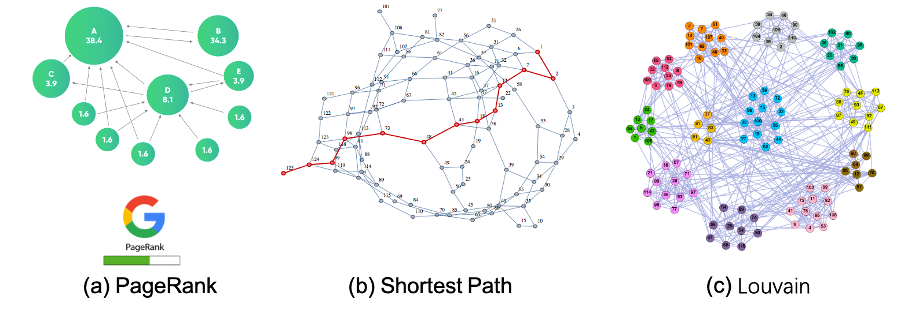

# Graph Analytics Workloads
## What is Graph Analytics
Broadly speaking, any kind of computation over graph data can be regarded as graph analytics. We find that computation patterns of different graph analytics vary a lot: some only involve a small number of vertices/edges, while others access a large fraction of (even all) vertices/edges of a graph. In GraphScope, we call the former as *graph traversal*, while use the term *graph analytics* to refer to the latter, unless otherwise specified. 

Currently, there exist diverse types of graph analytics algorithms, which usually iteratively access a large fraction of (even all) vertices/edges of a graph to explore underlying insights hidden in graph data. Typical graph analytics algorithms include general analytics algorithms (e.g., PageRank, the shortest path, and maximum flow), community detection algorithms (e.g., maximum clique/bi-clique, connected components, Louvain and label propagation), graph mining algorithms (e.g., frequent structure mining and graph pattern discovery). 

The graph analytics algorithms can used to analyze the properties of a set of vertices/edges in the graph. For example, PageRank can measure the importance of each vertex in the graph, the shortest path finds a path between two vertices such that the sum of the weights of its constituent edges is minimized, and Louvain retrieves a set of vertices which are tightly connected each other. 

The graph analytics algorithms can used to analyze the properties of a set of vertices/edges in the graph. For instance, PageRank can measure the importance of each vertex in the graph, the shortest path finds a path between two vertices such that the sum of the weights of its constituent edges is minimized, and Louvain retrieves a set of vertices which are tightly connected each other.

## Challenges of Graph Analytics on Large Graphs
Based on our experience, the graph data we need to process and the frameworks (systems) used to process graph data face the following challenges:

### Supporting large-scale and complex graph data

We have observed that vast majority of real-world graph data is large-scale, heterogeneous, attributed. For example, nowadays e-commerce graphs often contain billions of vertices and tens of billions of edges, with various types and rich attributes. How to represent and store such graph data is nontrivial.

### Various programming models/languages

Currently, many graph processing systems have been developed to handle graph analytics algorithms. These systems are implemented with different programming models (e.g., vertex-centric model and PIE model) and programming languages (e.g., C++, Java and Python). As a result, users usually suffer from high learning curves.

### Requirement for high performance

The scale and efficiency of processing large graphs is still limited. Although current systems have largely benefited from years of work in optimizations for each individual system, they still suffer from efficiency and/or scale problems. Offering superior performance when facing large-scale graph data is highly desired.

## What can GraphScope Do 

In GraphScope, Graph Analytics Engine (GAE) is responsible for handling graph analytics algorithms.It addresses the abovementioned challenges in the following ways:

### Managing graph data in a distributed way 

In GraphScope, graph data is represented as property graph model, which can model vertices, edges and properties well. To support large-scale graph, GraphScope automatically partitions the whole graph into several subgraphs (fragments) distributed into multiple machines in a cluster. Meanwhile, GraphScope provides user-friendly interfaces for loading graphs to allow users to manage graph data easily. More detials about how to manage large-scale graphs can refer to [this](https://graphscope.io/docs/latest/design_of_gae.html#Graph-Storage).

### Supporting various programming models/languages

On the programming model side, GraphScope supports both the vertex-centric model (Pregel) and PIE (PEval-IncEval-Assemble) programming model. Both programming models have been widely applied in existing graph processing systems, and readers can refer to [this blog](https://graphscope.io/blog/tech/2021/03/25/a-review-of-programming-models-for-parallel-graph-processing.html) for more details.

On the programming language side, GraphScope provides  SDKs for multiple languages, and users can choose to write their own algorithms in C++, Java or Python. Users can develop their own algorithms with different programming languages.

Please check out [this](https://graphscope.io/docs/latest/design_of_gae.html#Execution-Framework) for more details.

### High-performance runtime

GAE achieves high performance through a highly [optimized analytical runtime](https://graphscope.io/docs/latest/design_of_gae.html#High-performance-runtime). Many optimization techniques, such as pull/push dynamic switching, cache-efficient memory layout, and pipelining were employed in the runtime. We have performed a comparison with state-of-the-art graph processing systems on LDBC Graph Analytics Benchmark, and the results show GraphScope outperforms other graph systems. 
