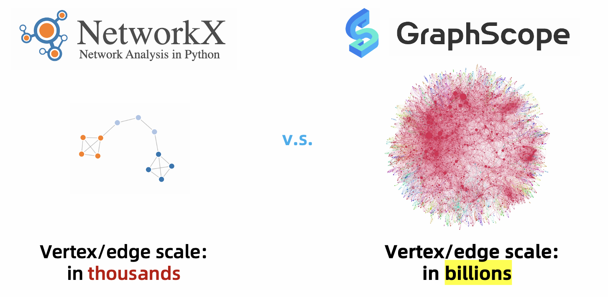
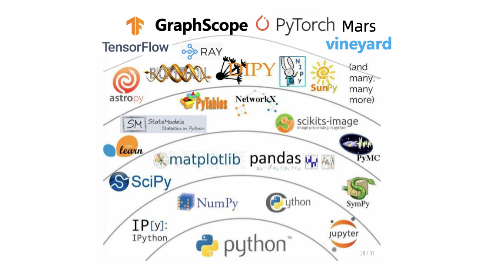

# GrpahScope for Data Scientists

A large number of real-world datasets can be naturally represented by graphs. Typical cases 
are knowledge graphs, social networks, traffic networks and web graphs. Given the ever-growing amount of graph data available, graph computation, which tries to explore underlying insights hidden in graph data, has attracted increasing attention from data scientists.

However, based on our experience of developing graph algorithms and feedbacks from other data scientists, we find that there still exist many challenging issues for data scientists to handle a real-world workload involving graph compuatition.

## Challenges of Handling Graph Computation

*It is difficult to develop graph algorithms for large graphs.* Typically, to work over graph data, data scientists often begin with small graphs on a single machine using easy- and ready-to-use tools (such as NetworkX in Python and TinkerPop) to develop and tune their graph algorithms. However, they may meet a lot of obstacles when they attempt to verify the effectiveness of developed algorithms on large graphs, as existing ready-to-use graph computation tools are only designed for single machine environment. Although there exist many efficient distributed parallel graph computation systems for large graphs, these systems usually have totally different APIs and programming models, and data scientist suffer from high learning curves.



*It is hard to develop a complex workflow which contains graph computation and other types of computations.* A real-world job developed by data scientists may be very complicated and contains other types of computation (e.g., SQL for data cleaning and deep learning for GNN model training). Therefore, how the tools for graph computations can seamlessly co-work and integrate with other data processing tools is very important. While distributed graph algorithms are already hard to implement efficiently in existing systems, implementing such complex workflows becomes more challenging.


## Solutions of GraphScope

Fortunately, GraphScope can handle the above two issues in two ways. First, it provides a single-machine programming abstraction in Python that supports a variety of graph operations in easy-to-use tools (TinkerPop, NetworkX, etc.), while hides the system distributed deployment and running complexity from the data scientists. Second, it provides efficient in-memory data transfer with high-level data structures as interfaces, and allows seamless integration of GraphScope with other data processing tools in PyData ecosystem.

## Program as Single Machine and Run as Distributed 

GraphScope is designed for processing large-scale graphs, which are hard to fit in the memory of a single machine. To this end, GraphScope allows data scientists to run graph algorithms on a cluster managed by Kubernetes (k8s). To use GraphScope in a distributed setting, data scientists fist need to establish a session `sess` in a Python interpreter.

```python
import graphscope
sess = graphscope.session(mount_dataset="/datasets")
```

Then the session will try to launch a cluster of resources (k8s pods), and the GraphScope computation engines ran on them. After that, data scientists can process large-scale graphs in a distributed setting just like working over a small graph on a single machine. For example, they can run a Gremlin query on the cluster with 

```python
# load an example graph
from graphscope.dataset import load_p2p_network
g = load_p2p_network(sess, "/dataset/p2p_network")

interactive = sess.gremlin(g)
print(interactive.execute('g.V().hasLabel("host")').one())
```

And they can also run a PageRank just with
```python
result = graphscope.pagerank(g)
```

In addition, GraphScope is compatible with NetworkX APIs, and thus a graph algorithm developed for NetworkX (e.g., degree centrality) can directly on GraphScope:
```python
import graphscope.nx as nx
G = nx.Graph(g)

nx.degree_centrality(G)
```

## Integration with PyData Ecosystem

By embedding the language in Python, it is natural and easy for GraphScope to inter-operate with other Python data processing systems such as Pandas and Mars. This seamless integration of GraphScope with other data-parallel systems provides a unified and elegant solution to many real-world problems in which certain parts of the computation are naturally handled using tools for which they are suited; whereas other parts of the computation requiring graph operations will be efficiently handled by GraphScope.



Currently, GraphScope has seamlessly integrated with many popular Python data processing tools, including Pandas, Numpy, NetworkX and Mars. Specifically, GraphScope can read results generated by these tools as inputs, and write its outputs as compatible formats of these tools. For example, GraphScope can load a graph from a Pandas dataframe with.

```python
# head -3 /home/graphscope/comment.csv
id|creationDate|locationIP|browserUsed|content|length
618475290625|2011-08-17T14:26:59.961+0000|31.210.17.48|Chrome|yes|3
618475290626|2011-08-17T11:10:21.570+0000|31.210.17.48|Chrome|thanks|6

# head -3 /home/graphscope/comment_replyOf_comment.csv
Comment.id|Comment.id.1
274877907301|274877907299
274877907302|274877907299

import pandas as pd
# column 0 will be used as vertex_id by default.
df_v = pd.read_csv('/home/graphscope/comment.csv', sep='|')
# column 0/1  will be used as src/dst by default.
df_e = pd.read_csv('/home/graphscope/comment_replyOf_comment.csv', sep='|')

g = sess.g().add_vertices(df_v).add_edges(df_e)
```

Meanwhile, GraphScope can write its outputs as dataframe format for further processing.
```python
# result = graphscope.pagerank(g)
result.to_dataframe({"node": "v.id", "r": "r"})
``

