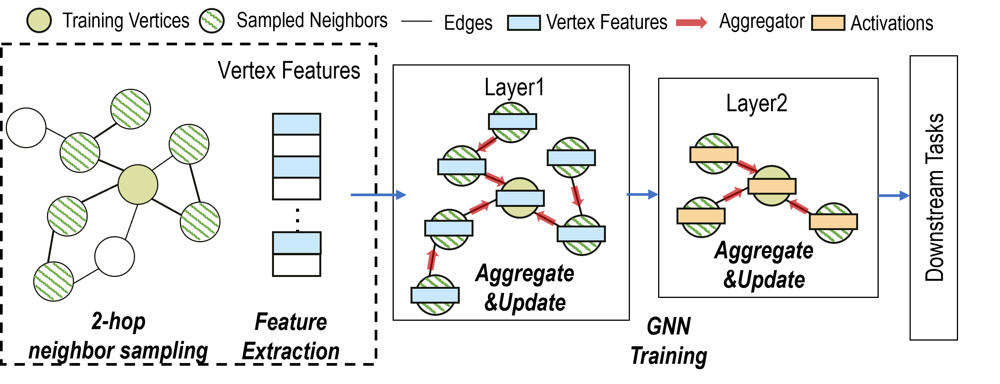
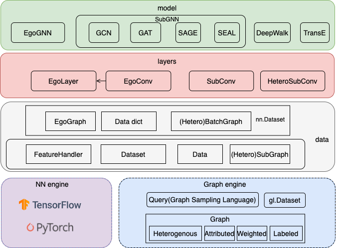
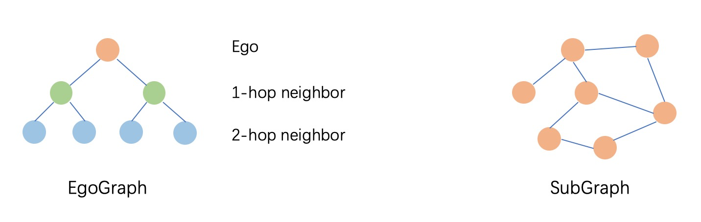

# GraphScope for Learning

The learning engine in GraphScope (GLE) drives from 
[Graph-Learn](https://github.com/alibaba/graph-learn), 
a distributed framework designed for development and training 
of large-scale graph neural networks (GNNs). 
GLE provides a programming interface carefully designed for 
the development of graph neural network models,
and has been widely applied in many scenarios within Alibaba, 
such as search recommendation, network security and knowledge graphs.

Next, we will briefly rewind the basic concept of GNN, 
introduce the model paradigms of **GLE**, 
and walk through a quick-start tutorial on how to build 
a user-defined GNN model using **GLE**.

## Graph Neural Networks

Let's start by rewinding the the basic concept of GNN and the workflow of 
mini-batch GNNs training.

Given a graph $G = (V,E)$, where each vertex is associated with a vector 
of data as its feature. Graph Neural Networks(GNNs) learn a low-dimensional 
embedding for each target vertex by stacking multiple GNNs layers $L$. 
For each layer, every vertex updates its activation by aggregating features 
or hidden activations of its neighbors $N(v),v \in V$.

In general, there are two ways to train a GNN model: (1) whole graph 
training and (2) mini-batch training. Whole graph training is to compute 
based on the whole graph directly. The GCN and GAT are originally proposed 
using this approach, directly computing on the entire adjacency matrix. 
However, this approach will consume huge amount of memory on large-scale 
graphs, limiting its applicability. Mini-batch training is a practical 
solution for scaling GNN training on very large graphs. Neighbor sampling 
is used to generate mini-batches, allowing sampling-based GNN models to 
handle unseen vertices. GraphSAGE is a typical example of mini-batch 
training. The following figure illustrates the workflow of 2-hop GraphSAGE training.
<center>
   
   <br>
   <div style="color:orange; border-bottom: 1px solid #d9d9d9;
   display: inline-block;
   color: #999;
   padding: 2px;">The workflow of 2-hop GraphSAGE training.</div>
</center>

<!-- The workflow of GraphSAGE training follows a vertex-centric computation 
paradigm including the following steps: 
   - Select a mini-batch of training vertices from the training set.
   - Sample the multiple hops of fixed-size neighbors for each training vertex.
   - Extract the features of the sub-graph consisting of the training vertices 
      and their neighbors to generate the mini-batch training data.
   - Aggregate and update features through topological relations of the training 
      data, and execute the forward and backward propagation to update the model parameters. -->


## Graph Learning Models

**GLE** is designed for large-scale graph neural networks. It consists of an 
efficient graph engine, a set of user-friendly APIs, and a rich set of built-in GNN 
models. The graph engine stores the graph topology and attributes distributedly, 
and supports efficient graph sampling and query. 
GLE can work with popular tensor engines including TensorFlow and PyTorch.


<center>
   
   <br>
   <div style="color:orange; border-bottom: 1px solid #d9d9d9;
   display: inline-block;
   color: #999;
   padding: 2px;">An overview of the algorithm framework in GLE.</div>
</center>

## Subgraph Sampling

To build and train a model, **GLE** usually samples subgraphs as the training data,
and performs batch training with it. In practical industrial applications, the size of 
the graph is often relatively large and the features on the nodes and edges of the graph 
are complex (there may be both discrete and continuous features). Thus it is not possible 
to perform message passing/neighbor aggregation directly on the original graph. A feasible 
and efficient approach is based on the idea of graph sampling, where a subgraph is first 
sampled from the original graph and then the computation is based on the subgraph. 
According to the difference of neighbor sampling operator in subgraph sampling and 
NN operator in message passing, we organize the subgraph into ``EgoGraph`` or ``SubGraph`` 
format. EgoGraph consists of the central object ego and its fixed-size neighbors, which 
is a dense organization format. SubGraph is a more general subgraph organization format, 
consisting of nodes, edges features and edge index (a two-dimensional array consisting 
of row index and column index of edges), generally using full neighbor. The conv layer 
based on SubGraph generally uses the sparse NN operator. The examples of EgoGraph and 
SubGraph are shown in the following figure.

<center>
   
   <br>
</center>

For models using EgoGraph sampling, the message aggregation path is determined by 
the potential relationship between the ego and its neighbors. For models using 
SubGraph sampling, the message passing path (forward computation path) can be 
determined directly by the ``edge_index``.

## Developing Your Own Model
 Next, we introduce how to use the basic APIs provided by **GLE** to cooperate 
 with deep learning engines to build graph learning algorithms. 
 We demonstrate the GraphSAGE model as an example. In the following example, 
 the model implementation is based on TensorFlow.

In general, it requires the following four steps to build a GNN model.

- Specifying the sampling query. Graph sampling broadly consists of several categories:
  ``Traversal`` sampling that obtains point or edge data of a batch from the graph;
  ``Relational`` sampling, which obtains the N-hop neighborhood of 
   points or generate a subgraph composed of points for constructing training samples; 
   and ``Negative`` sampling, which is generally used by unsupervised training to 
   generate negative example samples. We abstract above sampling operations 
   into a set of interfaces, called [GSL](https://graph-learn.readthedocs.io/en/latest/en/gl/graph/gsl.html). 
   GSL supports heterogeneous attribute graphs, and the syntax is designed close 
   to the [Gremlin](https://tinkerpop.apache.org/gremlin.html) style for easy understanding.
   For example, for the heterogeneous graph  “users clicking on products”, the sampling 
   query “randomly sample 64 users and sample 10 related products for each user by the 
   weight of the edges” can be written as: `g.V("user").batch(64).outV("click").sample(10).by("edge_weight")`

- Transforming outputs of the GSL query into the tensor format. The outputs of GSL is in the
  Numpy format, while the model based on TensorFlow or PyTorch needs that data are in the
  tensor format. Thus we need to convert the data format before training. In addition, 
  the features of the original graph data may be complex and cannot be directly accessed 
  for model training. For example, the node features “id=123456, age=28, city=Beijing” 
  and other plain texts need to be processed into continuous features by embedding lookup. 
  We need to describe clearly the type, value space, and dimension of each feature after 
  vectorization when adding vertex or edge data sources. Based on these information,  **GLE**
  provides a convenient interface to convert the raw feature data into vector format.

- Model construction. **GLE** encapsulates EgoGraph/SubGraph based layers and models, 
  which can be used to build a GNNs model after selecting a model paradigm that suits 
  your needs. The GNNs model takes EgoGraph or BatchGraph (SubGraph of mini-batch) as 
  input and outputs the embedding of the nodes.

- Design loss functions. The loss function should be designed according to the specific 
  application scenario, which in general can be classified into two categories: ``node classification`` 
  and ``link prediction``. Take link prediction as an example, we need “embedding of source 
  vertex, embedding of destination vertex, embedding of target vertex with negative sampling” 
  as the training input, and output the loss, and then optimize the loss by iterating through 
  the trainer. **GLE** encapsulates some common [loss functions](https://graph-learn.readthedocs.io/en/latest/en/gl/algo/tf/tf_loss.html).  Users can also customize the loss functions, optimizers and the training process.


Next, we introduce how to implement a GraphSAGE model following the above steps.

### Sampling & Output Transformation
We use the Cora dataset for the node classification example. We provide a
simple data conversion script ``cora.py`` to convert the original Cora data
to the format required by **GLE**. The script generates following 5
files: node_table, edge_table_with_self_loop, train_table, val_table and
test_table. They are the node table, the edge table, and the nodes
tables used to distinguish training, validation, and testing sets.
The format transformation of the feature data is also performed in this script.

Then, we can construct the graph using the following code snippet. 
The inputs of the ```load_graph(args)``` function are a set of user-defined 
arguments including the path of the source files, the types of the node and 
edge in the graph, etc.

```python
    def load_graph(args):
      dataset_folder = args.dataset_folder
      node_type = args.node_type
      edge_type = args.edge_type
      g = gl.Graph()                                                           \
            .node(dataset_folder + "node_table", node_type=node_type,
                  decoder=gl.Decoder(labeled=True,
                                    attr_types=["float"] * args.features_num,
                                    attr_delimiter=":"))                       \
            .edge(dataset_folder + "edge_table",
                  edge_type=(node_type, node_type, edge_type),
                  decoder=gl.Decoder(weighted=True), directed=False)           \
            .node(dataset_folder + "train_table", node_type=node_type,
                  decoder=gl.Decoder(weighted=True), mask=gl.Mask.TRAIN)       \
            .node(dataset_folder + "val_table", node_type=node_type,
                  decoder=gl.Decoder(weighted=True), mask=gl.Mask.VAL)         \
            .node(dataset_folder + "test_table", node_type=node_type,
                  decoder=gl.Decoder(weighted=True), mask=gl.Mask.TEST)
      return g
```
Next, the graph is loaded into memory by calling ``g.init()``. The
logics of output transforming for EgoGraph are abstracted as class 
[EgoDataLoader](https://github.com/alibaba/graph-learn/blob/master/graphlearn/examples/tf/ego_data_loader.py), which will transform the outputs of subgraph sampling 
from the numpy format into the tensor format. For each model on EgoGraph, 
we further implement a specific dataloader that inherits ```EgoDataLoader```.
For the model in this tutorial, we use the class [EgoSAGESupervisedDataLoader](https://github.com/alibaba/graph-learn/blob/master/graphlearn/examples/tf/ego_sage/ego_sage_data_loader.py)
to specify sampling arguments such as the sampling strategy, 
number of hops and the number of sampled neighbours in each hop. For example, 
the following code prepares the training dataset.

```python
    train_data = EgoSAGESupervisedDataLoader(graph=g, 
                                             mask=gl.Mask.TRAIN, 
                                             sampler='random', 
                                             neg_sampler='random'
                                             batch_size=args.train_batch_size, 
                                             node_type=args.node_type, 
                                             edge_type=args.edge_type,
                                             nbrs_num=args.nbrs_num, 
                                             hops_num=args.hops_num)
```
The test dataset can be prepared by changing ``gl.Mask.TRAIN`` into ``gl.Mask.TEST``. 

### Model
We use the ``EgoSAGEConv`` to specify the aggregation process from neighbors 
of one k+1 hop to neighbors of k hop. For an ``EgoGraph`` consisting of 
ego and K-hop neighbors, a full-graph messaging needs to perform EgoSAGEConv 
forward operations on all adjacent neighbor pairs in the EgoGraph.
We use ``EgoLayer`` to denote the message-passing process of such a single 
EgoGraph that consists of multiple 1-hop neighbor aggregations' conv.
Check [Model Layers](https://graph-learn.readthedocs.io/en/latest/en/gl/algo/tf/tf_model_layer.html) for more detailed descriptions on conv and layer.


```python
    class EgoGraphSAGE(tfg.EgoGNN):
      def __init__(self,
                  dims,
                  agg_type=,
                  bn_func=None,
                  act_func=tf.nn.relu,
                  dropout=0.0,
                  **kwargs):
        assert len(dims) > 1

        layers = []
        for i in range(len(dims) - 1):
          conv = tfg.EgoSAGEConv("homo_" + str(i),
                                in_dim=dims[i],
                                out_dim=dims[i + 1],
                                agg_type=agg_type)
          layer = tfg.EgoLayer([conv] * (len(dims) - 1 - i))
          layers.append(layer)

        super(EgoGraphSAGE, self).__init__(layers, bn_func, act_func, dropout)
```

### Loss Function and Training Process

For the Cora node classification model, we can select the corresponding
classification loss function in TensorFlow. In this example, we use
``tf.nn.sparse_softmax_cross_entropy_with_logits``. 

```python
    def supervised_loss(logits, labels):
        loss = tf.nn.sparse_softmax_cross_entropy_with_logits(labels=labels, logits=logits)
      return tf.reduce_mean(loss)
```

Next, we use ``LocalTFTrainer`` to train on a single-machine.

```python
    trainer = LocalTrainer()
    trainer.train(train_data.iterator, loss, optimizer, epochs=args.epochs)
    trainer.test(test_data.iterator, test_acc)
```
In the end, the the training process is finished by calling ``g.close()``

The above example concludes some key steps to build a GraphSAGE model. 
Please refer to the [ego_sage example](https://github.com/alibaba/graph-learn/blob/master/graphlearn/examples/tf/ego_sage/train_supervised.py) for the complete code. We have implemented a rich set of popular models, including GraphSage, Bipartite GraphSage, GAT, RGCN, Ultra GCN, SEAL, etc. These models can be used as a starting point for building similar models.