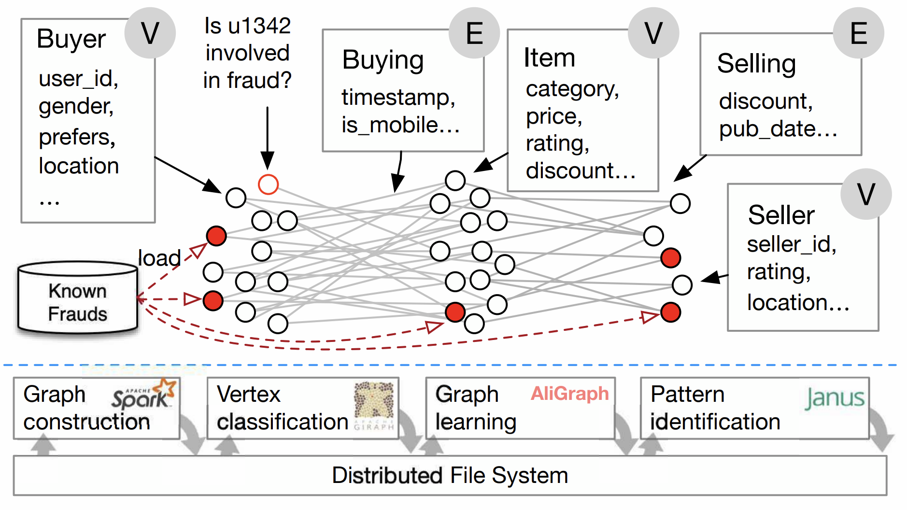
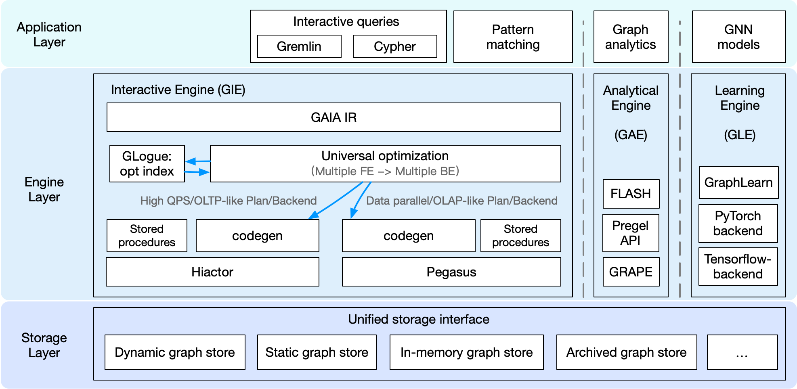

.. graphscope documentation master file, created by
   sphinx-quickstart on Tue Aug 27 10:19:05 2019.
   You can adapt this file completely to your liking, but it should at least
   contain the root `toctree` directive.

GraphScope: A One-Stop Large-Scale Graph Computing System from Alibaba
======================================================================

GraphScope is a unified distributed graph computing platform 
that provides a one-stop environment for performing diverse graph 
operations on a cluster of computers through a user-friendly 
Python interface. GraphScope makes multi-staged processing of 
large-scale graph data on compute clusters simple by combining 
several important pieces of Alibaba technology: including GRAPE, 
GraphCompute, and Graph-Learn (GL) for analytics, interactive, 
and graph neural networks (GNN) computation, respectively, 
and the vineyard store that offers efficient in-memory data transfers.

Motivation
----------------------------------------------

With the rapid growth of graph data and its applications, 
many graph processing systems are developed. 
However, existing systems are often designed for a specific type of graph computation, 
while tools or systems involving various graph computations are often called for instead. 
For example, in e-commerce platforms, some sellers and buyers may conduct fraudulent 
transactions and reviews collaboratively in order to inflate their ratings and rankings. 
In practice, all the users and transactions can be organized as a large-scale graph 
which contains vertices such as buyers, sellers, and items, and edges representing 
buying, selling, or reviewing relationships.

Various techniques can be applied to identify suspicious users and transactions on this transaction graph. 
For example, an anti-fraud workflow may consist of the following five steps. 
First, the graph is constructed in a data-parallel system from the external storage. 
Second, some mining algorithms such as k-clique or k-core are performed to extract suspicious patterns. 
Next, a label propagation algorithm is applied to find a set of vertices as possible fraudulent entities. 
Then, a graph neural networks (GNN) is used to conduct k-hop neighborhood sampling for each vertex, 
and the result is fed into a deep learning framework (e.g., TensorFlow) 
to predict whether an entity is fraudulent, based on a GNN model. 
Finally, the results would be presented in a visualized WebUI with the ability 
to interactively explore the results and the graph for manual verification.

As shown in this pipeline, we may find real-world graph computations are often 
far more complicated that intertwine many types of graph computations in one single workload. 
Many challenges arise in this scenario. 
The programming abstractions of applications varies from vertex-centric model for iterative algorithms, 
to random graph walking for graph traversal, and to specializations for pattern matching. 
As a result, developers often have to comprise multiple systems, 
and manage the complexities of date representation, resources utilization, 
and performance tuning across multiple systems. Furthermore, all these applications 
have their own runtime characteristics, 
and require different design of trade-offs and optimizations in the computation engine, 
which should be tightly coupled with specific programming abstractions. 
Last but not least, due to the diverse graph computation workloads, 
the system should be orchestrated in a flexible way to support different types of graph computations, 
either complex pipelines or simple tasks.

To tackle the aforementioned problems, 
we propose GraphScope, with a layered and disaggregated design, 
providing a one-stop and efficient solution for a wide range of graph computations at scale.

Unified Graph Computing Platform
----------------------------------------------

GraphScope is a full-fledged, in-production system for one-stop analysis on big graph data. 
Achieving this goal requires a wide variety of components to interact, 
including cluster management(deployment) software, graph store (as input, output and to hold intermediate results), 
distributed execution engines, language constructs, and development tools.

Application layer
^^^^^^^^^^^^^^^^^^^^^^^^^^^^^^^^^^^^^^^^^^^^^^

Graph processing often requires specific applications for each particular task.
They can be interactive queries, written in Gremlin, Cypher or GQL, 
or graph analytics with iterative computation, such as pagerank, 
connected components, or GNN model for graph learning tasks. 
For interactive queries, GraphScope supports Gremlin, 
which is the de-facto traversal language developed by Apache foundation. 
Other language support like Cypher and GQL is under development. 
For graph analytics and graph learning tasks, 
GraphScope has a built-in library containing common algorithms for various domains 
(such as graph neural networks, clustering, and pattern matching) to ease the development of new graph applications. 
GraphScope gives the programmer the illusion of writing for a single machine 
using a general purpose high-level programming model and to have the system deal with the complexities 
that arise from distributed execution. 
In addition, this approach allows GraphScope to seamlessly combine multiple 
graph execution engines in one unified platform as described below.

Execution engine layer
^^^^^^^^^^^^^^^^^^^^^^^^^^^^^^^^^^^^^^^^^^^^^^
GraphScope execution layer consists of three engines, namely GraphScope Interactive
Engine (GIE), GraphScope Analytics Engine (GAE), GraphScope Learning Engine (GLE), 
and provides the functionality of interactive, analytical, 
and graph-based machine learning, respectively. 
A common feature all those execution engines provide is the automatic support 
for efficient distributed execution of queries and algorithms in their target domains. 
Each query/algorithm is automatically and transparently compiled by GraphScope 
into a distributed execution plan that is partitioned across multiple compute nodes for parallel execution. 
Each partition runs on a separate compute node, managed by a local executor, 
that schedules and executes computation on a multi-core server. 
The engines can be deployed and work together as a full-fledged GraphScope. 
In this form, GraphScope is able to handle complex and diversified workflows, 
including any type of analytics, interactive, and graph neural networks (GNN) computations and their combinations. 
Better still, the engines can be deployed separately, and work standalone for a specific kind of tasks.

Storage layer
^^^^^^^^^^^^^^^^^^^^^^^^^^^^^^^^^^^^^^^^^^^^^^
GraphScope defines a unified storage interface for accessing and managing graph data.
This interface allows the storage layer to be flexible and extensible and can be easily plugged in with different storage backends. 
GraphScope ships with many kinds of graph stores. e.g., vineyard, 
an in-memory storage that maintains an (intermediate) data object partitioned across a cluster 
and enables data sharing without copying across the engines in a workflow. 
An on-disk and multi-versioned persistent graph store named groot is also provided. 
Unlike vineyard which focuses on the in-memory analytics workload, groot takes responsibility for running continuous 
graph data management service and ingesting frequently updates for the graph data. 
In addition, GraphScope has an archive store, 
which supports quickly synchronizing data from a relation database via bin-log 
and creating a graph view for computation tasks defined on graphs. 
Besides, there are many other in-house managed graph stores that are used at Alibaba 
and some third-party stores are ready to be plugged in. 
Benefiting from the unified interface, all the stores can be chosen by users on their own demands, 
while the engine layer can be transparently used without any modification.

Disaggregated Design for Diverse Graph Applications
----------------------------------------------

GraphScope employed a disaggregated design, 
which allows users to deploy GraphScope with only some parts of the components to simplify the deployment and meet their own needs. 
For example, if a user only needs to run a community detection over a social network graph, 
a deployment with only the analytical engine should be sufficient. 
In GraphScope system design, the components are divided into three layers as mentioned above, 
namely application layer, engine layer, and storage layer. 
Users can pick up some components from the three layers to create a customized deployment. 
This flexible design allows GraphScope to be deployed and optimized for specific graph computation scenarios.

Next, we highlight some featured deployments of GraphScope.

GraphScope for BI analysis
^^^^^^^^^^^^^^^^^^^^^^^^^^^^^^^^^^^^^^^^^^^^^^

The users for BI analysis are supposed to be business analysts who are querying and analyzing the data interactively via a WebUI. 
Thus, the concurrency is unlikely to be high, 
but the latency for complex queries is the key concern. 
In this scenario, GraphScope works as an interactive query answering service over an evolving graph. 
In the application layer, it should support Gremlin or Cypher query languages. 
In the engine layer, an interactive engine (GIE) is deployed. When the engine receives a query written in Gremlin/Cypher, 
the compiler GAIA compiles the query into a unified interpreted representation (IR). 
Then a universal query optimizer is applied to optimize the IR, to translate the IR for different backends. 
In this BI scenario, the queries are more like OLAP style, thus the IR would be interpreted into data parallel plan. 
Next, a code-gen module would generate the physical plan and apply it to Pegasus, 
which is a distributed data-parallel compute engine based on the cyclic dataflow computation model lying at the core of GIE. 
In the storage layer, a dynamic graph store is deployed and responsible for storing the graph data. 
With this combination, GraphScope can provide a high-performance and interactive query answering service for BI analysis.

GraphScope for high QPS queries
^^^^^^^^^^^^^^^^^^^^^^^^^^^^^^^^^^^^^^^^^^^^^^

In some service scenarios, e.g., recommendation or searching, 
the graph queries are coming at an extremely high rate. 
GraphScope can handle these scenarios by deploying a similar set of components in the BI scenario. 
However, the universal query optimizer would generate a query plan that is more suitable for high QPS queries. 
Then a designed code-gen module generates physical plan for another core engine, 
Hiactor, which is a high-performance and concurrent actor framework and responsible for processing the OLTP-like queries at the core of GIE. 
Since the storage layer provides a unified interface, 
users may choose to deploy an in-memory graph store (e.g., vineyard) or a persistent graph store (e.g., groot) to meet their own needs. 
One may find that the deployment of GraphScope for high QPS queries is similar to the deployment for BI analysis. 
However, the universal optimizer generates different plans and dispatches them to different backends according to the different workload characteristics.

GraphScope for graph analytics
^^^^^^^^^^^^^^^^^^^^^^^^^^^^^^^^^^^^^^^^^^^^^^

GraphScope is both performant and easy-to-use for graph analytical jobs. 
In this scenario, applications are provided as iterative algorithms in the built-in library or customized by the users. 
The algorithms can be implemented in FLASH-style API, Pregel API, or GRAPE native API. 
All these kinds of algorithms would be compiled in the engine layer and run on GRAPE, 
which is a processing system proposed on `this paper <https://dl.acm.org/doi/10.1145/3282488>`_ in SIGMOD2017. 
GRAPE differs from prior systems in its ability to parallelize sequential graph algorithms as a whole. 
In GRAPE, sequential algorithms can be easily “plugged into” with only minor changes and get parallelized to handle large graphs efficiently. 
To achieve high performance, deployment for this scenario usually chooses an in-memory graph store for the storage layer.

GraphScope for learning
^^^^^^^^^^^^^^^^^^^^^^^^^^^^^^^^^^^^^^^^^^^^^^

GNNs have been successfully applied in many real-world applications, 
such as ecommerce recommendation systems and financial risk control platforms, where billion-scale graphs are quite common. 
The learning engine in GraphScope (GLE) can efficiently support distributed GNN training on large-scale graphs in such industrial scenarios. 
GLE provides both Python and C++ interfaces for graph sampling operations and a gremlin-like GSL (Graph Sampling Language) interface to ease the definition of sampling queries. 
For GNN models, GLE provides a set of paradigms and processes for model development, 
and also provides a rich set of example models. Users can flexibly choose TensorFlow or PyTorch as the training backend. 
To allow for a flexible and cost-effective resource configuration, 
the processes of sampling and training in GLE are decoupled, 
each of which can be independently scaled to chase for the best end-to-end throughput.

.. toctree::
   :maxdepth: 2
   :caption: Contents

   installation
   getting_started
   tutorials
   deployment
   loading_graph
   graph_transformation
   analytics_engine
   interactive_engine
   learning_engine
   persistent_graph_store
   frequently_asked_questions
   developer_guide

.. toctree::
   :maxdepth: 2
   :caption: Reference

   reference/python_index
   reference/analytical_engine_index
   Analytical Engine Java API Reference <reference/gae_java/index>

.. toctree::
   :maxdepth: 2
   :hidden:

   zh/index

Indices and tables
==================

* :ref:`genindex`
* :ref:`modindex`
* :ref:`search`

