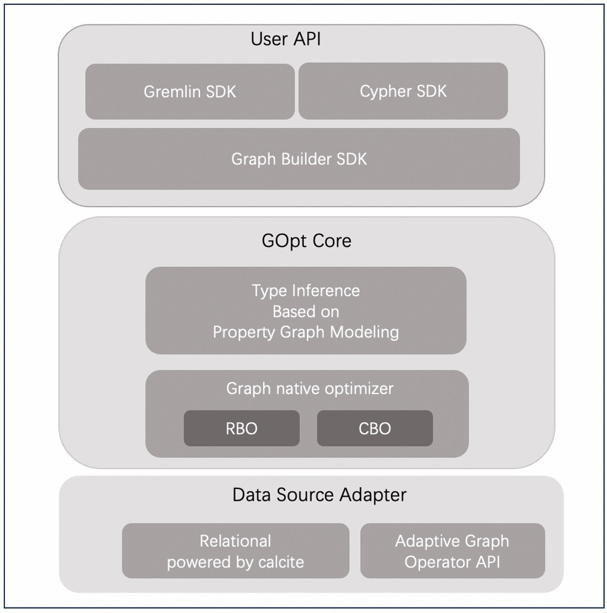

# GOpt: A Graph-Native Query Optimization Framework
## Introducing GOpt
GOpt is a graph-native query optimizer designed to accelerate query execution. It excels in handling hybrid scenarios that combine complex graph pattern matching with relational operations on large graphs. GOpt is not aware of the underlying storage data and focuses solely on computation on top of the data, which makes it easy and fast to be integrated into other graph or relational databases.

### Core Features

1. **Property Graph Modeling**: Automatically infers and completes user-provided ambiguous queries for more accurate optimization.
2. **Language Support**: Supports standard [Gremlin](https://tinkerpop.apache.org/gremlin.html) and [Cypher](https://neo4j.com/docs/cypher-manual/current/introduction/) languages, with upcoming [GQL](https://www.gqlstandards.org/) support.
3. **Graph-Native Algorithms**: Implements novel and efficient algorithms for complex graph pattern matching queries.
4. **Lightweight, Serverless Integration**: Seamlessly integrates with databases of various storage formats.

:::{figure-md}



GOpt System Overview
:::

### Why GOpt

1. **High Performance**

   GOpt is designed and implemented based on years of academic research, with key techniques published in prestigious systems conferences. Our experiments, as documented in our [papers](https://arxiv.org/abs/2401.17786), demonstrate that GOpt outperforms most graph and relational databases in both standard ([LDBC](https://ldbcouncil.org/)) and real-world (Alibaba) graph workloads.

2. **User-Friendly Interface**

   GOpt offers different layers of SDK tailored to various user requirements. It provides Cypher and Gremlin language support to lower the barrier of entry. User-provided Cypher or Gremlin queries can be more flexible and ambiguous, with GOpt automatically validating and completing the query information based on property graph modeling. Additionally, it provides lower-level APIs for developers who require deeper integration.

3. **Seamless Integration**

   GOpt is lightweight and serverless, facilitating seamless integration into other databases through a small-sized JAR file deployment. Built on the Calcite framework, GOpt leverages Calcite's extensive range of adapters, simplifying the integration with various data formats. This advantage allows GOpt to seamlessly integrate with mainstream relational databases that has been powered by Calcite. Additionally, GOpt is equipped with graph-native algorithms, enhancing its compatibility with graph-native database APIs. In our [Getting Started](#getting-started) section, we provide a demonstration of GOpt's easy integration into Neo4j with minimal codes.

## Getting Started

### Quick Start
GOpt is embeddable and serverless, available as a standalone package occupying just a few tens of MB in a JAR file. It can be quickly integrated into other systems as project dependency via Apache Maven. We have already integrated GOpt into the Neo4j system. Here, you can quickly experience the optimization effects that GOpt brings to Neo4j.

#### Deployment

##### Local Setup
We have prepared a `gopt-on-neo4j.tar.gz` package. You can quickly obtain it through the following link:
[Download GOpt for Neo4j](https://graphscope.oss-cn-beijing.aliyuncs.com/gopt_data/gopt-on-neo4j.tar.gz)

After unzipping the package, you will get the following artifacts:
```bash
├── bin
├── conf
├── data
├── import
│   └── movie
├── lib
│   └── gopt-all-0.0.1-SNAPSHOT.jar
├── plugins
└── queries
    ├── CBO
    ├── LSQB
    └── LDBC
```
Based on the original Neo4j artifacts, we made the following modifications:

1. Added `movie` CSV data to the `import/movie` directory. After successfully importing the data, the corresponding database files will be generated in the `data` directory.
2. Added the `gopt-0.0.1-SNAPSHOT.jar` file to the `lib` directory, making GOpt a project dependency of Neo4j.
3. Added query sets for benchmark tests.

You can now try running Neo4j with GOpt on your local machine. Note that the Neo4j version we use is 4.4.9. Ensure your local machine has all the necessary environments for [Neo4j-4.4.9](https://github.com/neo4j/neo4j/tree/4.4). If you do not have a complete development environment, you may prefer to use the [Docker setup](#docker-setup).

##### Docker Setup
If you do not have a complete development environment, we have also prepared a corresponding Docker environment. The Docker image contains all the contents of `gopt-on-neo4j.tar.gz` as well as all the necessary environment dependencies. You can start it with a single command:
```bash
docker run -it registry.cn-hongkong.aliyuncs.com/graphscope/gopt-on-neo4j:latest bash
```

#### Importing Data
Use the Neo4j importing tools to load your data into the Neo4j database. Here we use `movie` dataset as an example, which has the following property graph model:

:::{figure-md}


Movie Data Model
:::

:::{figure-md}


Nodes and Relationships in the Movie Dataset
:::

Follow the instructions of [neo4j-admin](https://neo4j.com/docs/operations-manual/4.4/tools/neo4j-admin/) to load the movie dataset, the original CSV files have been included in the `gopt-on-neo4j` artifacts under the directory `import/movie`.
```
cd gopt-on-neo4j

bin/neo4j-admin import \
    --database movie \
    --id-type=INTEGER \
    --ignore-empty-strings=true \
    --bad-tolerance=0 \
    --nodes=Person=import/movie/Person.csv \
    --nodes=Movie=import/movie/Movie.csv \
    --relationships=FOLLOWS=import/movie/Person_FOLLOWS_Person.csv \
    --relationships=ACTED_IN=import/movie/Person_ACTED_IN_Movie.csv \
    --delimiter '|'
```
#### Configuration
We integrate GOpt configuration into the Neo4j standard config file `conf/neo4j.conf` as follows:

- **graph.planner.rules**: Registers graph relational rules into the GOpt optimizer framework.
- **graph.planner.join.min.pattern.size**: Specifies the minimum pattern size that activates the `JoinDecompositionRule`. It is noted that `Extend` can yield better execution efficiency than `Join` for smaller patterns.
- **graph.planner.intersect.cost.factor**: For performance tuning, a higher value biases the optimizer towards more join-based plans, while a lower value favors extend-based plans.

Besides the GOpt configuration, we set the default database to `movie`.
```
# GOpt Configuration
graph.planner.rules=FilterIntoJoinRule,FilterMatchRule,ExtendIntersectRule,JoinDecompositionRule,ExpandGetVFusionRule
graph.planner.join.min.pattern.size:3
graph.planner.intersect.cost.factor:1

# The name of the default database
dbms.default_database=movie
```

#### Starting Neo4j Service
```bash
./bin/neo4j start

# wait unitl neo4j service started
...

./bin/cypher-shell

# check graph model
call apoc.meta.graph();

# check data
Match (a) Return count(a);
Match (a)-[b]->(c) Return count(b);
```

#### Analyzing Queries
To experience the optimization effects of GOpt, you can run various types of queries and observe the detailed profiling results. GOpt integrates Neo4j's Profile tool to display estimated counts for each operation. By comparing these estimates with the actual row counts, you can verify the accuracy of GOpt's cardinality estimation.

##### Ambiguous Pattern
Execute queries where type constraints are not explicitly defined.
```bash
Profile Match (a)-[]->(b), (b)-[]->(c), (c)-[]->(a) Return a, b, c;
```
From the execution explanation provided by Neo4j profile tools, it is evident that nodes a, b, and c, as well as the types of relationships between them, are precisely inferred. This allows the GOpt optimizer to operate effectively without being hindered by the lack of type details in queries, addressing Neo4j's limitation where it defaults to rule-based optimization (RBO) in the absence of such information, which prioritizes nodes with defined types.

:::{figure-md}


Ambiguous Pattern Profiling Results
:::

An important point to note is that if the data model does not contain the pattern specified in the query, GOpt can provide timely errors during the compiling phase through static analysis prior to actual data execution. For instance, If GOpt's static analysis determines that there are no outgoing edges associated with `Movie` in the data model, it will promptly raise an error.
```bash
Profile Match (a:Movie)-[]->(b) Return a, b;
```

:::{figure-md}


Pattern with Type Error Profiling Results
:::

##### Graph Pattern Matching
Find all square patterns.
```bash
Profile Match (a)-[]->(b), (a)-[]->(c), (d)-[]->(b), (d)-[]->(c)
Where a<>d AND b<>c
Return a, b, c, d;
```
Graph-native algorithms (i.e. [worst-case-optimal join](https://dl.acm.org/doi/10.1145/3180143) algorithm) are adopted to optimize the complex graph pattern matching workloads. The WCO implementation is not natively supported in the Neo4j execution layer. However, we can still use GOpt to optimize the order of `Expand` operations in Neo4j. For cyclic patterns, we transform the logical operator generated by the WCO algorithm into Neo4j's specific physical operator, `ExpandInto`.

:::{figure-md}


Square Pattern Profiling Results
:::

##### Hybrid Graph Relational
Based on the provided filtering conditions, the optimizer seamlessly integrates graph-native algorithm with the traditional relational rule `FilterPushDown`, which results in a distinct execution order from that of query-2.
```bash
Profile Match (a)-[]->(b), (a)-[]->(c), (d)-[]->(b), (d)-[]->(c)
Where d.name = 'Kean' AND a<>d AND b<>c
Return a, b, c, d;
```

:::{figure-md}


Square Pattern with Filtering Profiling Results
:::

##### ST Path
Find the count of all simple paths between two given vertices. GOpt provides specific optimizations for ST-Path queries. For long paths between a given start and endpoint, it selects an appropriate split point based on cardinality estimation to reduce data expansion in a single direction. This is a feature not available in the native Neo4j planner.
```bash
Profile Match (a)-[:ACTED_IN*5..6]-(b)
Where a.name = 'Kean' AND b.name = 'Top Gun'
Return count(a);
```

:::{figure-md}


ST-Path Pattern Profiling Results
:::

### Installation
We offer two versions of the GOpt JAR package, each approximately 35MB in size:

- **gopt-core**: Includes the core functionality of GOpt and uses the GraphBuilderSDK to build GOpt inputs. 
- **gopt-all**: Builds on top of gopt-core by providing additional Cypher SDK and Gremlin SDK, allowing users to directly write Cypher or Gremlin queries to build GOpt inputs. 

To try GOpt in your own project, download the latest version of the [gopt-core](https://graphscope.oss-cn-beijing.aliyuncs.com/gopt_data/gopt-core-0.0.1-SNAPSHOT.jar) or [gopt-all](https://graphscope.oss-cn-beijing.aliyuncs.com/gopt_data/gopt-all-0.0.1-SNAPSHOT.jar) and place it in the `src/main/resources` directory.
```bash
<dependency>
    <artifactId>gopt</artifactId>
    <groupId>com.alibaba.graphscope</groupId>
    <version>0.0.1-SNAPSHOT</version>
    <scope>system</scope>
    <systemPath>${project.basedir}/src/main/resources/gopt-core-0.0.1-SNAPSHOT.jar</systemPath>
</dependency>
```
```bash
<dependency>
    <artifactId>gopt</artifactId>
    <groupId>com.alibaba.graphscope</groupId>
    <version>0.0.1-SNAPSHOT</version>
    <scope>system</scope>
    <systemPath>${project.basedir}/src/main/resources/gopt-all-0.0.1-SNAPSHOT.jar</systemPath>
</dependency>
```

## Tutorial

In the [Getting Started](#getting-started) section, we explored some basic features of GOpt. In this section, we will guide you through advanced features of GOpt and demonstrate how to leverage these capabilities to optimize your system, including:
- **GOpt Benchmark Tools**: This guide provides detailed instructions on utilizing the benchmark tool to evaluate GOpt's performance on more complex queries with larger datasets.
- **Integration of GOpt into Other Systems**: Using Neo4j as a case study, we provide comprehensive details on integrating GOpt into other systems at different levels.

### Benchmark Tools
We provide a benchmark tool for running complex pattern queries on larger datasets. Our benchmark tool includes three components:

- **Dataset**: We have pre-prepared the LDBC data with sf=1 in the artifacts `gopt-on-neo4j`, under `data` directory.
- **Queries**: We have prepared three sets of query collections in the `queries` directory, including: 
   1. **CBO**: Designed for commonly used graph patterns, including triangles, squares, paths, and 4-cliques. 
   2. **LSQB**: A subset of standard LSQB queries.
   3. **LDBC**: Simplified versions of standard LDBC queries.
- **Scripts**: The `bin/bench.sh` script is used to run the benchmark.

You can now experience our one-click benchmarking feature.

#### Steps

1. First, stop the running service
   ```bash
   bin/neo4j stop
   ```

2. Reconfigure the database to `ldbc1`, and set the performance tuning configuration for GOpt
   ```
   dbms.default_database=ldbc1
   graph.planner.intersect.cost.factor:3
   ```

3. Restart the Neo4j service, and confirm that the data is ready
   ```bash
   bin/neo4j start
   # wait unitl neo4j service started
   ...

   ./bin/cypher-shell

   # check graph model
   call apoc.meta.graph();

   # check data
   Match (a) Return count(a);
   ```

4. Experience the various features of `bench.sh` by passing different parameters.
   1. Run the CBO query set in profile mode to print detailed profiling results. Alternatively, you can use explain mode, which returns the optimized plan without executing it.
      ```bash
      ./bin/bench.sh ./queries/CBO --profile
      ./bin/bench.sh ./queries/CBO --explain
      ```

   2. You can choose other query sets or run all query sets under `queries`
      ```bash
      ./bin/bench.sh ./queries/LSQB --profile
      ./bin/bench.sh ./queries/LDBC --profile
      ./bin/bench.sh ./queries --profile
      ```

   3. By default, we skip large queries that are time-consuming. You can use `--all` to run all queries, but this will take more time due to Neo4j's low execution efficiency on single node resources.
      ```bash
      ./bin/bench.sh ./queries --profile --all
      ```

   4. Optionally, you can switch to the Neo4j native planner by setting `--neo4j`. This allows you to analyze the differences from GOpt. Be sure to clear the query caches before switching between planners.
      ```bash
      # clean query cache
      ./bin/cypher-shell 'call db.clearQueryCaches();'

      ./bin/bench.sh ./queries --profile --neo4j --all
      ```

### Integration of GOpt
Detailed integration instructions for GOpt will be provided in the following sections. Stay tuned for more information.

## Design of GOpt
### Motivation
In large-scale graph querying scenarios, one core technique that can significantly influence performance is the optimizer. As graph data and its applications continue to grow rapidly, numerous graph processing systems equipped with native optimizers have been developed. However, these optimization methods tend to excessively focus on either graph-specific or relational-specific approaches. This narrow focus fails to holistically address queries involving both graph and relational data, leading to suboptimal performance. 
To address this issue, GOpt is designed as follows:

1. **Unified Graph Relational Design**: Develop a unified structure for Graph Relational that can express Gremlin or Cypher queries, serving as the initial structure for optimization.
2. **Unified Optimization Framework**: Optimize the graph relational structure within a unified relational optimization framework. We extended the interfaces of traditional relational frameworks to implement advanced graph optimizations, including high-order statistics and worst-case optimal join algorithms.
3. **Graph-Specific Optimization**: We also employed specific optimizations for graph pattern matching based on the characteristics of graphs. For instance, we extended type inference for graph patterns based on property graph modeling, leveraged graph isomorphism for pruning in traditional optimization frameworks, and implemented a specialized graph decomposition algorithm to reduce the search space during the optimization process.

:::{figure-md}


Design of GOpt
:::

### Detailed Introduction
A comprehensive introduction to GOpt will be provided in subsequent sections. Please stay tuned for detailed updates and information.
