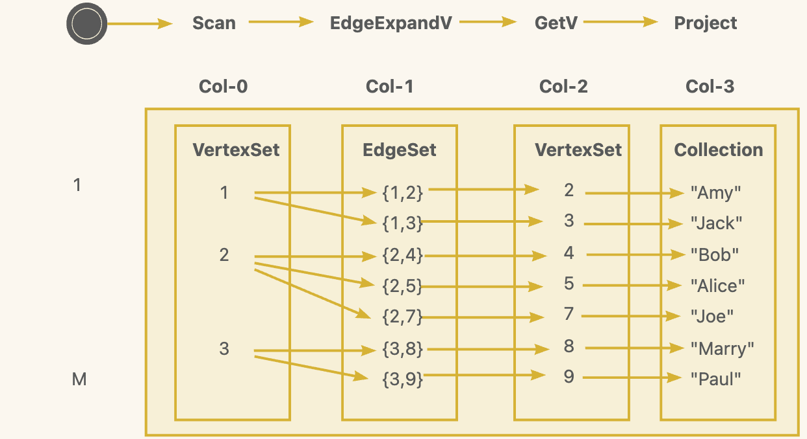

# Interactive Engine API Reference

## 1.Overview

By implementing the graph operators defined in GAIA IR, the engine has a complete graph computing capability. This article describes the operators provided by the query engine. Each graph query received by GraphScope Interactive is compiled into an execution plan consisting of these operators.


## 2.Data Structures
We use the following data structures to represent the data associated with the graph.

| Data Structure   | Meaning |
| ---------------  | -------- |
| VertexMultiSet   | Represent a set of vertices, where the actual stored data is based on internal IDs. The vertices can be duplicated.  |
| EdgeMultiSet     | Represent a set of edges, the edges can also be duplicated.|
| Collection       | Represent a set of data, the element type can be tuple, vector or pod type.|
| PathSet          | Represent a set of path, the path contains both vertices and edges|


## 3.Engine Operators

GraphScope Interactive Engine adopts a dataflow-like computation model. The engine exposes its computational capabilities by providing various operators. By chaining these operators together, where the output of one operator becomes the input of the next, we can have the ability to express any query plan. We abstract the "context" data structure to express the data passed between operators.

### 3.1 Context
The "context" expresses the contextual data retained by a query. In logical terms, the "context" can be understood as an MxN matrix, representing data with M rows and N columns.

- `Scan(label="person")` scans all points with the label "person" and puts them into Col-0 in the Context. At this point, Context only has one column.
- `EdgeExpand(edge_label="knows", direction="Out")` expands all "knows" edges from Col-0 and puts them into Col-1 in the Context. Now, Context has two columns.
  - Note that even though Col-0 actually only has 3 points, the actual record will have 7 columns.
- `GetV(vopt=End)` operates on Col-1 and obtains the endpoints of the edges, forming a new VertexSet, which is placed in Col-2.
- `Project("2.name")` projects the name property of the points in Col-2 into a new column.

### 3.2 Operators Overview

| Operator name | Starting Operator | Input    | Computing Result | Output | 
| ------------- | ------------------| -------- |--------          | -------- |
| Scan          | Yes               | Empty    | VertexSet        |Context<VertexSet> |
|EdgeExpand     | No                | One VertexSet from Context | EdgeSet | Context<..., EdgeSet>, appending EdgeSet to Context |
| PathExpand    | No                | On VertexSet from Context | PathSet | Context<..., PathSet>, append PathSet to Context |
| GetV          | No                | On VertexSet/EdgeSet/PathSet from Context | VertexSet | Context<..., VertexSet> |
| Select        | No                | All records in Context | Selected records | Context<...> |
| GroupBy        | No | All records in Context  | Selected columns of all records, with aggregation applied  | Context<...> |
| SortBy        | No                | All records in Context | All records sorted based on serveral columns | Context<...>| 
| Project       | No                | All records in Context | create new ElementSets |	Context<..., Ele...>  or Context <Ele>|
| Intersect     | No                | Two Context, only diff on last column |A new Context  | Context<...> |
| Join          | No                | Two Context and multiple columns as join key| Joined Context | Context<...> |
| Sink          | No                 | One Context| Printable Results | Printable Results|

### 3.3 Operator's input

Operators receive `Context` as input, and different operators may operate on different columns as their target objects.

Perform computation on one single column of data in the Context.

- Scan
- EdgeExpand
- PathExpand
- GetV

Perform computation on multiple columns of data in the Context.

- GroupBy
- Project
- Join
- Intersect
- Select
- SortBy
- Sink

### 3.4 Operator's Output

Each operator also return a new Context. Based on whether operators generate new data, we can categorize them into the following types:


Generating new data and add to current context.

- Scan
- EdgeExpand
- PathExpand
- GetV
- Project

Sort/reorganize current context.

- Sort
- Select
- GroupBy

 
Join/Merge between contexts.

- Join
- Intersect

## 4. Operator description

In this charactor, we will give a detail description for each operators.Before providing specific descriptions for each operator, let's first introduce the general format and invocation method of operators.

To express the selection of data, we introduce the concept of a selector. A selector describe the selected property name and corresponding property type.
```cpp
template <typename T>
struct PropertySelector {
  using prop_t = T;
  std::string prop_name_;
  PropertySelector(std::string prop_name) : prop_name_(std::move(prop_name)) {}
  PropertySelector() = default;
};
```

PropertySelector in enough for some simple operators, but for some operators that need to transform the input context, customized expressions are needed. We use `Mapper` and `Filter` to describe the data transformation. The difference between Filter and Mapper is that Filter produce a bool value, while Mapper can produce any value. Filter a special case of Mapper when expression's return value is bool.

```cpp
// @brief Mapping a vertex/edge to new data with expr& selector.
// @tparam EXPR
// @tparam ...SELECTOR
template <typename EXPR, typename SELECTOR_TUPLE, int32_t... in_col_id>
struct MultiMapper {
  EXPR expr_;
  SELECTOR_TUPLE selectors_;
  MultiMapper(EXPR&& expr, SELECTOR_TUPLE&& selectors)
      : expr_(std::move(expr)), selectors_(std::move(selectors)) {}
};

// Mapping the data selected by selector identically.
template <int in_col_id, typename SELECTOR>
struct IdentityMapper {
  SELECTOR selector_;
  IdentityMapper(SELECTOR&& selector) : selector_(std::move(selector)) {}
  IdentityMapper() = default;
};

template <typename EXPR, typename... SELECTOR>
struct Filter {
  using expr_t = EXPR;

  EXPR expr_;
  std::tuple<SELECTOR...> selectors_;
  Filter() = default;
  Filter(EXPR&& expr, std::tuple<SELECTOR...>&& selectors)
      : expr_(std::move(expr)), selectors_(std::move(selectors)) {}
};

```

With `Selector` and `Mapper`, we now can describe the general call to operator.
```cpp
auto ctx1 = Engine::Operator<AppendOpt,input_col_id>(graph, 
							[OperatorOpt],
							<Filter/Mapper>);
```
- User needs to specify whether to append the new data generated by the operator to the current Context and return it through AppendOpt.
	- AppendOpt::Temp means temporary saving, this column will be replaced by the new data later
 	- AppendOpt::Persist means new generated data will be append permanently.
- The user needs to specify the input col_id, but not the output col_id.
- Some operators may have an Operator-specific parameter, some may not.
- Some operators can receive Mapper to do data transformation to express the filter condition.


### 4.1 Scan
A starting operator for a physical plan. Iterates over the points of the whole map. Returns a Context containing only one ElementSet.
```cpp
template<typename EXPR, typename... Selector>
Context Scan(const Graph& graph, 
			Filter<EXPR, Selector...>&& filter);

struct Expression {
    //sample expression
    bool evaluate(const int64_t& oid, const std::string_view& name) {
        return oid == 1 && name == "person";
    }
};

//for i.e.
PropertySelector<int64_t> oid_selector("id");
PropertySelector<std::string_view> name_selector("name");

Filter<Expression, Selector<int64_t>, Selector<std::string_view>> filter(
			Expression(), 
			Selector<int64_t>("id"),
			Selector<std::string_view>("name"));
auto ctx0 = Scan(graph, 
				std::move(filter));
```

### 4.2 EdgeExpand
Expand from vertices through some edges, edges or vertices will be append to context.
```cpp
//EdgeExpand with filter
template<int in_col_id, typename EXPR, typename... Selector>
Context EdgeExpand(
	const Graph& graph, Context&& prev_ctx, 
	EdgeExpandOpt opt,
	Filter<EXPR, Selector...>&& filter);

struct Expression{
    bool evaluate(const int64_t& creation_date) {
        return creation_date >= 1000000;
    }
};

//suppose previous ctx is prev_ctx, which has only one column
EdgeExpandOpt expand_opt(Direction::Both, person_label_id, person_label_id);
Filter<Expression, PropertySelector<int64_t>> filter(
	Expression(),
	PropertySelector<int64_t>("creationDate"));

// use ind 0 as input_col
auto res = EdgeExpand<0>(graph, std::move(prev_ctx),
							opt,
							std::move(filter));
// res contains two columns
```

If not filter is provided
```cpp
//EdgeExpand with no filter
template<int in_tag_id, int out_tag_id>
Context EdgeExpand(
	const Graph& graph, Context&& prev_ctx,
	EdgeExpandOpt opt);
auto res = EdgeExpand<0>(graph, std::move(prev_ctx), opt);
```

### 4.3 GetV
GetVertex from Vertices/Edges/Paths

```cpp
template<int in_col_id, typename EXPR, typename... Selector>
Context GetVertex(
	const Graph& graph, Context&& prev_ctx,
	GetVOpt get_v_opt, Filter<EXPR, Selector...>&& filter);

struct Expression{
    //sample expression
    bool evaluate(const std::string_view& person_name, 
				const int64_t& creationDate) {
        return person_name != "jack" && creationDate == 12321431;
    }
};

GetVOpt vopt(....);
Filter<Expression, PropertySelector<std::string_view>, PropertySelector<int64_t>>
filter(
		Expression(), 
		Selector<std::string_view>("name"),
		Selector<int64_t>("creationDate"));
//suppose previous context is prev_ctx
auto res = GetVertex<1>(graph, std::move(prev_ctx), std::move(vopt),
                    	Expression(),
                        std::move(filter));
```

### 4.4 PathExpand

Expand path from vertices. Currenly only support expand to vertices.
```cpp
  static RES_T PathExpandV(
      const GRAPH_INTERFACE& graph,
      Context<CTX_HEAD_T, cur_alias, base_tag, CTX_PREV...>&& ctx,
      PathExpandOpt<LabelT, EXPR, EDGE_FILTER_T, T...>&& path_expand_opt);
```

### 4.5 Select

Select records from context with filtering conditions
```cpp
//select new records from prev_record
template<int... col_id, typename EXPR, typename... Selector>
Context Select(const Graph& graph, Context&& prev_ctx,
				Filter<EXPR, Selector...>&& filter);
//The RecordSelector indicates which columns do we need in each row

struct Expression{
    bool (const int64_t& creation_date, const std::string_view& lastName) {
        return creation_date == 123435 && lastName == "Jack";
    }
};

Filter<Expression, PropertySelector<int64_t>, PropertySelector<std::string_view>>
filter(
	Expression(),
	PropertySelector<int64_t>("creationDate"),
	PropertySelector<std::string_view>("lastName"));

auto res = Selector<0,1>(graph, prev_ctx, std::move(filter));
```

### 4.6 Sort

Sort the records in current context.

```cpp
enum Order{
	ASC = 0,
	DESC = 1,
};

template<int... col_id, typename... OrderingPair>
Context Sort(const Graph& graph, Context&& prev_ctx,
        	size_t limit,
            std::tuple<OrderingPair...>&& ordering_pairs);

template<typename Selector>
struct OrderingPair{
	Order order_;
	Selector selector_;
	OrderingPair(Order order, Selector selector) : order_(order), selector_(selector) {}
};

auto res = Sort<0,1>(graph, std::move(prev_ctx), 20, 
    std::tuple{
        OrderingPair(Order::ASC, PropertySelector<int64_t>("id")),
        OrderingPair(Order::DESC, PropertySelector<std::string_view>("lastName")
    });
```

### 4.7 GroupBy

Reorganize the records in context with some GroupKey and aggregate other columns with aggregate functions.

```cpp
template<typename... GroupKey, typename... AggAlias>
struct GroupBy(const Graph& graph, Context&& prev_ctx, 
    							std::tuple<GroupKey...>&& group_keys,
                                std::tuple<Agg...>&& agg_funcs);

template<int col_id, typename Selector>
struct GroupKey{
    Selector selector;
	GroupKey(Selector s) : Selector(s) {}
};

enum AggType{
	TO_SUM = 0,
	TO_SET = 1
};

template<int.. col_id,AggType agg_type, typename Selector>
struct AggFunc{
	Selector selector;
};

auto res = GroupBy(graph, std::move(prev_ctx), 
				std::tuple{
                	GroupKey<0,InternalIdSelector>()
				},
                std::tuple{
                	AggFunc<1, AggType::TO_SET, PropertySelector<int64_t>("id")
				});
```

### 4.8 Intersect

For two contexts that only diff in last column, get the intersection of them.
```cpp
template<int col_id1, int col_id2, typename CTX1, typename CTX2>
Context Intersect(CTX1&& ctx1, CTX2&& ctx2);
```


### 4.9 Join

Join two contexts with two column id as join key.

```cpp
template<int col_id1, int col_id2, typename CTX1, typename CTX2, JoinKind join_kind>
Context Join(CTX1&& ctx1, CTX2&& ctx2);
```

### 4.10 Project

Project columns in current context to new columns. 
```cpp
Context Project(
      const Graph& graph,
      Context&& ctx,
      std::tuple<ProjMapper...>&& proj_mappers);
```

Project need project mappers to define the project behavior. If you want to project with some customized expression, use `make_mapper_with_expr` to create a project mapper;If you want to project one column's property, use `make_mapper_with_variable` is enough.
```cpp
template <int... in_col_id, typename EXPR, typename... SELECTOR>
auto make_mapper_with_expr(EXPR&& expr, SELECTOR&&... selector);

template <int in_col_id, typename SELECTOR>
auto make_mapper_with_variable(SELECTOR&& selector);
```


### 4.11 Sink

Convert the records in context to a format that recognizable by GIE compiler.
```cpp
results::CollectiveResults Sink(Context<CTX_HEAD_T, cur_alias, base_tag, CTX_PREV...>& ctx);
```
