# Tutorial: LDBC Gremlin
Prior to beginning, it is important to note that [LDBC](https://ldbcouncil.org/) is a highly
regarded organization in the realm of graph databases/systems benchmark standards and audit testing.
LDBC has developed several benchmark toolsuits, with GIE primarily focusing on the
[Social Network Benchmark (SNB)](https://ldbcouncil.org/benchmarks/snb/). This benchmark defines
graph workloads specifically for database management systems, including both interactive (high-QPS)
workloads and business intelligence workloads.

During this tutorial, we will walk you through various use cases when querying the simulated
social network utilized in SNB. By the conclusion of this tutorial, we are confident that
you will be proficient in constructing Gremlin queries that are just as intricate as the
business intelligence workloads found in SNB.

## Load the LDBC Graph
For this tutorial, we will use the [LDBC social network](https://ldbcouncil.org/) as the graph data, which has the following entities:

- vertex/edge labels(types) in the graph
- connections and relationships among labels
- properties related all kinds of labels

:::{figure-md}

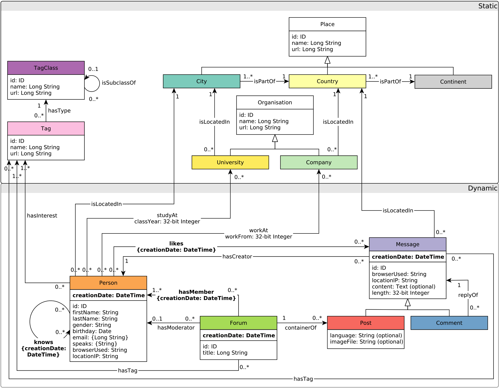

Figure 1. The schema of the LDBC graph (referred to LDBC [SNB](https://ldbcouncil.org/benchmarks/snb/)).
:::

LDBC graph is one of the built-in dataset of GraphScope, so it can be easily loaded through:

```python
from graphscope.dataset.ldbc import load_ldbc

graph = load_ldbc()
```

This will load the LDBC social network with the scale factor (sf) 1.

```{tip}
We do permit loading much larger LDBC graphs, such as sf 3k.
To handle such large graphs, you're recommended using the [standalone deployment of GIE](./deployment.md)
in a large cluster.
```

Currently, GIE supports Gremlin as its query language.
After loading the LDBC graph and initializing the engine, we can submit gremlin queries to GIE through `g.execute(GREMLIN_QUERIES)` easily.

For example, if we want to count there are how many vertices and edges in the LDBC graph, we can simply write the following python codes:

```python
import graphscope as gs
from graphscope.dataset.ldbc import load_ldbc

# load the ldbc graph
graph = load_ldbc()

# Hereafter, you can use the `graph` object to create an `gremlin` query session
g = gs.gremlin(graph)
# then `execute` any supported gremlin query.
# count vertices
q1 = g.execute('g.V().count()')
print(q1.all())
# count edges
q2 = g.execute('g.E().count()')
print(q2.all())
```

Then the output should be:

```bash
[190376]
[787074]
```

It suggests that there are 190376 vertices and 787074 edges in the LDBC sf1 graph.

## Basic Vertex/Edge Query

It is very common to use SQL sentences to retrieve data from relational databases. In graph, vertices can be regarded as entities, and edges can be regarded as the connecting relationship among entities. Similarly, we can easily retrieve data from graph with GIE and corresponding graph query sentences.


### Retrieve Vertices and Edges

As shown in the last tutorial, we can easily retrieve vertices and edges from graph through `g.V()` and `g.E()` gremlin steps.

```python
# then `execute` any supported gremlin query.
# Retrieve all vertices
q1 = g.execute('g.V()')
print(q1.all())
# Retrieve all edges
q2 = g.execute('g.E()')
print(q2.all())
```

The output of the above code should be like:

```bash
# All vertices
[v[432345564227583365], ......, v[504403158265495622]]
# All edges
[e[576460752303435306][432345564227579434-hasType->504403158265495612], ......, e[144115188075855941][504403158265495622-isSubclassOf->504403158265495553]]
```

For vertices, the number inside `[]` represents its id. However, the ids seem to be a little bit confusing: why are they so large? Actually, such large ids result from the different storage mechanism between graph and relational databases.

In relational databases, instances with different types are stored separately in different tables. Therefore, we usually use *local id* to retrieve specific instance from the table. For example, we can use `select * from Person where id=0` to retrieve person with id=0 from the Person table. Since the id is local, instances belonging to different tables may have the same id (e.g. person(id=0) and message(id=0)).

When it comes to graph storage, all kinds of vertices and edges are stored together. If it still uses local id to locate vertices and edges, there will be many conflicts. Therefore, every vertex and edge needs a specific global identifier, called *global id*, to distinguish it from others.

GIE uses *global id* to identify very vertex and edge. The ids look so large mainly because the underlying storage generates vertex's  *global id* from its  *local id* and *label* by some bit operations(shift and plus). After all, the *global ids* are just identifiers, and we don't need to worry too much about what it looks like.

For edges, still the number inside the first `[]` represents its id. The content inside the second `[]` is of the format `source vertex id -edge label(type)-> destination vertex id`，indicating the edge's two end vertices' id and the connection type (edge label).

### Apply Some Filters

In most cases, we don't need to retrieve all the vertices and edges from the graph, as we may only care about a small portion of them. Therefore, GIE with gremlin provides you with some filtering operations to help find the data you are interested in.

If you only want to extract a vertex/edge with the given id, you can write gremlin sentence `g.V(id)` in GIE. (`g.E(id)` will be supported in the future)

```python
# Retrieve vertex with id 1
q1 = g.execute('g.V(1)')
print(q1.all())
```

The output should be like:

```bash
[v[1]]
```

Sometimes, you may want to retrieve vertices/edges having a specific label, you can use `haveLabel(label)` step in gremlin. For example, the following codes show how to find all person vertices.

```python
# Retrieve vertices having label 'person'
q1 = g.execute('g.V().hasLabel(\'person\')')
print(q1.all())
```

The output should be like:

```bash
# All person veritces
[v[216172782113783808], ......, v[216172782113784710]]
```

If you want to extract more than one type(label) of vertices, you can write many labels in the step, like `haveLabel(label1, label2...)`. For example, the following codes extracts all the vertices having label 'person' or 'forum'.

```python
# Retrieve vertices having label 'person' or 'forum'
q1 = g.execute('g.V().hasLabel(\'person\', \'forum\')')
print(q1.all())
```

The output should be like:

```bash
# All person veritces and forum vertices
[v[216172782113783808], ......,  v[72057594037936036]]
```

As mentioned in the last tutorial, GraphScope models data graph as property graph, so GIE allows user to filter the outputs according to some properties by using `has(...)` step.

The usage of `has(...)` step is very flexible. Firstly, it allows user to find vertices having some required properties. For example, the following codes aims to extract vertices having property 'creationDate'

```python
# Retrieve vertices having property 'creationDate'
q1 = g.execute('g.V().has(\'creationDate\')')
print(q1.all())
```

The output should be like:

```bash
# All vertices having property 'creationDate'
v[360287970189718653], ......, v[360287970189718655]]
```

From the LDBC schema shown above, you can see that vertices with label 'person', 'forum',  'post' and 'comment' all have property 'creationDate'. Therefore, the above query sentence is equivalent to:

```python
# Retrieve vertices having label 'person' or 'forum' or 'message'
q1 = g.execute('g.V().hasLabel(\'person\', \'forum\', \'comment\', \'post\')')
print(q1.all())
```

In addition, you may further require the extracted properties satisfying some conditions. For example, if you want to extract persons whose first name is 'Joseph', you can write the following codes:

```python
# Retrieve person vertices whose first name is 'Joeseph'
q1 = g.execute('g.V().hasLabel(\'person\').has(\'firstName\', \'Joseph\')')
print(q1.all())
```

You can also write more complicated predicates in the `has(...)` step, for example:

```python
# Retrieve person vertices whose first name is not 'Joseph'
q1 = g.execute('g.V().hasLabel(\'person\').has(\'firstName\', not(eq(\'Joseph\')))')
# Retrieve person vertices whose first name is either 'Joseph' or 'Yacine'
q2 = g.execute('g.V().hasLabel(\'person\').has(\'firstName\', within(\'Joseph\', \'Yacine\'))')
# Retrieve comment vertices created after the very beginning of year 2011
q3 = g.execute('g.V().hasLabel(\'comment\').has(\'creationDate\', gt( \'2011-01-01T00:00:00.000+0000\'))')
print(q1.all())
print(q2.all())
print(q3.all())
```

Here are more [references](https://tinkerpop.apache.org/docs/3.6.2/reference/#has-step) about `has(...)` step in gremlin.

### Extract Property Values

Sometimes, you may more curious about the property values of the vertices/edges. With GIE, you can easily  use `values(PROPERTY_NAME)` gremlin step to extract the vertices/edges' property value.

For example, you have already known that vertex(id=38416) is a comment, and you are interested in its content, then you can write the following codes in GIE:

```python
# Extract comment vertex(id=38416)'s content
q1 = g.execute('g.V(38416).values(\'content\')')
print(q1.all())
```

The output should be like:

```bash
# The content of the comment(id=38416)
['maybe']
```

### Real Applications

Since GIE provides python interface, it is very convenient to do some further data analytics on the retrieved data.

Here is an example about the statistics of the comment content's length (word count) in the LDBC Graph.

```python
import matplotlib.pyplot as plt
import graphscope as gs
from graphscope.dataset.ldbc import load_ldbc

# load the modern graph as example.
graph = load_ldbc()

# Hereafter, you can use the `graph` object to create an `gremlin` query session
g = gs.gremlin(graph)

# Extract all comments' contents
q1 = g.execute('g.V().hasLabel(\'comment\').values(\'content\')')
comment_contents = q1.all()
comment_length = [len(comment_content.split()) for comment_content in comment_contents];

# Draw Histogram
plt.hist(x=list(filter(lambda x:(x< 50), comment_length)), bins='auto', color='#607c8e',alpha=0.75)
plt.grid(axis='y', alpha=0.75)
plt.xlabel('Comments Length')
plt.ylabel('Comments Count')
plt.title('Comment Length Histogram')
plt.show()
```

:::{figure-md}

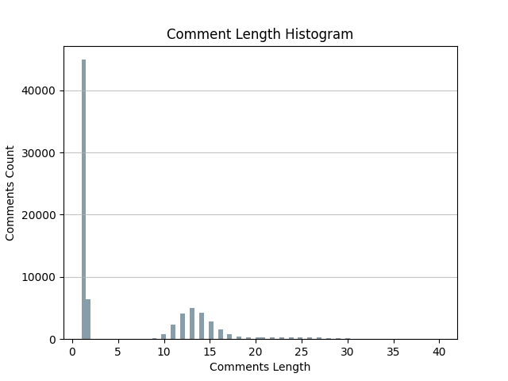

 Figure 2. The histogram of the comments' length in the ldbc social network.
:::

We can also draw a pie chart about the gender ratio in the social network.

```python
import matplotlib.pyplot as plt
import graphscope as gs
from graphscope.dataset.ldbc import load_ldbc


# load the modern graph as example.
graph = load_ldbc()

# Hereafter, you can use the `graph` object to create an `gremlin` query session
g = gs.gremlin(graph)

# Extract all person' gender property value
q1 = g.execute('g.V().hasLabel(\'person\').values(\'gender\')')
person_genders = q1.all()
# Count male and female
male_count = 0
female_count = 0
for gender in person_genders:
    if gender == "male":
        male_count += 1
    else:
        female_count += 1

# Draw pie chart
plt.pie(x=[male_count, female_count], labels=["Male", "Female"])
plt.show()
```

:::{figure-md}

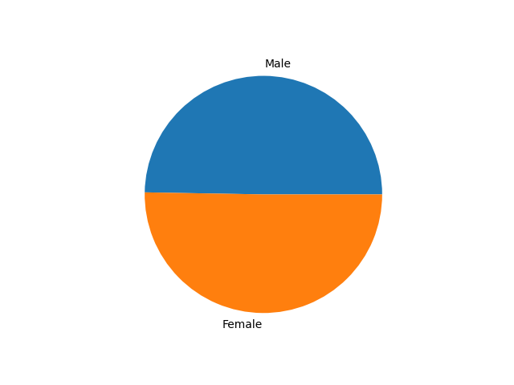

Figure 3. The pie chart of person's gender in the ldbc social network.
:::

## Basic Traversal Query

The main difference between Property Graph and Relational Database is that Property Graph treats the relationship(edges) among entities(vertices) at the first class. Therefore, it is easy to walk through vertices and edges in the Property Graph according to some pre-defined paths.

In GIE, we call such walk as  **Graph Traversal**: This type of workload involves traversing the graph from a set of source vertices while satisfying the constraints on the vertices and edges that the traversal passes. Graph traversal differs from the [analytics](https://graphscope.io/docs/latest/graph_analytics_workloads.html) workload as it typically accesses a small portion of the graph rather than the whole graph.

In this tutorial, we would like to discuss how to use gremlin steps to traverse the Property Graph. Furthermore, we will show some examples about how to apply graph traversals in real world data analytics.

### Expansion

The most basic unit in Graph Traversal is Expansion, which means starting from a vertex/edge and reaching its adjacencies. GIE currently supports the following expansion steps in gremlin:

- `out()`: Map the vertex to its outgoing adjacent vertices given the edge labels.
- `in()`: Map the vertex to its incoming adjacent vertices given the edge labels.
- `both()`: Map the vertex to its adjacent vertices given the edge labels.
- `outE()`: Map the vertex to its outgoing incident edges given the edge labels.
- `inE()`: Map the vertex to its incoming incident edges given the edge labels.
- `bothE()`: Map the vertex to its incident edges given the edge labels.
- `outV()`: Map the edge to its outgoing/tail incident vertex.
- `inV()`: Map the edge to its incoming/head incident vertex.
- `otherV()`: Map the edge to the incident vertex that was not just traversed from in the path history.
- `bothV():`Map the edge to its incident vertices.

Here is a local subgraph extracted from the LDBC Graph, which is formed by a center person vertex (id=216172782113784483) and all of its adjacent edges and vertices. Then we will use this subgraph to explain all of the expansion steps.


:::{figure-md}
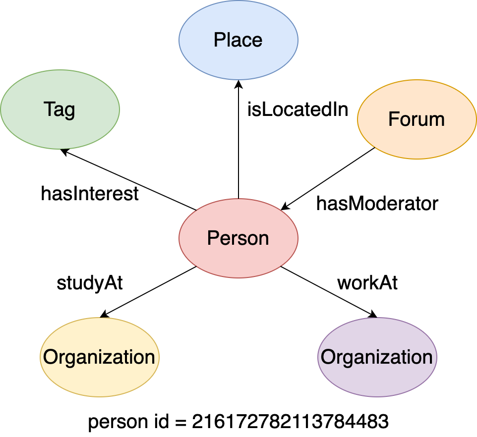

Figure 5. A local graph around a given person vertex.
:::

#### out(), in() and both()

All of these three steps start traverse from source vertices to their adjacent vertices. The differences between them are:

- `out()` traverse through the **outgoing** edges to the adjacent vertices
- `in()` traverse through the **incoming** edges to the adjacent vertices
- `both()` traverse through **both of the outgoing and incoming** edges to the adjacent vertices

For example, if you want to find vertex(id=216172782113784483)'s adjacent vertices by the three steps, you can write sentences in GIE like:

```python
# Traverse from the vertex to its adjacent vertices through its outgoing edges
q1 = g.execute('g.V(216172782113784483).out()')
# Traverse from the vertex to its adjacent vertices through its incoming edges
q2 = g.execute('g.V(216172782113784483).in()')
# Traverse from the vertex to its adjacent vertices through all of its incident edges
q3 = g.execute('g.V(216172782113784483).both()')
print(q1.all())
print(q2.all())
print(q3.all())
```

This figure illustrates the execution process of `q1`, `q2` and `q3`:

:::{figure-md}

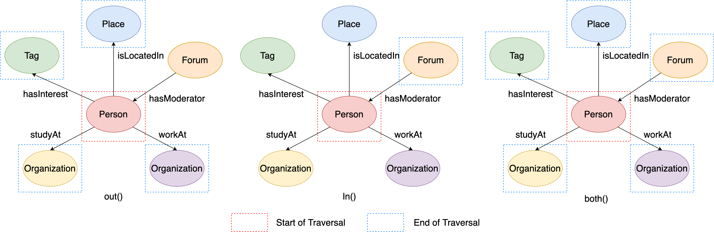

Figure 6. The examples of `out`/`in`/`both` steps.
:::

Therefore, the output of the above codes should be like:

```bash
# q1: vertex's adjacent vertices through outgoing edges
[v[432345564227569033], v[288230376151712472], v[144115188075856168], v[144115188075860911]]
# q2: vertex's adjacent vertices through incoming edges
[v[72057594037934114]]
# q3: vertex's adjacent vertices through all of its incident edges
[v[432345564227569033], v[288230376151712472], v[144115188075856168], v[144115188075860911], v[72057594037934114]]
```

In addition, the three steps all support using edge labels as its parameters to further limit the traversal edges, like `out`/`in`/`both(label1, label2, ...)`, which means it only can traverse through the edges whose label is one of {label 1, label 2, ..., label n}. For example:

```python
# Traverse from the vertex to its adjacent vertices through its incoming edges, and the edge label should be 'hasModerator'
q1 = g.execute('g.V(216172782113784483).in(\'hasModerator\')')
# Traverse from the vertex to its adjacent vertices through its outgoing edges, and the edge label should be either 'studyAt' or 'workAt'
q2 = g.execute('g.V(216172782113784483).out(\'studyAt\', \'workAt\')')
# Traverse from the vertex to its adjacent vertices through all of its incident edges, and the edge label should be either 'isLocatedIn' or 'hasModerator'
q3 = g.execute('g.V(216172782113784483).both(\'isLocatedIn\', \'hasModerator\')')
print(q1.all())
print(q2.all())
print(q3.all())
```

This figure illustrates the execution process of `q1`, `q2` and `q3`:

:::{figure-md}
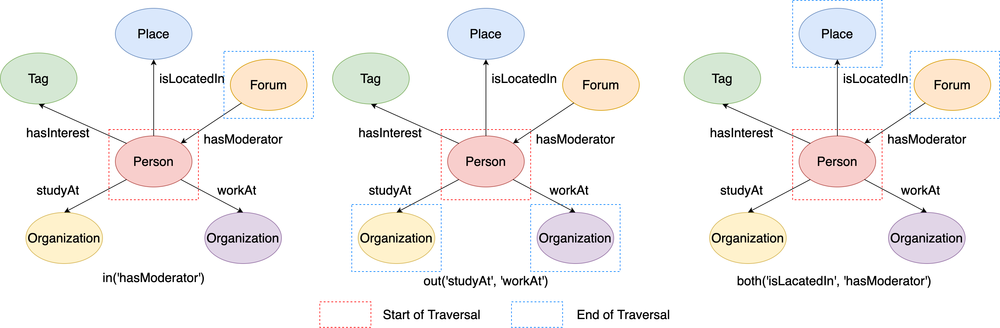

Figure 7. The examples of `out`/`in`/`both` steps from given labels.
:::


Therefore, the output of the above codes should be like:

```bash
# q1: vertex's adjacent vertices through incoming 'hasModerator' edges
[v[72057594037934114]]
# q1: vertex's adjacent vertices through outgoing 'studyAt' or 'workAt' edges
[v[144115188075860911], v[144115188075856168]]
# q1: vertex's adjacent vertices through 'isLocatedIn' or 'hasModerator' edges
[v[288230376151712472], v[72057594037934114]]
```

#### outE(), inE() and bothE()

All of these three steps start traverse from source vertices to their **adjacent edges**. Similar to `out()`, `in()` and `both()`, the differences between them are:

- `outE()` can only traverse to the **outgoing**  adjacent edges of the source vertices
- `inE()` can only traverse to the **incoming**  adjacent edges of the source vertices
- `bothE()` can traverse to **both of the outgoing and incoming** adjacent edges of the source vertices

For example, if you want to find vertex(id=216172782113784483)'s adjacent edges by the three steps, you can write sentences in GIE like:

```python
# Traverse from the vertex to its outgoing adjacent edges
q1 = g.execute('g.V(216172782113784483).outE()')
# Traverse from the vertex to its incoming adjacent edges
q2 = g.execute('g.V(216172782113784483).inE()')
# Traverse from the vertex to all of its adjacent edges
q3 = g.execute('g.V(216172782113784483).bothE()')
print(q1.all())
print(q2.all())
print(q3.all())
```

This figure illustrates the execution process of `q1`, `q2` and `q3`:

:::{figure-md}

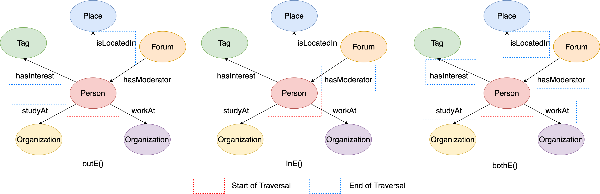

Figure 8. The examples of `outE`/`inE`/`bothE` steps.
:::

Therefore, the output of the above codes should be like:

```bash
# q1: vertex's incident outgoing edges
[e[432345564227582847][216172782113784483-hasInterest->432345564227569033], e[504403158265496227][216172782113784483-isLocatedIn->288230376151712472], e[864691128455136658][216172782113784483-workAt->144115188075856168], e[1008806316530991636][216172782113784483-studyAt->144115188075860911]]
# q2: vertex's incident incoming edges
[e[360287970189645858][72057594037934114-hasModerator->216172782113784483]]
# q3: vertex's incident edges
[e[360287970189645858][72057594037934114-hasModerator->216172782113784483], e[432345564227582847][216172782113784483-hasInterest->432345564227569033], e[504403158265496227][216172782113784483-isLocatedIn->288230376151712472], e[864691128455136658][216172782113784483-workAt->144115188075856168], e[1008806316530991636][216172782113784483-studyAt->144115188075860911]]
```

Similarly, the three steps also support using edge labels as its parameters to further limit the traversal edges, like `outE/inE.bothE(label1, label2, ...)`, which means it only can traverse to the edges whose label is one of {label 1, label 2, ..., label n}. For example:

```python
# Traverse from the vertex to its incident incoming edges, and the edge label should be 'hasModerator'
q1 = g.execute('g.V(216172782113784483).inE(\'hasModerator\')')
# Traverse from the vertex to its incident outgoing edges, and the edge label should be either 'studyAt' or 'workAt'
q2 = g.execute('g.V(216172782113784483).outE(\'studyAt\', \'workAt\')')
# Traverse from the vertex to its incident edges, and the edge label should be either 'isLocatedIn' or 'hasModerator'
q3 = g.execute('g.V(216172782113784483).bothE(\'isLocatedIn\', \'hasModerator\')')
print(q1.all())
print(q2.all())
print(q3.all())
```

This figure illustrates the execution process of `q1`, `q2` and `q3`:

:::{figure-md}
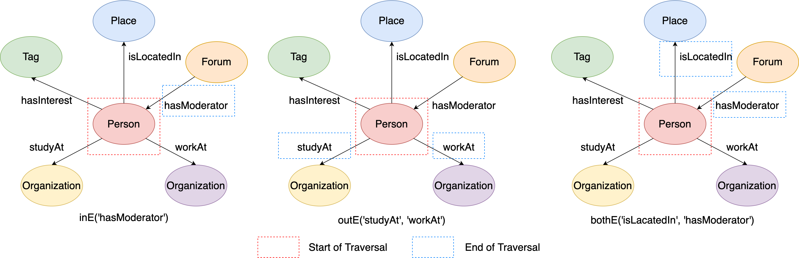

Figure 9. The examples of `outE`/`inE`/`bothE` steps from given labels.
:::

Therefore, the output of the above codes should like:

```bash
# q1: vertex's incident incoming 'hasModerator' edges
[e[360287970189645858][72057594037934114-hasModerator->216172782113784483]]
# q2: vertex's incident outgoing 'studyAt' or 'workAt' edges
[e[1008806316530991636][216172782113784483-studyAt->144115188075860911], e[864691128455136658][216172782113784483-workAt->144115188075856168]]
# q3: vertex's incident 'isLocatedIn' or 'hasModerator' edges
[e[360287970189645858][72057594037934114-hasModerator->216172782113784483], e[504403158265496227][216172782113784483-isLocatedIn->288230376151712472]]
```

#### outV(), inV(), bothV() and otherV()

When reaching an edge during the traversal, you may be interested in its incident vertices. Therefore, GIE supports gremlin steps that traverse from source edges to their incident vertices.

:::{figure-md}
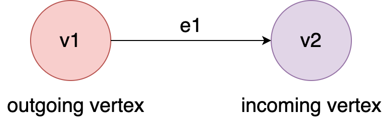

Figure 10. The examples of outgoing/incoming vertex of an edge.
:::


For en edge `e1` whose direction is from `v1` to `v2`, we call `v1` as 'outgoing vertex' and `v2` as 'incoming' vertices.

- `outV()`: traverse from source edges to the outgoing vertices
- `inV()`: traverse from source edges to the incoming vertices
- `bothV()`: traverse from source edges to both of the outgoing and incoming vertices
- `otherV()`: this step is a little bit special, it traverse from source edges to the incident vertices that haven't appear in the traversal history. It will be explained in details later.

In the local subgraph, assume that currently we are at 'isLocatedIn' edge. If you want to get its incident vertices through `outV()/inV()/bothV()` step, you can write sentences in GIE like:

```python
# Traverse from the edge to its outgoing incident vertex
q1 = g.execute('g.V(216172782113784483).outE(\'isLocatedIn\').outV()')
# Traverse from the edge to its incoming incident vertex
q2 = g.execute('g.V(216172782113784483).outE(\'isLocatedIn\').inV()')
# Traverse from the edge to both of its incident vertex
q3 = g.execute('g.V(216172782113784483).outE(\'isLocatedIn\').bothV()')
print(q1.all())
print(q2.all())
print(q3.all())
```

This figure illustrates the execution process of `q1`, `q2` and `q3`:

:::{figure-md}

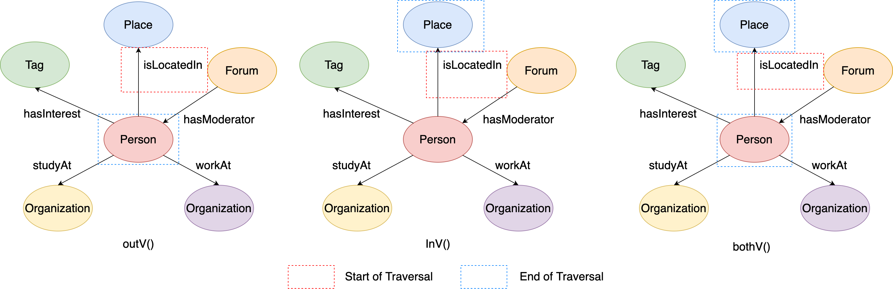

Figure 11. The examples of outV/inV/bothV steps.
:::

Therefore, the output of the above codes should like:

```bash
# q1: the edge's outgoing vertex
[v[216172782113784483]]
# q2: the edge's incoming vertex
[v[288230376151712472]]
# q3: both of the edge's outgoing and incoming vertices
[v[216172782113784483], v[288230376151712472]]
```

For `otherV()`, it will only traverse to the vertices that haven't been reached in the traversal history. For example, the 'isLocatedIn' edge is reached from the outgoing vertex 'Person', then the `otherV()`  of 'isLocatedIn' edge is its incoming vertex 'Place', because it hasn't been visited before.

```python
# Traverse from the edge to its incident vertex that hasn't been reached
q1 = g.execute('g.V(216172782113784483).outE(\'isLocatedIn\').otherV()')
print(q1.all())
```

The output should be like:

```bash
# q1: 'place' vertex, which has not been reached before
[v[288230376151712472]]
```

#### Multiple Expansion Steps

You may have already noticed that graph traversal supports multiple expansion steps. For example, in gremlin sentence`g.V(216172782113784483).outE('isLocatedIn').inV()`, `outE('isLocatedIn')` is first expansion and `inV()` is the second expansion.

The figure illustrates the execution process of this gremlin sentence:

:::{figure-md}

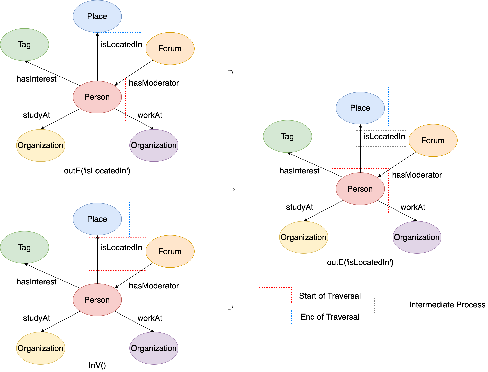

Figure 12. The examples of `outE` followed by `inV`.
:::

During the traversal, it firstly start from the source vertex 'person', and get to the 'isLocatedIn' edge. Then it starts from the 'isLocatedIn' edge, and get to the 'place' vertex. Thus the traversal ends, the 'place' vertex is the end of this traversal, and the 'isLocatedIn' edge can be regarded as the intermediate process of the traversal.

When GIE handle continuous multiple expansion steps during the traversal, the next expansion step will use the its previous expansion step's output as its starting points. According to this property, we can summarize the following equivalent rules:

- `out() = outE().inV() = outE().otherV()`
- `in() = inE().outV() = inE().otherV()`
- `both() = bothE().otherV()`

It is sure that GIE can support multiple vertex expansion steps. For example, the place (city) the person is located in 'isPartOf' a larger place (country). If you want to find the larger place, you can write multiple vertex expansion steps in GIE as:

```python
# Traverse from the vertex to the larger place it is located in by two vertex expansions
q1 = g.execute('g.V(216172782113784483).out(\'isLocatedIn\').out(\'isPartOf\')')
print(q1.all())
```

This figure illustrates the execution process:

:::{figure-md}
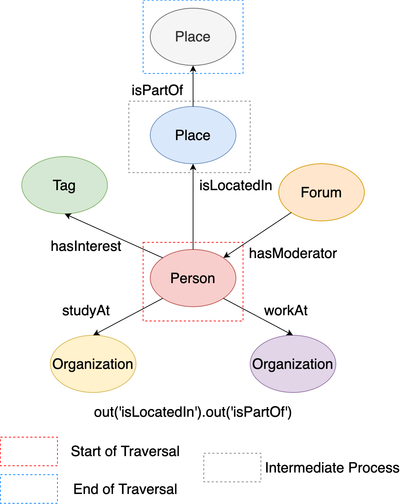

Figure 13. The examples of two-hop outgoing vertices.
:::

Therefore, the output of the gremlin sentence should be like:

```bash
# The larger place(country) that the person is located in
[v[288230376151711797]]
```

There is one problem of currently introduced gremlin traversal sentences: only the last step's results are kept. Sometimes, you may need to record the intermediate results of the traversal for further analysis, but how? Actually, you can use the `as(TAG)` and `select(TAG 1, TAG 2, ..., TAG N)` steps to keep the intermediate results:

- `as(TAG)`: it gives a tag to the step it follows, and then its previous step's value can be accessed through the tag.
- `select(TAG 1, TAG 2, ..., TAG N)`: select all the values of the steps the given tags refer to.

Extend from previous example, if you want to keep person, smaller place(city) and larger place(country) together in the output, you can write gremlin sentence in GIE like:

```python
# a: person, b: city, c: country
q1 = g.execute('g.V(216172782113784483).as(\'a\')\
                 .out(\'isLocatedIn\').as(\'b\')\
                 .out(\'isPartOf\').as(\'c\')\
                 .select(\'a\', \'b\', \'c\')')
print(q1.all())
```

where tag 'a' refers to 'person' vertex, tag 'b' refers to 'city' vertex and tag 'c' refers to 'country' vertex. The output should be like:

```bash
[{'a': v[216172782113784483], 'b': v[288230376151712472], 'c': v[288230376151711797]}]
```

#### Expansion from many starting points

Currently, we only discuss the expansion from only one vertex/edges. However, it is very common to write gremlin sentence like `g.V().out()` in GIE. In previous tutorials we have known that `g.V()` will get all the vertices in the graph. Then how to understand the meaning of `g.V().out()`?

The explain it more clear, let's firstly look at a much simpler situation: starting from only two vertices. This is a subgraph of LDBC Graph formed by two person vertices' local graphs, where the two person vertices' ids are 216172782113784483 and 216172782113784555.

:::{figure-md}

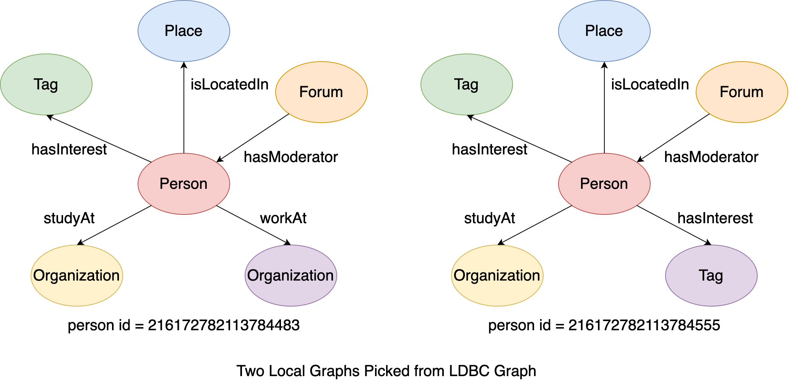

Figure 14. The examples of two local graphs.
:::

In addition, we further limit the starting points of the traversal to be exactly the two person vertices. Therefore, we can write the following gremlin sentence in GIE:

```python
# Traverse from the two source vertices to their adjacent vertices through their incident outgoing edges
q1 = g.execute('g.V(216172782113784483, 216172782113784555).out()')
print(q1.all())
```

The figure illustrates the execution process of `q1`:

:::{figure-md}

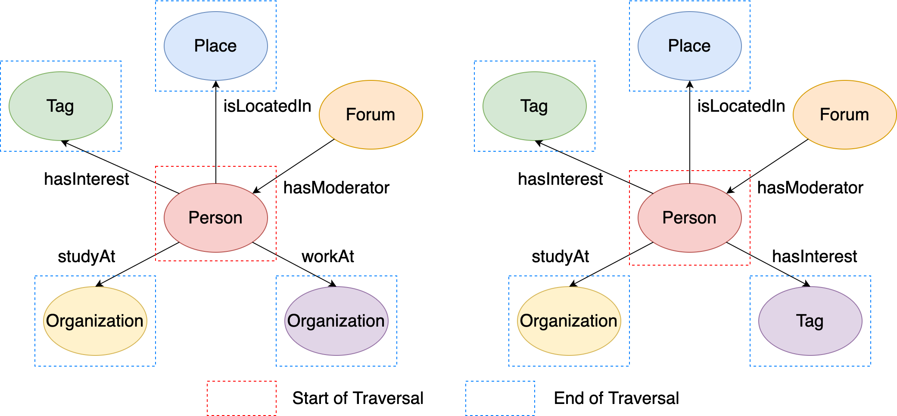

Figure 15. The results of outgoing neighbors from two given vertices.
:::

The traversal starts from the two person vertices, and then the `out()` step map the two source vertices both to their outgoing adjacent vertices. Therefore, the output should be like:

```bash
[v[432345564227569033], v[288230376151712472], v[144115188075856168], v[144115188075860911], v[432345564227569357], v[432345564227570524], v[288230376151712984], v[144115188075861043]]
```

which are the outgoing adjacent vertices of the two 'person' vertices.

It is more clear to understand if you keep person vertex's info in the final output:

```python
q1 = g.execute('g.V(216172782113784483, 216172782113784555).as(\'a\')\
                 .out().as(\'b\')\
                 .select(\'a\', \'b\')')
print(q1.all())
```

```bash
# the first 4 elements are tuple of vertex(id=216172782113784483) and its outgoing adjacent vertex
# the last 4 elements are tuple of vertex(id=216172782113784555) and its outgoing adjacent vertex
[{'a': v[216172782113784483], 'b': v[432345564227569033]},
 {'a': v[216172782113784483], 'b': v[288230376151712472]},
 {'a': v[216172782113784483], 'b': v[144115188075856168]},
 {'a': v[216172782113784483], 'b': v[144115188075860911]},
 {'a': v[216172782113784555], 'b': v[432345564227569357]},
 {'a': v[216172782113784555], 'b': v[432345564227570524]},
 {'a': v[216172782113784555], 'b': v[288230376151712984]},
 {'a': v[216172782113784555], 'b': v[144115188075861043]}]
```

Generally, it is better to understand the expansion and traversal step from traverser's aspect. Every expansion step actually map current traversers to another series traversers, and the complete traversal can be regarded as the transformations of traversers.  Let's take `g.V().out().in()` as an example to explain it.

- At the very beginning, `g.V()` extracts all the vertices from the graph, and these vertices form the initial traversers: each traverser contains the corresponding vertex.
- Then `out()` maps every traverser (vertex) to its outgoing adjacent vertices, and these outgoing adjacent vertices form the next series of traversers.
- Finally, `in()` maps every traverser (vertex) to its incoming adjacent vertices, and these incoming adjacent vertices form the next series of traversers, and it is the final output of the gremlin sentence.

This figure illustrates the overview of the traverser transformation during the traversal of `g.V().out().in()`.

:::{figure-md}
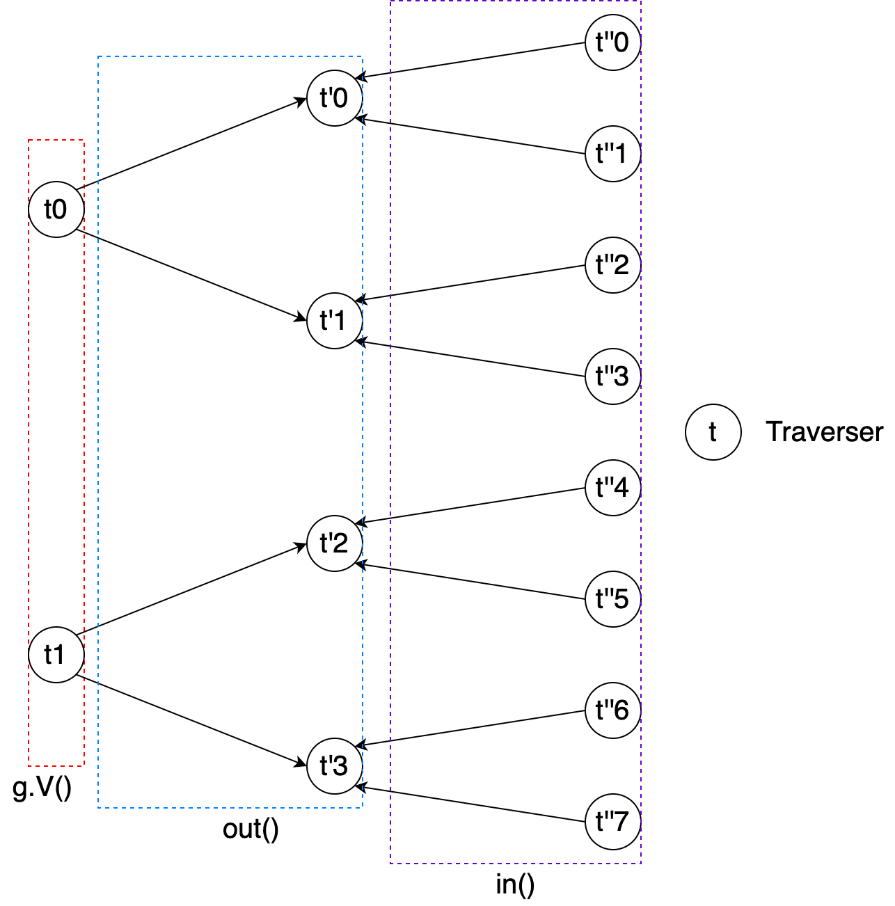

Figure 16. The overview of traversers' transformation.
:::

In addition, this figure shows the details of the traverser's change after every expansion step and `as(TAG)` step during the execution of gremlin sentence `g.V().as('a').out().as('b').in().as('c')`.

:::{figure-md}
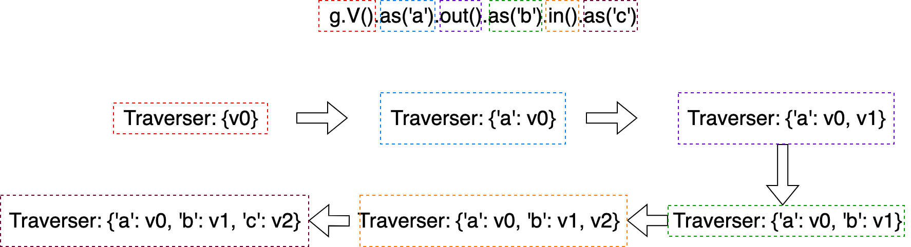

Figure 17. The mapping details of the above traversers' transformation.
:::


### Filter & Expansion

#### Apply filters after expansion

In last tutorial, we have discussed that we can use `has(...)` series of steps to apply filters to the extracted vertices and edges. Actually, these steps can be applied after expansion steps either that filter on the current traversers.

Still using `g.V().out().in()` as the example, if we hope that:

- The traversers(vertices) after `g.V()` has label 'person'

-  The traversers(vertices) after the first expansion `out()` have property 'browserUsed' and the value is 'Chrome'
- The traversers(vertices) after the second expansion `in()` have property 'length' and the length is < 5, and the label of the expansion edge is 'replyOf'

```python
# Traversers(vertices) after g.V() has label 'person'
# Traversers(vertices) after out() has property 'browserUsed' and the value is 'Chrome'
# Traversers(vertives) after in('replyOf') has property 'length' and the length is < 5
q1 = g.execute('g.V().hasLabel(\'person\')\
                     .out().has(\'browserUsed\', \'Chrome\')\
                     .in(\'replyOf\').has(\'length\', lt(5))')
print(q1.all())
```

The output should be like:

```bash
[v[54336], ..., v[33411]]
```

Furthermore, for gremlin sentences contain `as(TAG)` steps, we can introduce `where()` step to apply filters on traversers based on the tagged values.

Extend from previous example that we add tag 'a' and 'b' after the two `has(...)` step:

```python
q1 = g.execute('g.V().hasLabel(\'person\')\
                     .out().has(\'browserUsed\', \'Chrome\').as(\'a\')\
                     .in(\'replyOf\').has(\'length\', lt(5)).as(\'b\')')
```

If we hope that the vertices of the tag 'a' and 'b' have the same property value on property 'browserUsed', we can add a `where` step and write the following gremlin sentence in GIE:

```python
# Traversers(vertices) after g.V() has label 'person'
# Traversers(vertices) after out() has property 'browserUsed' and the value is 'Chrome'
# Traversers(vertives) after in('replyOf') has property 'length' and the length is < 5
# vertex a and b have the same value of 'browserUsed' property
q1 = g.execute('g.V().hasLabel(\'person\')\
                     .out().has(\'browserUsed\', \'Chrome\').as(\'a\')\
                     .in(\'replyOf\').has(\'length\', lt(5)).as(\'b\')\
                     .where("b", eq("a")).by("browserUsed")\
                     .select(\'a\', \'b\')')
print(q1.all())
print(q1.all())
```

The output should be like:

```bash
[{'a': v[360287970189700805], 'b': v[59465]}, ..., {'a': v[33403], 'b': v[33411]}]
```

#### Expansion as filters

In addition, not only can we add filters after expansion steps, but also we can use expansion step as the filtering predicate with `where(...)` step. For example, if we want to extract all the vertices having at least 5 outgoing incident edges, we can write a gremlin sentence with `where(...)` step as following:

```python
# Retrieve vertices having at least 5 outgoing incident edges
q1 = g.execute('g.V().where(outE().count().is(gte(5)))')
print(q1.all())
```

### Path Expansion (Syntactic Sugar)

Until now, we can use expansion steps, filter steps and auxiliary steps like `as(TAG)` to write complicated gremlin sentences to traverse the graph. However, there are still two shortcomings:

- If we want to find a vertex which is 10-hop(edges) away from the current vertex, we need to write expansion step 10 times, which is very cost-ineffective.
- The number of hops from the source to the destination is arbitrary. For example, if we want to find all vertices which can be reached from a source vertex within 3-hops, it can not be solved by already introduced steps.

Therefore, we would like to introduce path expansion to solve the two problems, which extends the expansion steps `out()`, `in()` and `both()` as the [syntactic sugar](./supported_gremlin_steps.md).

In the three expansion steps, you can now write as `out/in/both(lower..upper, label1, label2...)`, where `lower` is the minimum number of hops in the path, and `upper-1` is the maximum number of hops in the path. For example, `out(3..5)` means expansion through the outgoing edges 3 or 4 times. Therefore,  `lower <= upper - 1`, otherwise the sentence is illegal.

Path expansion is very flexible. Therefore, we design the `with()` step followed by path expansion step to provide two options for user to configure the corresponding behaviors of the path expansion step:

- `PATH_OPT`: Since path expansion allows expand the same step multiple times, it is likely to have duplicate vertices in the path. If the `PATH_OPT` is set to `ARBITRARY`, paths having duplicate vertices will be kept in the traversers; otherwise, if the `PATH_OPT` is set to `SIMPLE_PATH`, paths having duplicate vertices will be filtered.
- `RESULT_OPT`: Sometimes, you may be interested in all the vertices in the path, but sometimes you may be only interested in the last vertex of the path. Therefore, when the `RESULT_OPT` is set to `ALL_V`, all the vertices in the path will be kept to the output. Instead, when the `RESULT_OPT` is set to `END_V`, only the last vertex of the path will be kept.

At last, we would like to introduce `endV()` step in path expansion. Since a path may contain many vertices, all kept vertices are stored in a path collection by default. Therefore, `endV()` is used to unfold the path collection. For example, if the traversers after path expansion is `[[v[1], v[2], v[3]]`, where the inner `[v[1], v[2], v[3]]` is the path collection.   With the `endV()`, `v[1]`, `v[2]` and `v[3]` are picked out from the path collection, and the traversers becomes `[v[1], v[2], v[3]]`

:::{figure-md}
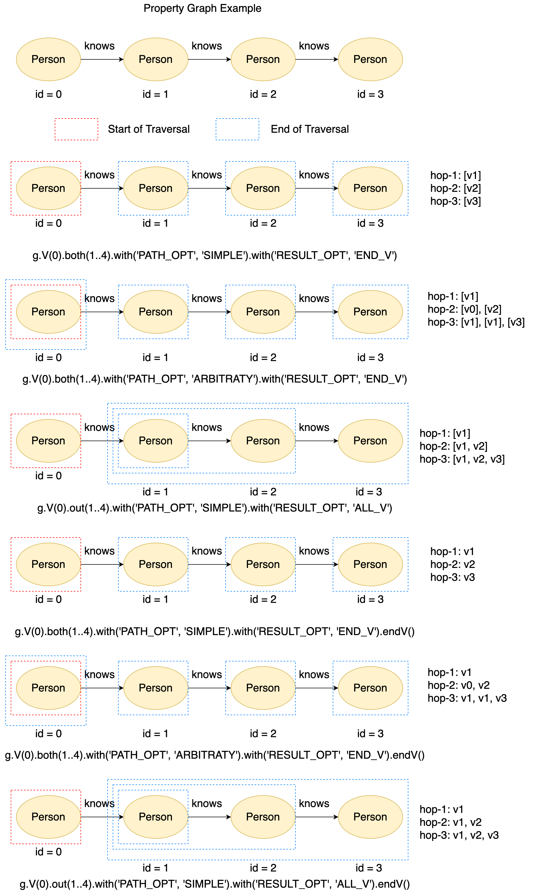

Figure 18. The examples of path expansion.
:::
### Real Applications

Graph traversal enables us to conduct more complicated data analytics on the graph. 

For example, the path `comment-hasCreator->person->isLocatedIn->city-isPartOf->country` can help to determine the nationality of `comments`. Therefore,  we can calculate the histogram of comment length for comments from China easily with GIE:

```python
import matplotlib.pyplot as plt
import numpy as np
import graphscope as gs
from graphscope.dataset.ldbc import load_ldbc

# load the modern graph as example.
graph = load_ldbc()

# Hereafter, you can use the `graph` object to create an `gremlin` query session
g = gs.gremlin(graph)
# Extract all comments' contents in China
q1 = g.execute('g.V().hasLabel(\'person\').where(out(\'isLocatedIn\').out(\'isPartOf\').values(\'name\').is(eq(\'China\'))).in(\'hasCreator\').values(\'content\')')
comment_contents = q1.all()
comment_length = [len(comment_content.split()) for comment_content in comment_contents];

plt.hist(x=list(filter(lambda x:(x< 50), comment_length)), bins='auto', color='#607c8e',alpha=0.75)
plt.grid(axis='y', alpha=0.75)
plt.xlabel('Comments Length')
plt.ylabel('Comments Count')
plt.title('Comment Length Histogram for comments from China')
plt.show()
```

:::{figure-md}
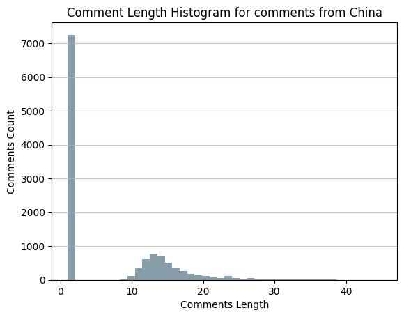

Figure 19. Comments length histogram in China.
:::

Or we can estimate the browser market share in Japan:

```python
import matplotlib.pyplot as plt
import graphscope as gs
from graphscope.dataset.ldbc import load_ldbc
from collections import Counter


# load the modern graph as example.
graph = load_ldbc()

# Hereafter, you can use the `graph` object to create an `gremlin` query session
g = gs.gremlin(graph)

# Extract all person' gender property value
q1 = g.execute('g.V().hasLabel(\'person\').where(out(\'isLocatedIn\').out(\'isPartOf\').values(\'name\').is(eq(\'Japan\'))).in(\'hasCreator\').values(\'browserUsed\')')
browsers_used = q1.all()
browser_list = ['Firefox', 'Chrome', 'Internet Explorer', 'Safari']
# Count Firefox, Chrome, Internet Explorer and Safari
browser_counts = Counter(browsers_used)

# Draw pie chart
plt.pie(x=[browser_counts[browser] for browser in browser_list], labels=browser_list, autopct='%1.1f%%')
plt.show()
```

:::{figure-md}
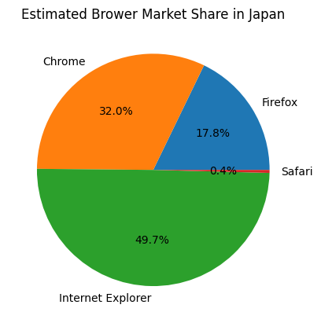

Figure 20. Estimated Japan Browser Market Share
:::

## Pattern Match

Suppose you want to find two `persons` and the `universities` they `studyAt` in the graph that:

1. The two `person` `know` each other
2. The two `person` `studyAt` the same `university`

With the method taught previously , you can write the following code in GIE to achieve this purpose:

```python
q1 = g.execute('g.V().hasLabel(\'person\').as(\'person1\').both(\'knows\').as(\'person2\')\
                     .select(\'person1\').out(\'studyAt\').as(\'university1\')\
                     .select(\'person2\').out(\'studyAt\').as(\'university2\')\
                     .where(\'university1\', eq(\'university2\'))\
                     .select(\'person1\', \'person2\', \'university1\')')
print(q1.all())
```

- First, you find all pairs of `person1` and `person2` who know each other.
- Then, you find `person1`'s university as `university1` and `person2`'s university as `university2`.
- Next, you use the `where(...)` step to check whether `university1` is equal to `university2` and filter out those that are not equal.
- Finally, you use the `select(...)` step to project `person1`, `person2`, and `university1` (now `university1` is the same as `university2`).

The output of should be like:

```bash
# Person1 and 2 know each other and study at the same university
[{'person2': v[216172782113784481],
  'person1': v[216172782113784279],
  'university1': v[144115188075858884]},
 {'person2': v[216172782113784361],
  'person1': v[216172782113784291],
  'university1': v[144115188075858879]},
 {'person2': v[216172782113784642],
  'person1': v[216172782113784291],
  'university1': v[144115188075858879]},
 {'person2': v[216172782113784473],
  'person1': v[216172782113784328],
  'university1': v[144115188075858700]},
 {'person2': v[216172782113784700],
  'person1': v[216172782113784331],
  'university1': v[144115188075860619]},
 {'person2': v[216172782113784375],
  'person1': v[216172782113784333],
  'university1': v[144115188075858813]},
 {'person2': v[216172782113784593],
  'person1': v[216172782113784361],
  'university1': v[144115188075858879]},
 {'person2': v[216172782113784642],
  'person1': v[216172782113784361],
  'university1': v[144115188075858879]},
 {'person2': v[216172782113784291],
...
  'person1': v[216172782113784688],
  'university1': v[144115188075860870]},
 {'person2': v[216172782113784047],
  'person1': v[216172782113784692],
  'university1': v[144115188075862429]}]
```

Actually, such kind of problem is called graph pattern matching. It means, you define a pattern at first. The pattern can be either described by the natural language:

- "Find two `persons` and the `universities` they `studyAt` in the graph that the two `person` `know` each other and the two `person` `studyAt` the same `university`"

or can be illustrated as a graph pattern as shown in the following.

:::{figure-md}
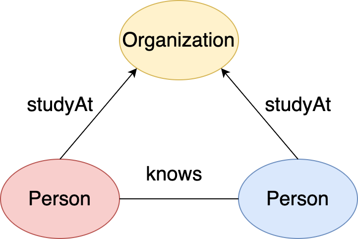

Figure 21. Pattern: two person know each other and study at the same university.
:::

Then you aim to find all the matched subgraphs that are [isomorphic](https://en.wikipedia.org/wiki/Graph_isomorphism) to the pattern. Under graph isomorphism, a subgraph and the pattern are matched if, when there is an edge between vertices in the pattern, there is an equivalent edge between two matched vertices in the subgraph. In addition, a vertex in the subgraph cannot match multiple pattern vertices. 

For example, this is a local graph of university vertex(id = 144115188075858884) in the LDBC Graph: 

:::{figure-md}
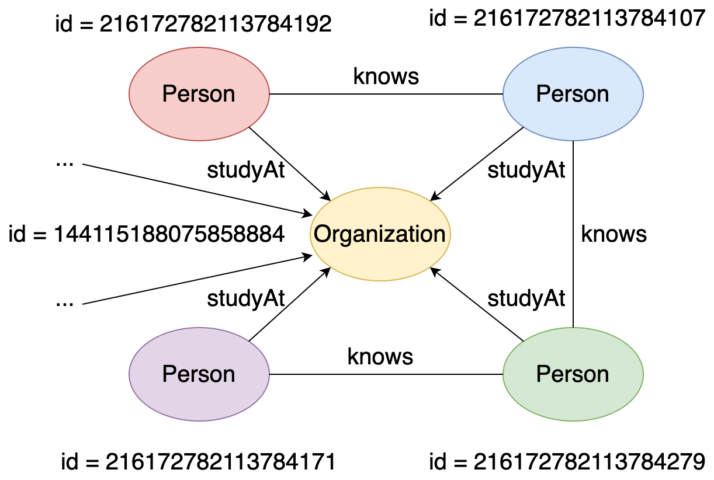

Figure 22. Local graph of a university vertex. 
:::

and here are the matched subgraphs in this local graph:

:::{figure-md}
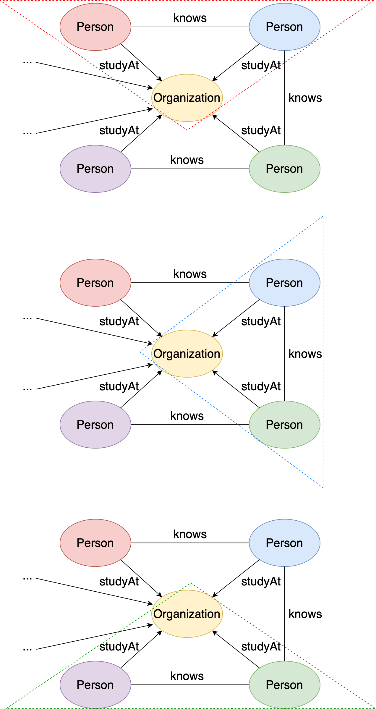

Figure 23. Three matched subgraphs in the local graph. 
:::

The matched instances in the local graph are:

- `{person1: v[216172782113784192], person2: v[216172782113784107], university: v[144115188075858884]}`
- `{person1: v[216172782113784107], person2: v[216172782113784192], university: v[144115188075858884]}`
- `{person1: v[216172782113784107], person2: v[216172782113784279], university: v[144115188075858884]}`
- `{person1: v[216172782113784279], person2: v[216172782113784107], university: v[144115188075858884]}`
- `{person1: v[216172782113784279], person2: v[216172782113784171], university: v[144115188075858884]}`
- `{person1: v[216172782113784171], person2: v[216172782113784279], university: v[144115188075858884]}`

There are a total of 6 matched instances (compared to 3 subgraphs) because changing the position of `person1` and `person2` leads to a new matched instance.

As shown at the beginning of this section, you can write a regular Gremlin query to conduct pattern matching. However, it has two shortcomings:

1. The query sentence is complex. If you write such a long query sentence for this simple triangle pattern, what about more complicated patterns like squares, butterflies, or cliques?
2. There's almost no optimization. The speed of pattern matching largely depends on how you write the query sentence.

To solve these two problems, GIE supports the `match(...)` step in Gremlin, which is specifically designed for pattern matching.

The `match()` step provides a more declarative form of graph querying based on the notion of pattern matching:

- Every `match()` step is a collection of `sentences`, and every `sentence` is a regular Gremlin traverser sentence but starts and ends with given tags.
- Then, GIE uses the underlying MatchAnalyticsAlgorithm to connect all the `sentences` together to form a pattern structure based on those start and end tags.
- Finally, GIE applies its MatchOptimizationAlgorithm to generate an optimized matching strategy for the formed pattern and conduct the pattern matching.

Therefore, it is much more efficient to solve pattern matching problems using Gremlin's built-in `match()` step.

As for the pattern shown at the beginning of this section (two persons who know each other and study at the same university), you can write the following code in GIE using the `match()` step:

```python
# Person1 and 2 know each other and study at the same university
q1 = g.execute('g.V().match(__.as(\'person1\').both(\'knows\').as(\'person2\'),\
                       __.as(\'person1\').out(\'studyAt\').as(\'university\'),\
                       __.as(\'person2\').out(\'studyAt\').as(\'university\'))')
print(q1.all())
```

The output should be the same as the previous self-written pattern matching sentences: 

```bash
[{'person2': v[216172782113784361],
  'person1': v[216172782113784291],
  'university': v[144115188075858879]},
 {'person2': v[216172782113784642],
  'person1': v[216172782113784291],
  'university': v[144115188075858879]},
 {'person2': v[216172782113784375],
  'person1': v[216172782113784333],
  'university': v[144115188075858813]},
 {'person2': v[216172782113784593],
  'person1': v[216172782113784361],
  'university': v[144115188075858879]},
 {'person2': v[216172782113784642],
  'person1': v[216172782113784361],
  'university': v[144115188075858879]},
 {'person2': v[216172782113784587],
  'person1': v[216172782113784363],
  'university': v[144115188075860919]},
 {'person2': v[216172782113784532],
  'person1': v[216172782113784400],
  'university': v[144115188075861858]},
 {'person2': v[216172782113784491],
  'person1': v[216172782113784401],
  'university': v[144115188075858086]},
 {'person2': v[216172782113784598],
...
  'person1': v[216172782113784629],
  'university': v[144115188075858881]},
 {'person2': v[216172782113783931],
  'person1': v[216172782113784657],
  'university': v[144115188075858708]}]
```

Let's present a more complex pattern matching example: we want to find two `persons` A and B such that:

- they know each other
- `person` A creates a `message`, which is replied to by a `comment` created by `person` B

This figure illustrates the pattern:

:::{figure-md}
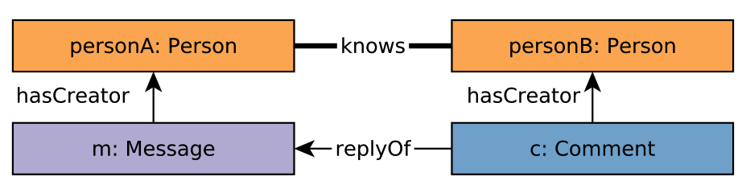

Figure 24. Pattern: two person know each other, and one person creates a comment replying a message created by the other. 
:::

We can easily match this pattern with gremlin `match(...)` step:

```python
# pA and pB know each other
# pB create a comment that reply a message created by pA
q1 = g.execute('g.V().match(__.as(\'pA\').both(\'knows\').as(\'pB\'),\
                       __.as(\'pA\').in(\'hasCreator\').as(\'m\'),\
                       __.as(\'pB\').in(\'hasCreator\').as(\'c\'),\
                       __.as(\'c\').out(\'replyOf\').as(\'m\'))')
print(q1.all())
```

The output should be like:

```bash
[{'pA': v[216172782113783809], 'pB': v[216172782113784011], 'c': v[3], 'm': v[360287970189640007]}, {'pA': v[216172782113783809], 'pB': v[216172782113784011], 'c': v[4], 'm': v[360287970189640007]}, {'pA': v[216172782113783809], 'pB': v[216172782113784011], 'c': v[5], 'm': v[360287970189640007]}, {'pA': v[216172782113783809], 'pB': v[216172782113784011], 'c': v[13], 'm': v[360287970189640007]}, {'pA': v[216172782113783809], 'pB': v[216172782113784011], 'c': v[18], 'm': v[360287970189640007]}, {'pA': v[216172782113783809], 'pB': v[216172782113784011], 'c': v[19], 'm': v[360287970189640007]}, {'pA': v[216172782113783809], 'pB': v[216172782113784011], 'c': v[22], 'm': v[360287970189640008]}, {'pA': v[216172782113783809], 'pB': v[216172782113784011], 'c': v[27], 'm': v[360287970189640008]}, {'pA': v[216172782113783809], 'pB': v[216172782113784011], 'c': v[29], 'm': v[360287970189640009]}, {'pA': v[216172782113783809], 'pB': v[216172782113784011], 'c': v[34], 'm': v[360287970189640009], ......, }]
```

Note that every match sentence inside the `match(...)` step supports filter steps and path expands. For example, if you hope that the `knows` edge is a `1..3` multi-hop, and the `message` and `comment` are created after 2012-01-01, you can write:

```python
# pA and pB know each other
# pB create a comment that reply a message created by pA
q1 = g.execute('g.V().match(__.as(\'pA\').both(\'1..3\', \'knows\').as(\'pB\'),\
                       __.as(\'pA\').in(\'hasCreator\').has(\'creationDate\', gt(\'2012-01-01\')).as(\'m\'),\
                       __.as(\'pB\').in(\'hasCreator\').has(\'creationDate\', gt(\'2012-01-01\')).as(\'c\'),\
                       __.as(\'c\').out(\'replyOf\').as(\'m\'))')
print(q1.all())
```

The output should be like:

```bash
[{'pA': v[216172782113783812], 'pB': v[216172782113783882], 'c': v[36], 'm': v[360287970189640010]}, {'pA': v[216172782113783812], 'pB': v[216172782113783882], 'c': v[37], 'm': v[360287970189640010]}, {'pA': v[216172782113783812], 'pB': v[216172782113784105], 'c': v[38], 'm': v[360287970189640010]}, {'pA': v[216172782113783812], 'pB': v[216172782113783882], 'c': v[41], 'm': v[360287970189640010]}, {'pA': v[216172782113784105], 'pB': v[216172782113783882], 'c': v[43], 'm': v[42]}, {'pA': v[216172782113783814], 'pB': v[216172782113783962], 'c': v[50], 'm': v[360287970189640135]}, {'pA': v[216172782113783814], 'pB': v[216172782113784171], 'c': v[52], 'm': v[360287970189640135]}, {'pA': v[216172782113784481], 'pB': v[216172782113784199], 'c': v[54], 'm': v[49]}, {'pA': v[216172782113783814], 'pB': v[216172782113784038], 'c': v[56], 'm': v[360287970189640135]}, {'pA': v[216172782113783816], 'pB': v[216172782113784144], 'c': v[175], 'm': v[360287970189640462], ......, }]
```
## Relational Operations

Then we would like to introduce more relational operations of gremlin steps that GIE supports. 

### Filter Steps

#### `hasId()`

In previous tutorial, we have introduced that you can use `g.V(id)` to pick out the vertex having specific required global id from the graph. But, what if we want to apply filters based on global id during the traversal? 

You can use the `hasId(id)` step to achieve the purpose. For example, if you want the expanded vertex exactly having global id 144115188075861858, you can write the following codes in GIE:

```python
q1 = g.execute('g.V().out().hasId(144115188075861858)')
print(q1)
```

The output should be like:

```bash
[v[144115188075861858], v[144115188075861858], v[144115188075861858]]
```

Note that `hasId(id)` is different from `has('id', id)`! As mentioned before, `hasId(id)` apply filter based on the global id, while `has('id', id)` apply filter based on the local id. For example, if you write:

```python
q1 = g.execute('g.V().has(\'id\', 0)')
print(q1.all())
```

The output would be:

```bash
[v[72057594037927936],
 v[144115188075855872],
 v[288230376151711744],
 v[432345564227567616],
 v[504403158265495555]]
```

which are all the vertices whose local id is 0. 

#### `where()`

In previous tutorial, we have introduced that `where()` step in gremlin sentences having `as()` steps can be used to filter traversers based on the tagged values:

```python
# vertex tagged as 'a' should be the same as vertex 'tagged' as b
q1 = g.execute('g.V(216172782113783808).as(\'a\')\
                 .out(\'knows\').in(\'knows\').as(\'b\').where(\'b\', P.eq(\'a\'))')
print(q1.all())
```

The output should be like:

```bash
[v[216172782113783808], v[216172782113783808], v[216172782113783808]]
```

In addition, `where()` step can be followed by a `by(...)` step to provide much more powerful functionalities: the selected entities may not need to compare themselves, but compare their properties. 

For example, the following gremlin sentence require vertex 'a' and 'b' having the value on same 'firstName' :

```python
# vertex tagged as 'a' and 'b' should have the same property 'name'
q1 = g.execute('g.V(216172782113783808).as(\'a\').out(\'knows\').in(\'knows\').as(\'b\')\
                 .where(\'b\', P.eq(\'a\')).by(\'firstName\')')
print(q1.all())
```

The output should also be like:

```bash
[v[216172782113783808], v[216172782113783808], v[216172782113783808]]
```

In addition, if you hope that vertex 'a' and 'b' having the same output degree, you can write:

```python
# vertex tagged as 'a' and 'b' should have the output degree
q1 = g.execute('g.V(216172782113783808).as(\'a\').out(\'knows\').in(\'knows\').as(\'b\')\
                 .where(\'b\', P.eq(\'a\')).by(out().count())')
print(q1.all())
```

The output should be like:

```bash
# v[216172782113784171] is not v[216172782113783808](the source vertex),
# but have the same output degree
[v[216172782113783808], v[216172782113783808], v[216172782113783808], v[216172782113784171]]
```

#### `dedup()`

Suppose that you are interested in how many forums having members from India, and you may write the following gremlin sentence in GIE:

```python
# Aim to count how may forums have members from India
q1 = g.execute('g.V().hasLabel(\'place\').has(\'name\', \'India\')\
                 .in(\'isPartOf\').in(\'isLocatedIn\').in(\'hasMember\').count()')
print(q1.all())
```

The output is `[8248]`. It seems to have no problem. However, how many forums are there in the graph?

```python
# Count how many forums are there in the graph 
q1 = g.execute('g.V().hasLabel(\'forum\').count()')
print(q1.all())
```

 The output is `[8101]`. Here comes the problem: the number of forums having members from India is even larger than the total number of forums. It is impossible! Actually,  when we count how many forums having members from India with previous graph traversal, the last step `.in(\'hasMember\')` will lead to many duplicates, because it is very common for different people to join the same forum. 

Therefore, `dedup()` step is designed to remove the duplicates among traversers. After we add the `dedup()` step before the `count()`, the statistics result is back to normal:

```python
# Count how may forums have members from India
q1 = g.execute('g.V().hasLabel(\'place\').has(\'name\', \'India\')\
                 .in(\'isPartOf\').in(\'isLocatedIn\').in(\'hasMember\').dedup().count()')
print(q1.all())
```

The output is `[2822]`. 

For gremlin sentence containing `as()` step, we can also `dedup(TAG)` remove duplicates according to specific tagged entities. For example, the following  gremlin sentence also counts how may forums have members from India, but the traverser starts from `forum`. To remove the duplicates, we `dedup('a')`, where 'a' is the tagged`forum` vertices. 

```python
# Count how may forums have members from India
q1 = g.execute('g.V().hasLabel(\'forum\').as(\'a\').out(\'hasMember\')\
                     .out(\'isLocatedIn\').out(\'isPartOf\').has(\'name\', \'India\')\
                     .dedup(\'a\').count()')
print(q1)
```

The output is also `[2822]`. 

In addition, we can `dedup(TAG1, TAG2, ...)` to remove duplicates by the composition of several tagged entires. For example, the following gremlin sentence counts there are how many different related `(country, forum)` pairs in the graph.

```python
# Count how many different related (country, forum) pairs in the graph
q1 = g.execute('g.V().hasLabel(\'place\').as(\'a\')\
                 .in(\'isPartOf\').in(\'isLocatedIn\')\
                 .in(\'hasMember\').as(\'b\').dedup(\'a\', \'b\').count()')
print(q1.all())
```

The output is `[37164]`

Furthermore, just like previously introduced `where()` step, we can add `by(...)` after `dedup(...)` step to remove duplicates based on the property values. For example, if you want to count there are how many different `firstNames` of `persons` in the graph, you can write in GIE as:

```python
# Count how many different firstName are there in the graph
q1 = g.execute('g.V().hasLabel(\'person\').dedup().by(\'firstName\').count()')
print(q1)
```

The output should be `[432]`.

### Project Steps

#### `id()` and `label()`

In previous tutorial, we have taught to use `values(PROPERTY)` to project an entity (vertex or edge) to its property's value. However, to extract the global id and label, we may need to separate steps: `id()` and `label()`: 

```python
# Get vertex(id=72057594037927936) ’s id
q1 = g.execute('g.V(72057594037927936).id()')
# Get vertices(label='person')'s label
q2 = g.execute('g.V().hasLabel(\'person\').label()')

print(q1.all())
print(q2.all())
```

The output should be like:

```bash
# ID
[72057594037927936]
# Labels
[3, ..., 3]
```

Note that `id()` step is not equivalent to `values(\'id\')`, where the latter one project an entity (vertex or edge) to its local id! For example: 

```python
# Get vertex(id=72057594037927936) ’s local id
q1 = g.execute('g.V(72057594037927936).values(\'id\')')
print(q1.all())
```

The output is `[0]`

#### `constant()`

The `constant()` step is meant to map any object to a fixed object value. For example:

```python
# Map all the vertinces to 1
q1 = g.execute('g.V().constant(1)')
# Map all the vertices to "marko"
q2 = g.execute('g.V().constant(\'marko\')')
# Map all the vertices to 1.0
q3 = g.execute('g.V().constant(1.0)')
print(q1.all())
print(q2.all())
print(q3.all())
```

The output should be like:

```bash
# 1s
[1, ..., 1]
# "markos"
["marko", ..., "marko"]
# 1.0s
[1.0, ..., 1.0]
```

#### `valueMap()`

`value(PROPERTY)` step can only map an entity(vertex or edge) to one of its property's value. What if we want to extract many properties's value at the same time? 

`valueMap(PROPERTY1, PROPERTI2, ...)` step provides such ability. For example, the following code extracts `person` vertices' `firstName` and `lastName` together by `valueMap(...)` step.

```python
# Extract person vertives' firstName and lastName
q1 = g.execute('g.V().hasLabel(\'person\').valueMap(\'firstName\', \'lastName\')')
print(q1.all())
```

The output should be like:

```bash
[{'lastName': ['Donati'], 'firstName': ['Luigi']}, {'lastName': ['Hall'], 'firstName': ['S. N.']},
......
, {'lastName': ['Costa'], 'firstName': ['Carlos']}, {'lastName': ['Khan'], 'firstName': ['Meera']}]
```

#### `select()`

As introduced previously, for a gremlin sentence containing `as()` step, we can use `select(TAG1, TAG2, ...)` step to extract the tagged entities we want. Just as `where()` and `dedup()` step, we can add a `by(...)` step after it to further extract the property's value of the tagged entities. 

For example, the following gremlin sentence picked the tagged 'a' vertex's `firstName`. 

```python
# Extract tagged 'a' vertex's firstName
q1 = g.execute('g.V().hasLabel(\'person\').as(\'a\').select(\'a\').by(\'firstName\')')
print(q1.all())
```

The output should be like:

```bash
['Mahinda', 'Eli', 'Joseph',... ]
```
Actually, contents inside the `by(...)` step can be a sub-traversal. For example, the following gremlin sentence extract tagged 'a' vertex's out degree. 
```python
# Extract tagged 'a' vertex's out degree
q1 = g.execute('g.V().hasLabel(\'person\').as(\'a\').select(\'a\').by(out().count())')
print(q1.all())
```

The output should be like:

```bash
[36, 12, 94, 228, ...]
```

In addition, if you want to extract multiple properties' values of the  tagged vertices, you can embed `valueMap(TAG1, TAG2, ...)` step inside the `by(...)` step. For example:

```python
# Extract tagged 'a' vertex's firstName and lastName
q1 = g.execute('g.V().hasLabel(\'person\').as(\'a\').select(\'a\').by(valueMap(\'firstName\', \'lastName\'))')
print(q1.all())
```

The output should be like:

```bash
[{'lastName': ['Donati'], 'firstName': ['Luigi']}, {'lastName': ['Hall'], 'firstName': ['S. N.']}, ..., ]
```

Furthermore, if you want to add `by()` step after `select(TAG1, TAG2, ...)` which contains multiple tags, assume the tags number is $n$, you should add $n$ `by()` steps after the `select(...)` step, and the $i^{th}$ `by()` step corresponds to the $i^{th}$ tag. For example,  if you want to extract vertex 'a's `firstName` and vertex 'b's `lastName`, you can write:

```python
# extract vertex 'a's firstName and vertex 'b's lastName
q1 = g.execute('g.V().hasLabel(\'person\').as(\'a\').out(\'knows\').as(\'b\')\
                 .select(\'a\', \'b\').by(\'firstName\').by(\'lastName\')')
print(q1.all())
```

The output should be like:

```bash
[{'a': 'Luigi', 'b': 'Dom Pedro II'}, {'a': 'Luigi', 'b': 'Condariuc'}, {'a': 'Luigi', 'b': 'Bonomi'}, ..., ]
```

Note that, if `select(TAG1, TAG2...)` step containing $n$ tags has `by()` step followed, then it must be $n$ `by()` steps. For some tagged entities, even if we don't want to project them to anything, we have to give them a corresponding empty `by()` step. For example, the following code only project vertex 'b' to its `lastName` but leave vertex 'a' as it is.

```python
# extract vertex 'a' and vertex 'b's lastName
q1 = g.execute('g.V().hasLabel(\'person\').as(\'a\').out(\'knows\').as(\'b\')\
                 .select(\'a\', \'b\').by().by(\'lastName\')')
print(q1.all())
```

The output should be like:

```bash
[{'a': v[216172782113783808], 'b': 'David'}, {'a': v[216172782113783809], 'b': 'Silva'}, {'a': v[216172782113783809], 'b': 'Guliyev'},..., ]
```

### Aggregate Steps

#### `fold()`

Gremlin sentences always generate output containing many traversers. `fold()` step can roll up these traversers into an aggregate list. For example:

```python
# Roll up the TagClass vertices into an aggregate list
q1 = g.execute('g.V().hasLabel(\'tagClass\').fold()')
print(q1.all())
```

The output should be like:

```bash
[[v[504403158265495552], v[504403158265495553], v[504403158265495554], v[504403158265495555], v[504403158265495556], v[504403158265495557], v[504403158265495558], v[504403158265495559], v[504403158265495560], v[504403158265495561], v[504403158265495562], v[504403158265495563], v[504403158265495564], v[504403158265495565], v[504403158265495566], v[504403158265495567], v[504403158265495568], v[504403158265495569], v[504403158265495570], v[504403158265495571], v[504403158265495572], v[504403158265495573], v[504403158265495574], v[504403158265495575], v[504403158265495576], v[504403158265495577], v[504403158265495578], v[504403158265495579], v[504403158265495580], v[504403158265495581], v[504403158265495582], v[504403158265495583], v[504403158265495584], v[504403158265495585], v[504403158265495586], v[504403158265495587], v[504403158265495588], v[504403158265495589], v[504403158265495590], v[504403158265495591], v[504403158265495592], v[504403158265495593], v[504403158265495594], v[504403158265495595], v[504403158265495596], v[504403158265495597], v[504403158265495598], v[504403158265495599], v[504403158265495600], v[504403158265495601], v[504403158265495602], v[504403158265495603], v[504403158265495604], v[504403158265495605], v[504403158265495606], v[504403158265495607], v[504403158265495608], v[504403158265495609], v[504403158265495610], v[504403158265495611], v[504403158265495612], v[504403158265495613], v[504403158265495614], v[504403158265495615], v[504403158265495616], v[504403158265495617], v[504403158265495618], v[504403158265495619], v[504403158265495620], v[504403158265495621], v[504403158265495622]]]
```

#### `sum()`, `min()`, `max()` and  `mean()`

Assume you have already projected the traversers into a series of numbers, you can use `sum()`, `min()`, `max()` and `mean()` step to conduct some further analysis on these values. For example:

```python
# Get the sum of all vertex's out degree
q1 = g.execute('g.V().as(\'a\').select(\'a\').by(out().count()).sum()')
# Get the minimum of vertex's out degree
q2 = g.execute('g.V().as(\'a\').select(\'a\').by(out().count()).min()')
# Get the maximum of vertex's out degree
q3 = g.execute('g.V().as(\'a\').select(\'a\').by(out().count()).max()')
# Get the mean of vertex's out degree
q4 = g.execute('g.V().as(\'a\').select(\'a\').by(out().count()).mean()')

print(q1.all())
print(q2.all())
print(q3.all())
print(q4.all())
```

The output should be like:

```bash
[787074]
[0]
[690]
[4.134313148716225]
```

#### `group()`

It is a very common need to divide traversers into different groups according to some values or conditions, called group keys.  Gremlin provides `group()` step to achieve this purpose. 

The group key should be contained in the `by()` step following the `group()` step. The group key can be either a:

- Property name
- sub-traversal sentence which will generate a single value

For example, if you want to divide the `person` vertices into `male` group and `female` group according to their `gender`, you can write:

```python
# Divide person vertices into male group and female group according to their gender
q1 = g.execute('g.V().hasLabel(\'person\').group().by(\'gender\')')
print(q1.all())
```

The output should be like:

```bash
[{'male': [v[216172782113783808], v[216172782113783811], v[216172782113783813], ...]
 {'female': [..., v[216172782113784707], v[216172782113784708], v[216172782113784709]]]
```

You can also divide the vertices into groups according to their out degrees that the vertices belongs to the same group having the same out degree: 

```python
# divide the vertices into groups according to their out degrees
q1 = g.execute('g.V().hasLabel(\'person\').group().by(out().count())')
print(q1.all())
```

```bash
[{11: [v[216172782113783910], v[216172782113784104], v[216172782113784207], v[216172782113784318]], 
  24: [v[216172782113784305], v[216172782113784597], v[216172782113784693], v[216172782113784018], v[216172782113784092], v[216172782113784108], v[216172782113784161], v[216172782113784162]], 
  73: [v[216172782113783875], v[216172782113783932], v[216172782113784057], v[216172782113784068] ......}]
```

What it there's no `by()` step following `group()` step or the content of `by()` step is empty? Facing such scenario, GIE will group the traversers by the current value, e.g., the vertex itself:

```python
# Group the vertices by the vertex itself
q1 = g.execute('g.V().hasLabel(\'person\').group()') # same for 'g.V().hasLabel(\'person\').group().by()'
print(q1.all())
```

The output should be like:

```bash
[{v[216172782113784065]: [v[216172782113784065]], v[216172782113784235]: [v[216172782113784235]], v[216172782113784247]: [v[216172782113784247]], ..., }]
```

Therefore, it is strongly suggested to add meaningful group key in the `by()` step following `group()` step.

#### `groupCount()`

Sometimes, we only care about there are how many entities in the group. Therefore, it is unnecessary to use `group()` step to get the complete group with every entities inside it.  

We can simply use `groupCount()` step to achieve this purpose. The usage of `groupCount()` step is almost the same as `group()` step, but it will return the count instead of the complete group. For example, the following code calculates there are how many males and females in the graph. 

```python
# Count the number of males and females
q1 = g.execute('g.V().hasLabel(\'person\').groupCount().by(\'gender\')')
print(q1.all())
```

The output should be like:

```bash
[{'male': 449, 'female': 454}]
```

### Order Step

By default, the output of gremlin's sentence in GIE is not ordered. Therefore, gremlin provides `order()` step to order all the objects in the traversal up to this point and then emit them one-by-one in their ordered sequence.

As the same as `group()` step, the order key should be placed in the `by()` step following `order()` step. If there's no `by()` step or the content of `by()` step is empty, it will use the default setting of order:

- use current value as the order key
- ascending order

For example:

```python
# Order person vertices by default
q1 = g.execute('g.V().hasLabel(\'person\').order()')
print(q1.all())
```
The output should be like:
```python
[v[216172782113783808], v[216172782113783809], v[216172782113783810], v[216172782113783811], v[216172782113783812], ......, ]
```

The same as `group()` step, you can add either 

- Property name or 
- sub-traversal sentence which will generate a single value 

to the `by()` step as the order key. In addition, you can determine whether the order is `acsending` or `descending` in the second parameter of the `by()` step. 

For example:

```python
# Order person vertices by their first names, ascending
q1 = g.execute('g.V().hasLabel(\'person\').order().by(\'firstName\', asc)') # asc is optional
# Order person vertices by their first names, descending
q2 = g.execute('g.V().hasLabel(\'person\').order().by(\'firstName\',desc)')
# Order person vertices by their out degree, ascending
q3 = g.execute('g.V().hasLabel(\'person\').order().by(out().count(), asc)') #asc is optional
# Order person vertices by their out degree, descending
q4 = g.execute('g.V().hasLabel(\'person\').order().by(out().count(), desc)')

print(q1.all())
print(q2.all())
print(q3.all())
print(q4.all())
```

The output should be like:

```bash
[v[216172782113784082], v[216172782113784169], v[216172782113784267], v[216172782113784368], ..., ]
[v[216172782113784376], v[216172782113783938], v[216172782113784405], v[216172782113783980], ..., ]
[v[216172782113783844], v[216172782113783901], v[216172782113783935], v[216172782113784439], ..., ]
[v[216172782113784315], v[216172782113784374], v[216172782113784601], v[216172782113784431], ..., ]
```

### Limit Step

Gremlin sentences always generate a lot of traversers, but sometimes we only need some of them. Therefore, gremlin provides `limit()` step to filter the objects in the traversal by the number of them to pass through the stream, where only the first n objects are allowed as defined by the limit argument. 

For example, if you want to extract 10 person vertices from the graph, you can write:

```python
# Extract 10 person vertices
q1 = g.execute('g.V().hasLabel(\'person\').limit(10)')
print(q1.all())
```

The output should be like:

```bash
[v[216172782113783808], v[216172782113783809], v[216172782113783810], v[216172782113783811], v[216172782113783812], v[216172782113783813], v[216172782113783814], v[216172782113783815], v[216172782113783816], v[216172782113783817]]
```

`limit()` step is usually used together with `order()` step to select *top(k)* vertices. For example, if you want to select 10 persons with the largest number of degrees, you can write in GIE as:

```python
# Extract 10 person vertices with the largest number of degrees
q1 = g.execute('g.V().hasLabel(\'person\').order().by(both().count(), desc).limit(10)')
print(q1.all())
```

The output should be like:

```bash
[v[216172782113784601], v[216172782113784315], v[216172782113784011], v[216172782113784374], v[216172782113783971], v[216172782113784431], v[216172782113784333], v[216172782113784154], v[216172782113784381], v[216172782113783933]]
```

### Expression(Syntax Sugar)

Currently, it is still kind of complicated when we need to apply many predicates together to the traversers. 

For example, if you want to find all `male` `persons` that are `created` after `2012-01-01`, you may need two `has(...)` steps. The first `has()` step keeps all the `persons` whose `gender` property has value `male`, and the second `has()` step filters out all the `persons` whose `creationDate` property has value earlier than `2012-01-01`. 

```python
# Find all male persons that are created after 2012-01-01
q1 = g.execute('g.V().hasLabel(\'person\').has(\'gender\', \'male\').has(\'creationDate\', gt(\'2012-01-01\'))')
print(q1.all())
```

How can we combine many predicates together in a single filter operation? GIE supports a syntax sugar, **writing expressions directly in the filter operators **, to solve the problem!

**Expression** is introduced to denote property-based calculations or filters, which consists of the following basic entries:

- `@`: the value of the current entry
- `@.name`: the property value of `name` of the current entry
- `@a`: the value of the entry `a`
- `@a.name`: the property value of `name` of the entry `a`

And related operations can be performed based on these entries, including:

- arithmetic

  ```bash
  @.age + 10
  @.age * 10
  (@.age + 4) / 10 + (@.age - 5)
  ```

- logic comparison

  ```bash
  @.name == "marko"
  @.age != 10
  @.age > 10
  @.age < 10
  @.age >= 10
  @.weight <= 10.0
  ```

- logic connector

  ```bash
  @.age > 10 && @.age < 20
  @.age < 10 || @.age > 20
  ```

- bit manipulation

  ```bash
  @.num | 2
  @.num & 2
  @.num ^ 2
  @.num >> 2
  @.num << 2
  ```

- exponentiation

  ```bash
  @.num ^^ 3
  @.num ^^ -3
  ```

We can write expressions in project(`select`) or filter(`where`) operators:

- filter: `where(expr(“…”))`, for example:

  ```bash
  g.V().where(expr("@.name == \"marko\"")) # = g.V().has("name", "marko")
  g.V().where(expr("@.age > 10")) # = g.V().has("age", P.gt(10))
  g.V().as("a").out().where(expr("@.name == \"marko\" || (@a.age > 10)"))
  ```

- project: `select(expr(“…”))`

  ```bash
  g.V().select(expr("@.name")) # = g.V().values("name")
  ```

Now, to find all  `male` `persons` that are `created` after `2012-01-01`, you only need to write:

```bash
# Find all male persons that are created after 2012-01-01
q1 = g.execute("g.V().hasLabel('person').where(expr('@.gender == \"male\" && @.creationDate > \"2012-01-01\"'))")
print(q1.all())
```

The output should be like:

```bash
[v[216172782113783813], v[216172782113783819], v[216172782113783826], v[216172782113783836], ..., ]
```

## Complex Queries

In this tutorial, we will mainly discuss how to use GIE with gremlin sentences to make some complex queries. The queries we choose are mainly from LDBC BI Workload.

### LDBC BI2

:::{figure-md}
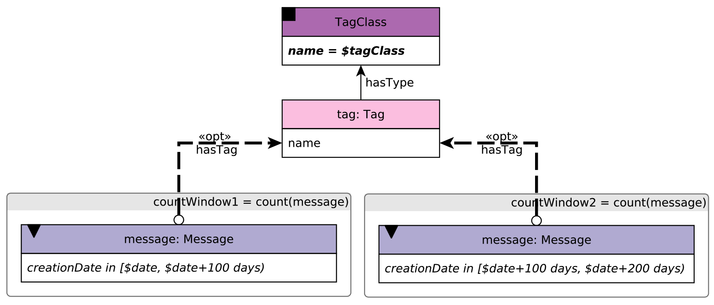

Figure 25. LDBC BI Query2.
:::

This figure illustrates LDBC BI2 query. This query aims to find the `Tags` under a given `TagClass` that were used in `Messages` during in the 100-day time window starting at date and compare it with the 100-day time window that follows. For the `Tags` and for both time windows, compute the count of `Messages`. 

The key to this query is creating two sub execution branches to count the two windows separately. We can use gremlin's `by()` step to achieve the purpose. Assume the `TagClass's name='Actor'` `$date='2012-01-01'`, `$date+100='2012-04-09'$` and `$date+200='2012-07-18'`:

1. Firstly, we have to find all `Tags` related to the given `TagClass`

   `g.V().has(\'tagclass\', \'name\', \'Actor\').in(\'hasType\').as(\'tag\')`

2. Then, we need to count for the first window: all the messages created from `2012-01-01` to `2012-04-09` and having the specific `Tag`. Since there are two separate counting tasks, we have to use `select()` followed by `by(...)` step to create a new sub branch to execute the task. 

   `.select("tag").by(__.in(\'hasTag\').hasLabel(\'comment\').has(\'creationDate\', inside(\'2012-01-01\', \'2012-04-09\')).dedup().count()).as(\'count1\')`

3. Next, we need to count for the second window: all the messages created from `2012-04-09` to `2012-07-18` and having the specific `Tag`. Still, we use `select()` followed by `by(...)` step to create a new sub branch to execute the task. 

   `.select("tag").by(__.in(\'hasTag\').hasLabel(\'comment\').has(\'creationDate\', inside(\'2012-04-09\', \'2012-07-18\')).dedup().count()).as(\'count2\')\`

4. Finally, we select `tag's name`, `count1` and `count2`  from the traversers as the output

   `.select(\'tag\', \'count1\', \'count2\').by(\'name\').by().by()')`

Combine these procedures together, we can write the following code in GIE to make the LDBC BI2 query:

```python
q1 = g.execute('g.V().has(\'tagclass\', \'name\', \'Actor\').in(\'hasType\').as(\'tag\')\
                .select("tag").by(__.in(\'hasTag\').hasLabel(\'comment\')\
                .has(\'creationDate\', inside(\'2012-01-01\', \'2012-04-09\'))\
                .dedup().count()).as(\'count1\')\
                .select("tag").by(__.in(\'hasTag\').hasLabel(\'comment\')\
                .has(\'creationDate\', inside(\'2012-04-09\', \'2012-07-18\'))\
                .dedup().count()).as(\'count2\')\
                .select(\'tag\', \'count1\', \'count2\')\
                .by(\'name\').by().by()')
print(q1.all())
```

The output should be like:

```bash
# Query results for ldbc bi2 query
[{'count1': 0, 'count2': 0, 'tag': 'Jet_Li'},
 {'count1': 0, 'count2': 0, 'tag': 'Zhang_Yimou'},
 {'count1': 0, 'count2': 0, 'tag': 'Faye_Wong'},
 {'count1': 0, 'count2': 0, 'tag': 'Tsui_Hark'},
 {'count1': 3, 'count2': 7, 'tag': 'Bruce_Lee'},
 {'count1': 12, 'count2': 20, 'tag': 'Johnny_Depp'},
 {'count1': 6, 'count2': 4, 'tag': 'Tom_Cruise'},
 {'count1': 4, 'count2': 7, 'tag': 'Jackie_Chan'}]
```

### LDBC BI3

:::{figure-md}
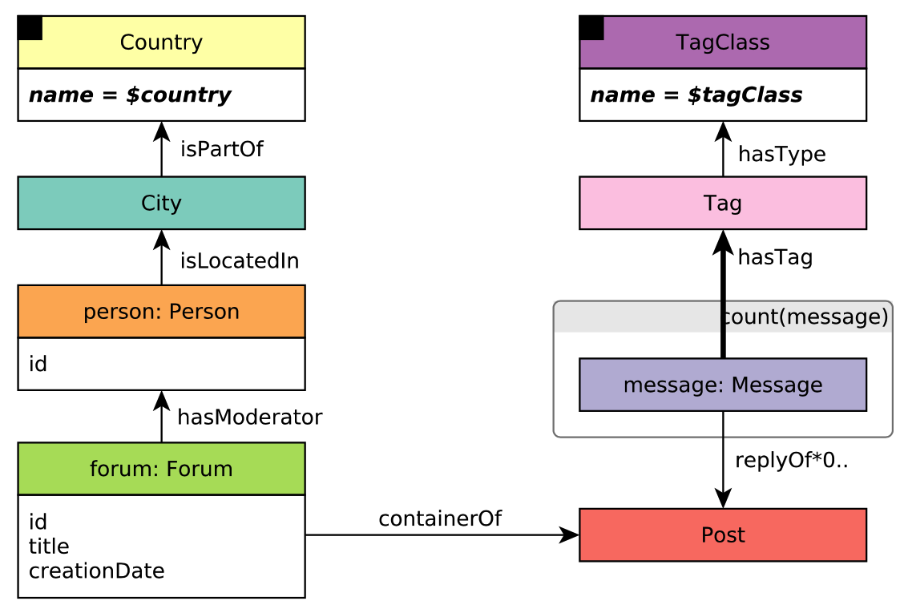

Figure 26. LDBC BI Query3.
:::

This figure illustrates LDBC BI3 query. Given a `TagClass` and `Country`, this query aims to find all the `Forums` created in the given `Country`, containing at least one `Message` with `Tags` belonging directly to the given `TagClass`, and count the `Messages` by the `Forum` which contains them. 

The location of a `Forum` is identified by the location of the Forum’s moderator. Here comes another question, how to determine whether the forum contains a message directly related to the given `TagClass` or not? We assume that a message is contained by a forum if:

- It replies a post contained by the forum
- It replies a message contained by the forum

Therefore, we can use `out(1..)`  path expand step in gremlin to find all the messages contained by a forum. However, the infinite path length may lead to serious computation cost. Therefore, the upper bound of the path expand is set to 6. Then we can use another two `out('hasTag')` and `out('hasType')` step followed by the filter `has('name', TAGCLASS)` to determine whether the message has required tag or not. 

Assume the `Country's name = 'China'` and `TagClass's name = 'Song'`, we can write in GIE as:

```python
q1 = g.execute('g.V().has(\'place\', \'name\', \'China\').in(\'isPartOf\').in(\'isLocatedIn\').as(\'person\')\
            .in(\'hasModerator\').as(\'forum\').select(\'forum\')\
            .by(out(\'containerOf\').in(\'1..6\', \'replyOf\').endV().as(\'message\')\
            .out(\'hasTag\').out(\'hasType\').has(\'name\', \'Song\')\
            .select(\'msg\').dedup().count()).as(\'message_count\')\
            .select(\'person\', \'forum\', \'message_count\')\
            .by(\'id\').by(valueMap(\'id\', \'title\', \'creationDate\')).by())')
print(q1.all())
```

The output should be like:

```bash
# Query results for ldbc bi3 query
[{'forum': {'id': [824633725780],
   'creationDate': ['2012-01-08T02:52:34.334+0000'],
   'title': ['Album 3 of Hao Wang']},
  'person': 19791209300479,
  'message': 0},
 {'forum': {'id': [755914248304],
   'creationDate': ['2012-01-02T20:35:03.344+0000'],
   'title': ['Wall of Lin Lei']},
  'person': 24189255811275,
  'message': 0},
 {'forum': {'id': [824633725045],
   'creationDate': ['2012-02-03T18:15:52.633+0000'],
   'title': ['Album 4 of Lin Lei']},
  'person': 24189255811275,
  'message': 0},
 {'forum': {'id': [893353201782],
   'creationDate': ['2012-03-28T23:02:53.251+0000'],
   'title': ['Album 5 of Lin Lei']},
  'person': 24189255811275,
  'message': 0},
 {'forum': {'id': [1030792152809],
   'creationDate': ['2012-09-03T09:47:01.414+0000'],
   'title': ['Wall of Lei Chen']},
  'person': 32985348833887,
  'message': 0},
...
   'creationDate': ['2012-03-07T07:30:01.038+0000'],
   'title': ['Album 0 of Zhang Yang']},
  'person': 15393162789707,
  'message': 0},
 ...]
```

### LDBC BI4(Left Part)

:::{figure-md}
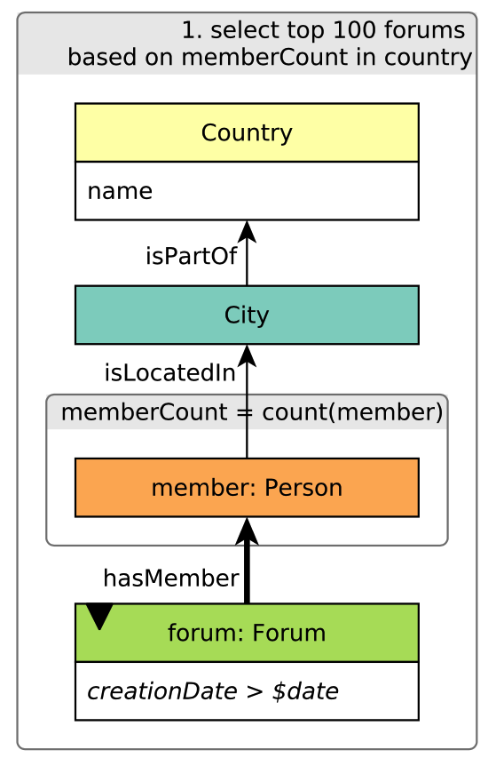

Figure 27. LDBC BI Query4(Left Part).
:::

This figure illustrates the left part of the LDBC BI4 query. The query aims to find the top 100 forum of every country based on the memberCount, and the forum should be created after the given date. 

Since GIE doesn't provide global storage currently, we cannot pick out the top 100 forums of every country using gremlin sentence directly. We can retrieve a tuple of `(country, forum, country_count)` at first. 

Assume `Forum's creationDate > '2012-01-01'`, we can write in GIE as

```python
q1 = g.execute('g.V().hasLabel(\'place\').as(\'country\').in(\'isPartOf\').in(\'isLocatedIn\')\
           .in(\'hasMember\').as(\'forum\').dedup(\'counry\',\'forum\')\
           .select(\'forum\').by(out(\'hasMember\').as(\'person\').out(\'isLocatedIn\')\
           .out(\'isPartOf\').where(eq(\'country\')).select(\'person\').dedup().count())\
           .as(\'personCount\').select(\'country\', \'forum\', \'personCount\')')
print(q1.all())
```

The output should be like:

```bash
[{'forum': v[72057594037932503],
  'country': v[288230376151711797],
  'personCount': 2},
 {'forum': v[72057594037932473],
  'country': v[288230376151711797],
  'personCount': 1},
 {'forum': v[72057594037932489],
  'country': v[288230376151711797],
  'personCount': 1},
 {'forum': v[72057594037932494],
  'country': v[288230376151711797],
  'personCount': 1},
 {'forum': v[72057594037932501],
  'country': v[288230376151711797],
  'personCount': 2},
 {'forum': v[72057594037934803],
  'country': v[288230376151711797],
  'personCount': 1},
 {'forum': v[72057594037934804],
  'country': v[288230376151711797],
  'personCount': 1},
 {'forum': v[72057594037935005],
  'country': v[288230376151711797],
  'personCount': 2},
 {'forum': v[72057594037928132],
...
  'personCount': 1},
 {'forum': v[72057594037935879],
  'country': v[288230376151711799],
  'personCount': 1},
 ...]
```

Since GIE provides the python interface, then we can write codes to calculate the top 100 forum for each country very conveniently:

```python
country_top100_forums_dict = {}
for traverser in q1.all():
    country = traverser['country']
    forum = traverser['forum']
    personCount = traverser['personCount']
    if country in country_top100_forums_dict:
        country_top100_forums_dict[country].append((forum, personCount))
    else:
        country_top100_forums_dict[country] = [(forum, personCount)]
for personCountForums in country_top100_forums_dict.values():
    personCountForums.sort(reverse=True, key=lambda x: x[1])
    if len(personCountForums) > 100:
        personCountForums = personCountForums[:100]
print(country_top100_forums_dict)
```

The result of LDBC BI Query 4(Left Part) should be like:

```bash
{v[288230376151711797]: [(v[72057594037935702], 7), (v[72057594037930685], 7), (v[72057594037932114], 6), (v[72057594037934231], 5), (v[72057594037935703], 5), (v[72057594037935730], 5), (v[72057594037935734], 5), (v[72057594037932509], 4), (v[72057594037935707], 4), (v[72057594037935708], 4), (v[72057594037935711], 4), (v[72057594037935714], 4), (v[72057594037935719], 4), (v[72057594037935729], 4), (v[72057594037935731], 4), (v[72057594037935724], 4), (v[72057594037929560], 4), (v[72057594037931546], 4), (v[72057594037931545], 4), (v[72057594037932479], 3), (v[72057594037932485], 3), (v[72057594037932505], 3), (v[72057594037932511], 3), (v[72057594037935710], 3), (v[72057594037935722], 3), (v[72057594037929246], 3), (v[72057594037928266], 3), (v[72057594037935713], 3), (v[72057594037934308], 3), (v[72057594037934313], 3), (v[72057594037934302], 3), (v[72057594037930430], 3), (v[72057594037934303], 3), (v[72057594037932503], 2), (v[72057594037932482], 2), (v[72057594037935147], 2), (v[72057594037935148], 2), (v[72057594037935157], 2), (v[72057594037927973], 2), (v[72057594037929386], 2), (v[72057594037934315], 2), (v[72057594037932501], 2), (v[72057594037935005], 2), (v[72057594037935720], 2), (v[72057594037935015], 2), (v[72057594037934300], 2), (v[72057594037930861], 2), (v[72057594037934319], 2), (v[72057594037931542], 2), (v[72057594037929583], 2), (v[72057594037933324], 2), (v[72057594037929182], 2), (v[72057594037929739], 2), (v[72057594037934829], 2), (v[72057594037935658], 2), (v[72057594037935660], 2), (v[72057594037935674], 2), (v[72057594037935682], 2), (v[72057594037935683], 2), (v[72057594037935672], 2), (v[72057594037927978], 2), (v[72057594037935163], 2), (v[72057594037935014], 2), (v[72057594037931544], 2), (v[72057594037934297], 2), (v[72057594037927979], 1), (v[72057594037932473], 1), (v[72057594037932474], 1), (v[72057594037934384], 1), (v[72057594037932639], 1), (v[72057594037934380], 1), (v[72057594037935146], 1), (v[72057594037935152], 1), (v[72057594037934804], 1), (v[72057594037928134], 1), (v[72057594037928674], 1), (v[72057594037929248], 1), (v[72057594037931240], 1), (v[72057594037931247], 1), (v[72057594037931256], 1), (v[72057594037930958], 1), (v[72057594037930963], 1), (v[72057594037931259], 1), (v[72057594037931260], 1), (v[72057594037931262], 1), (v[72057594037929365], 1), (v[72057594037929419], 1), (v[72057594037929421], 1), (v[72057594037929431], 1), (v[72057594037929434], 1), (v[72057594037929437], 1), (v[72057594037929446], 1), (v[72057594037929447], 1), (v[72057594037929449], 1), (v[72057594037929450], 1), (v[72057594037935166], 1), (v[72057594037929519], 1), (v[72057594037929451], 1), (v[72057594037929452], 1), (v[72057594037935046], 1), (v[72057594037932339], 1), (v[72057594037932481], 1), (v[72057594037934294], 1), (v[72057594037932389], 1), (v[72057594037932976], 1), (v[72057594037930870], 1), (v[72057594037931266], 1), (v[72057594037928092], 1), (v[72057594037928495], 1), (v[72057594037929510], 1), (v[72057594037929517], 1), (v[72057594037929961], 1), (v[72057594037929965], 1), (v[72057594037930242], 1), (v[72057594037930248], 1), (v[72057594037930250], 1), (v[72057594037930313], 1), (v[72057594037931547], 1), (v[72057594037935686], 1), (v[72057594037929052], 1), (v[72057594037929053], 1), (v[72057594037929055], 1), (v[72057594037929057], 1), (v[72057594037929060], 1), (v[72057594037934811], 1), (v[72057594037934813], 1), (v[72057594037934816], 1), (v[72057594037934821], 1), (v[72057594037934822], 1), (v[72057594037934823], 1), (v[72057594037934828], 1), (v[72057594037934835], 1), (v[72057594037934837], 1), (v[72057594037934975], 1), (v[72057594037934976], 1), (v[72057594037935032], 1), (v[72057594037935038], 1), (v[72057594037935045], 1), (v[72057594037935664], 1), (v[72057594037935673], 1), (v[72057594037935678], 1), (v[72057594037935685], 1), (v[72057594037931549], 1), (v[72057594037931550], 1), (v[72057594037931552], 1), (v[72057594037931554], 1), (v[72057594037931557], 1), (v[72057594037931560], 1), (v[72057594037931566], 1), (v[72057594037935671], 1), (v[72057594037935670], 1), (v[72057594037934977], 1), (v[72057594037931543], 1), (v[72057594037929518], 1), (v[72057594037935679], 1), (v[72057594037931575], 1), (v[72057594037932438], 1), (v[72057594037932878], 1), (v[72057594037932886], 1), (v[72057594037932888], 1), (v[72057594037927982], 1), (v[72057594037930526], 1), (v[72057594037930535], 1), (v[72057594037930546], 1), (v[72057594037930976], 1), (v[72057594037930536], 1), (v[72057594037931358], 1), (v[72057594037930366], 1), (v[72057594037931574], 1), (v[72057594037932435], 1), (v[72057594037935020], 1), (v[72057594037935864], 1), (v[72057594037933861], 1), (v[72057594037932440], 1), (v[72057594037927981], 1), (v[72057594037931349], 1), (v[72057594037931366], 1), (v[72057594037932885], 1), (v[72057594037927980], 1), (v[72057594037930529], 1), (v[72057594037930532], 1), (v[72057594037931304], 1), (v[72057594037932433], 1), (v[72057594037932441], 1), (v[72057594037934547], 1)], ......
```


### LDBC BI11

:::{figure-md}
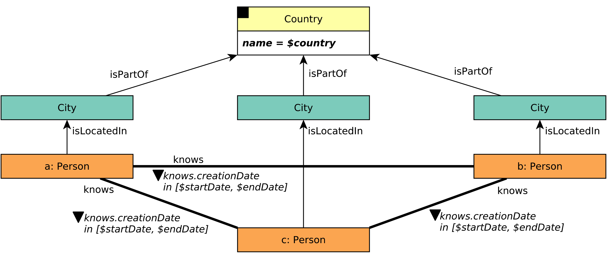

Figure 28. LDBC BI Query11.
:::

This figure illustrates LDBC BI11 query. This query aims to find three persons tagged as a, b, c, where:

- a, b, c know each other
- a, b, c live in the same country
- their relationship('knows') were created in the range [`startDate`, `endDate`]

 It is easy to use gremlin's `match(...)` step to describe this query. Assume the `Country's name=China`, the `startDate='2012-01-01'`, the `endDate='2012-07-01'`:

```python
q1 = g.execute('g.V().match(__.as(\'a\').bothE(\'knows\')\
                              .has(\'creationDate\', inside(\'2012-01-01\', \'2012-07-01\'))\
                              .otherV().as(\'b\'),\
                            __.as(\'a\').bothE(\'knows\')\
                              .has(\'creationDate\', inside(\'2012-01-01\', \'2012-07-01\'))\
                              .otherV().as(\'c\'),\
                            __.as(\'a\').bothE(\'knows\')\
                               .has(\'creationDate\', inside(\'2012-01-01\', \'2012-07-01\'))\
                               .otherV().as(\'c\'),\
                            __.as(\'a\').out(\'isLocatedIn\').out(\'isPartOf\').as(\'d\'),\
                            __.as(\'b\').out(\'isLocatedIn\').out(\'isPartOf\').as(\'d\'),\
                            __.as(\'c\').out(\'isLocatedIn\').out(\'isPartOf\').as(\'d\'),\
                            __.as(\'d\').has(\'name\', \'China\').as(\'d\'))\
                     .select(\'a\', \'b\', \'c\')')
print(q1.all())
```

The output should be like:

```bash
# Query results for ldbc bi11 query
[{'a': v[216172782113784091], 'b': v[216172782113783882], 'c': v[216172782113784250]}, ......, 
 {'a': v[216172782113784403], 'b': v[216172782113784537], 'c': v[216172782113784122]}]
```

### LDBC BI14

:::{figure-md}
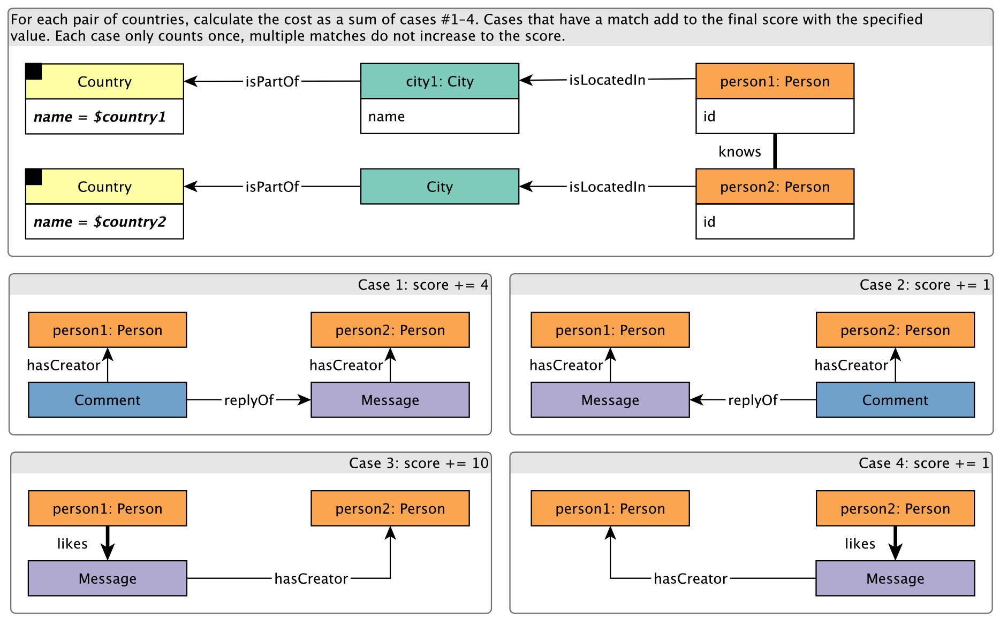

Figure 29. LDBC BI Query14.
:::

This figure illustrates LDBC BI14 query. Here is its purpose:

Consider all pairs of people (`person1`, `person2`) such that 

1. they know each other, 
2. one is located in a City of Country `country1`, 
3. and the other is located in a City of Country `country2`. 

For each City of Country `country1`, return the highest scoring pair. The score of a pair is defined as the sum of the subscores awarded for the following kinds of interaction. The initial value is score = 0.

1. `person1` has created a reply `Comment` to at least one `Message` by `person2`: score += 4
2. `person1` has created at least one `Message` that `person2` has created a reply to: score += 1
3. `person1` liked at least one `Message` by `person2`: score += 10
4. `person1` has created at least one `Message` that was liked by `person2`: score += 1

Assume `country1's name = "India"` and `country2's name = "Chile"`, we can write in GIE as:

```python
q1 = g.execute('g.V().has(\'place\', \'name\', \'India\')\
                .in(\'isPartOf\').in(\'isLocatedIn\').as(\'p1\')\
                .both(\'knows\').as(\'p2\').out(\'isLocatedIn\').out(\'isPartOf\')\
                .has(\'name\', \'Chile\')\
                .select(\'p1\').by(in(\'hasCreator\').hasLabel(\'comment\').out(\'replyOf\')\
                .out(\'hasCreator\').where(eq(\'p2\')).select(\'p1\').dedup().count()).as(\'case1\')\
                .select(\'p1\').by(in(\'hasCreator\').in(\'replyOf\').hasLabel(\'comment\')\
                .out(\'hasCreator\').where(eq(\'p2\')).select(\'p1\').dedup().count()).as(\'case2\')\
                .select(\'p1\').by(out(\'likes\').hasLabel(\'post\', \'comment\')\.out(\'hasCreator\')\\
                .where(eq(\'p2\'))\.select(\'p1\').dedup().count()).as(\'case3\')\
                .select(\'p1\').by(in(\'hasCreator\').hasLabel(\'post\', \'comment\').in(\'likes\')\
                .where(eq(\'p2\')).select(\'p1\').dedup().count()).as(\'case4\')\
                .select(expr(\'@case1 * 4 + @case2 * 1 + @case3 * 10 + @case4 * 1\')).as(\'score\')\
                .select(\'p1\', \'p2\', \'score\')')
print(q1.all())
```

The output of LDBC BI14 query should be like:

```bash
# Query results for ldbc bi14 query
[{'p1': v[216172782113784153], 'score': 10, 'p2': v[216172782113784100]},
 {'p1': v[216172782113783956], 'score': 10, 'p2': v[216172782113784673]},
 {'p1': v[216172782113784252], 'score': 10, 'p2': v[216172782113784263]},
 {'p1': v[216172782113784193], 'score': 0, 'p2': v[216172782113784100]},
 {'p1': v[216172782113784242], 'score': 6, 'p2': v[216172782113784263]},
 {'p1': v[216172782113784623], 'score': 11, 'p2': v[216172782113784498]},
 {'p1': v[216172782113784251], 'score': 5, 'p2': v[216172782113784538]},
 {'p1': v[216172782113784167], 'score': 11, 'p2': v[216172782113784100]},
 {'p1': v[216172782113783864], 'score': 12, 'p2': v[216172782113784100]},
 {'p1': v[216172782113784613], 'score': 5, 'p2': v[216172782113784116]},
 {'p1': v[216172782113784481], 'score': 16, 'p2': v[216172782113784498]},
 {'p1': v[216172782113784481], 'score': 16, 'p2': v[216172782113784100]}]
```