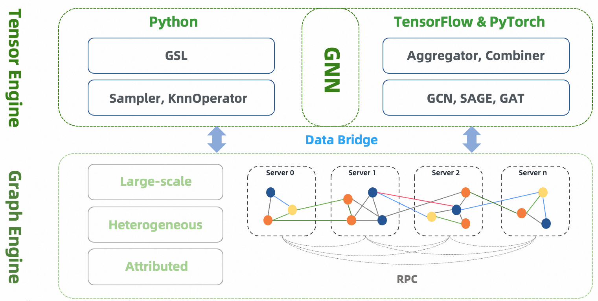

# Overview and Architecture

## Introduction

GLE (Graph Learning Engine) is a distributed framework to develop and implement graph neural networks at a large scale. GLE has been successfully applied in various scenarios such as network security, knowledge graph, and search recommendation. It facilitates sampling on batch graphs and enables offline or incremental GNN model training. GLE provides graph sampling operations with both Python and C++ interfaces, and a GSL (Graph Sampling Language) interface that is similar to Gremlin. GLE provides model development paradigms and processes for GNN models, and is compatible with TensorFlow and PyTorch. It offers data layer and model layer interfaces, as well as several model examples.

## Architecture

:::{figure-md}

Architecture of GLE
:::