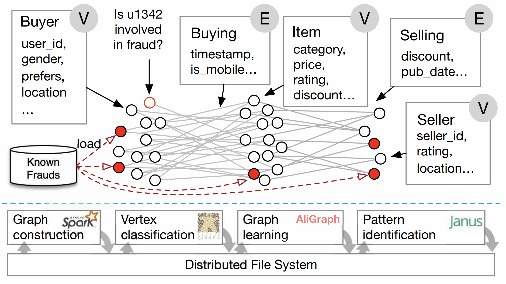
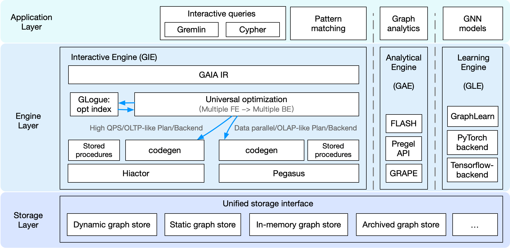

# Design of GraphScope

Real-life graph computation applications are often more complex than the workloads we've seen so far, which highlights the need for a flexible and intelligent design for the graph processing system. In this section, we will introduce the modular design of GraphScope and how it addresses the diverse needs of graph computation workloads.

## Motivation

As graph data and its applications continue to grow rapidly, 
numerous graph processing systems have been developed. 
However, existing systems often focus on a specific type of graph computation, 
while real-world scenarios frequently require tools or systems that can handle various graph computations. 
For instance, in e-commerce platforms, some sellers and buyers may engage in fraudulent 
transactions and reviews collaboratively to boost their ratings and rankings. 
In practice, all users and transactions can be represented as a large-scale graph 
containing vertices such as buyers, sellers, and items, and edges representing 
buying, selling, or reviewing relationships.

:::{figure-md}

An example in e-commerce
:::

To identify suspicious users and transactions in the transaction graph, an anti-fraud workflow may include the following steps:
1. Construct the graph using a data-parallel system from external storage.
2. Apply mining algorithms like k-clique or k-core to extract suspicious patterns.
3. Use a label propagation algorithm to identify potential fraudulent vertices.
4. Perform k-hop neighborhood sampling for each vertex using a Graph Neural Network (GNN) and feed the results into a deep learning framework (e.g., TensorFlow) for fraud prediction based on a GNN model.
5. Present the results in a visualized WebUI, allowing for interactive exploration of the results and the graph for manual verification.

As demonstrated in this pipeline, real-world graph computations are often more complex, 
involving various types of graph computations within a single workload. 
This scenario presents numerous challenges. 
The programming abstractions of applications range from vertex-centric models for iterative algorithms 
to random graph walking for graph traversal and specializations for pattern matching. 
Consequently, developers often need to integrate multiple systems, 
managing the complexities of data representation, resource utilization, 
and performance tuning across these systems. Moreover, each application 
has its unique runtime characteristics, 
necessitating different trade-offs and optimizations in the computation engine, 
which should be closely connected to specific programming abstractions. 
Finally, due to the diverse graph computation workloads, 
the system should be designed flexibly to support different types of graph computations, 
whether they are complex pipelines or simple tasks.

To address these challenges, we introduce GraphScope, 
featuring a layered and disaggregated architecture, 
offering a comprehensive and efficient platform for large-scale graph computations.

## Unified Graph Computing Platform

GraphScope is a comprehensive, production-ready system for end-to-end analysis of large-scale graph data. 
To achieve this, various components must interact seamlessly, 
including cluster management (deployment) software, graph storage (for input, output, and intermediate results), 
distributed execution engines, language constructs, and development tools.

:::{figure-md}

GraphScope workflow
:::

### Application layer

Graph processing often requires customized applications for each specific task.
These tasks may include interactive queries in Gremlin, Cypher, or GQL, 
graph analytics with iterative computations like pagerank, 
connected components, or GNN models for graph learning tasks. 
For interactive queries, GraphScope supports Gremlin, 
the widely-used traversal language developed by the Apache Foundation. 
Support for other languages, such as Cypher and GQL, is under development. 
For graph analytics and learning tasks, 
GraphScope features a built-in library with common algorithms for various domains 
(e.g., graph neural networks, clustering, and pattern matching).
To simplify the development of new graph applications, 
GraphScope allows programmers to write code as if for a single machine 
using a high-level, general-purpose programming model, while the system handles the complexities 
of distributed execution. 
This approach enables GraphScope to seamlessly integrate multiple 
graph execution engines within a single unified platform, as described below.

### Execution engine layer

The GraphScope execution layer comprises three engines: GraphScope Interactive Engine (GIE), 
GraphScope Analytics Engine (GAE), and GraphScope Learning Engine (GLE). 
These engines provide interactive, analytical, and graph-based machine learning functionalities, respectively. 
A common feature among these execution engines is their automatic support 
for efficient distributed execution of queries and algorithms in their target domains. 
Each query or algorithm is automatically and transparently compiled by GraphScope into a distributed execution plan, 
partitioned across multiple compute nodes for parallel execution. 
Each partition runs on a separate compute node, managed by a local executor, which schedules and executes computation on a multi-core server. 
The engines can be deployed and work together as a full-fledged GraphScope, capable of handling complex and diversified workflows, 
including any combination of analytics, interactive, and graph neural network (GNN) computations. 
Furthermore, the engines can be deployed separately and work standalone for specific tasks.

### Storage layer
GraphScope defines a unified storage interface for accessing and managing graph data. 
This interface allows the storage layer to be flexible and extensible, 
enabling easy integration with different storage backends. GraphScope includes various graph stores, such as vineyard, 
an in-memory storage that maintains a partitioned data object across a cluster 
and enables data sharing without copying across engines in a workflow. 
Another on-disk and multi-versioned persistent graph store, named groot, 
is also provided. Unlike vineyard, which focuses on in-memory analytics workloads, 
groot is responsible for running a continuous graph data management service and ingesting frequent updates to the graph data. 
Additionally, GraphScope has an archive store that supports rapid synchronization of data from a relational database via bin-log 
and creates a graph view for computation tasks defined on graphs. 
Furthermore, there are several in-house managed graph stores used at Alibaba, 
and some third-party stores are ready to be integrated. 
Thanks to the unified interface, users can choose the appropriate store based on their needs, 
while the engine layer can be used transparently without any modifications.

## Disaggregated Design for Diverse Graph Applications

GraphScope utilizes a disaggregated design, 
enabling users to deploy GraphScope with only selected components to simplify deployment and cater to their specific needs. 
For instance, if a user only needs to run community detection on a social network graph, 
deploying only the analytical engine would be sufficient. 
In GraphScope's system design, components are divided into three layers: the application layer, 
engine layer, and storage layer. Users can choose components from these three layers to create a customized deployment. 
This flexible design allows GraphScope to be deployed and optimized for various graph computation scenarios.

Next, we highlight some featured deployments of GraphScope.

### GraphScope for BI analysis

Users for BI analysis are typically business analysts who interactively query and analyze data via a WebUI. 
In this scenario, concurrency is not a primary concern, but low latency for complex queries is crucial. 
GraphScope operates as an interactive query answering service over an evolving graph. 
In the application layer, it supports Gremlin or Cypher query languages. 
In the engine layer, an interactive engine (GIE) is deployed. When the engine receives a query written in Gremlin/Cypher, 
the compiler GAIA compiles the query into a unified interpreted representation (IR). 
A universal query optimizer is then applied to optimize the IR and translate it for different backends. 
In this BI scenario, the queries resemble OLAP style, so the IR is interpreted into a data parallel plan. 
Next, a code-gen module generates the physical plan and applies it to Pegasus, 
a distributed data-parallel compute engine based on the cyclic dataflow computation model at the core of GIE. 
In the storage layer, a dynamic graph store is deployed and responsible for storing the graph data. 
With this combination, GraphScope provides a high-performance and interactive query answering service for BI analysis.

[Read more about GraphScope for traversal queries](../interactive_engine/tutorial_ldbc_gremlin.md)

### GraphScope for high QPS queries

In some service scenarios, such as recommendation or searching, 
graph queries arrive at an extremely high rate. 
GraphScope can handle these scenarios by deploying a similar set of components as in the BI scenario. 
However, the universal query optimizer generates a query plan more suitable for high QPS queries. 
Then, a designated code-gen module generates a physical plan for another core engine, 
Hiactor, which is a high-performance and concurrent actor framework responsible for processing OLTP-like queries at the core of GIE. 
Since the storage layer provides a unified interface, 
users may choose to deploy an in-memory graph store (e.g., vineyard) or a persistent graph store (e.g., groot) to meet their specific needs. 
One may notice that the deployment of GraphScope for high QPS queries is similar to the deployment for BI analysis. 
However, the universal optimizer generates different plans and dispatches them to different backends according to the distinct workload characteristics.

### GraphScope for graph analytics

GraphScope is both performant and easy-to-use for graph analytical jobs. 
In this scenario, applications are provided as iterative algorithms in the built-in library or customized by the users. 
The algorithms can be implemented using FLASH-style API, Pregel API, or GRAPE native API. 
All these types of algorithms are compiled in the engine layer and run on GRAPE, 
a processing system proposed in [this paper](https://dl.acm.org/doi/10.1145/3282488) published in SIGMOD2017. 
GRAPE distinguishes itself from prior systems by its ability to parallelize sequential graph algorithms as a whole. 
In GRAPE, sequential algorithms can be easily "plugged into" with only minor changes, allowing them to efficiently handle large graphs. 
To achieve high performance, deployments for this scenario typically choose an in-memory graph store for the storage layer. 

[Read more about GraphScope for analytics](graphscope_for_graph_analytics.md)

### GraphScope for learning

GNNs have been effectively utilized in numerous real-world applications,
such as e-commerce recommendation systems and financial risk control platforms, where billion-scale graphs are prevalent.
The learning engine in GraphScope (GLE) efficiently supports distributed GNN training on large-scale graphs in these industrial scenarios.
GLE offers both Python and C++ interfaces for graph sampling operations and a Gremlin-like GSL (Graph Sampling Language) 
interface to simplify the definition of sampling queries.
For GNN models, GLE provides a variety of paradigms and processes for model development,
and also includes a rich set of example models. Users can flexibly choose TensorFlow or PyTorch as the training backend.
To enable a flexible and cost-effective resource configuration,
the processes of sampling and training in GLE are decoupled,
allowing each to be independently scaled to achieve the best end-to-end throughput.

[Read more about GraphScope for learning](graphscope_for_learning.md)
