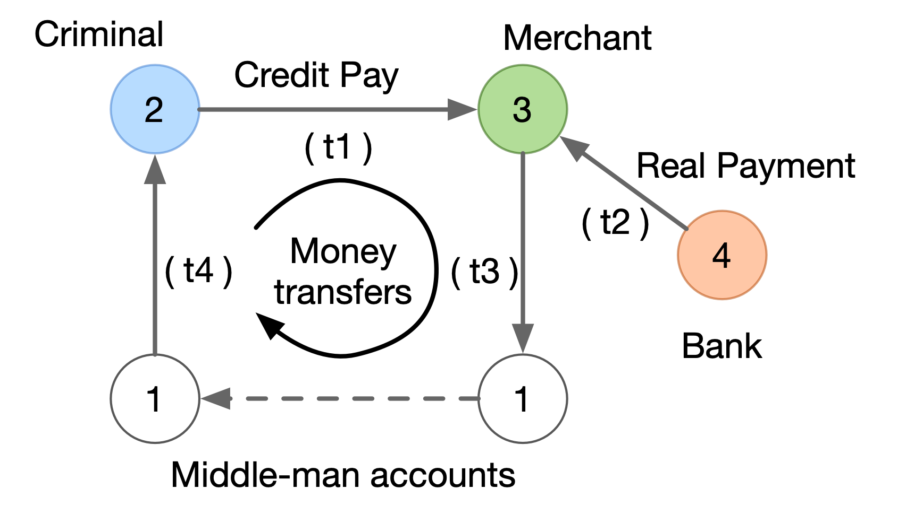
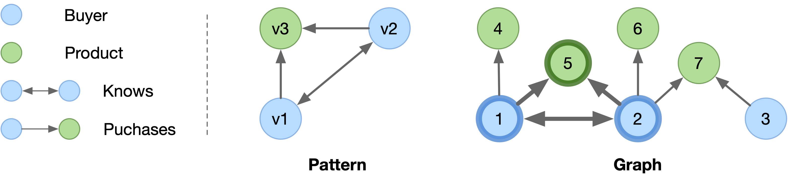

# Graph Interactive Workloads
Graph interactive workloads primarily focus on exploring complex graph structures in an
**interactive** manner. There're two common interactive workloads, namely
- Graph traversal: This type of workload involves traversing the graph from a set of source vertices
  while satisfying the constraints on the vertices and edges that the traversal passes. Graph
  traversal differs from the [analytics](./graph_analytics_workloads.md) workload as it typically accesses a small
  portion of the graph rather than the whole graph.
- Pattern Matching: Given a pattern that is a small graph, graph pattern matching aims to compute
  all occurrences (or instances) of the pattern in the graph. Pattern matching often involves relational operations to project, order and group the matched instances.

In GraphScope, the Graph Interactive Engine (GIE) has been developed to handle such interactive workloads,
which provides widely used query languages, such as Gremlin, that allow  users to easily
express both graph traversal and pattern matching queries. These queries will be executed with massive
parallelism in a cluster of machines, providing efficient and scalable solutions to graph interactive
workloads.

## Tinkerpop and Gremlin
Apache [TinkerPop](https://tinkerpop.apache.org) is an open framework for developing interactive
graph applications using the [Gremlin](https://tinkerpop.apache.org/gremlin.html) query language. We have implemented TinkerPop’s Gremlin Server interface and attempted to support the official traversal steps of Gremlin in GIE. As a result, Gremlin users can easily get started with GIE through the existing [TinkerPop ecosystem](../interactive_engine/tinkerpop_eco.md), including the language wrappers of Python and Gremlin's console.
For language features, we support both the imperative graph traversal and declarative pattern matching in Gremlin for handling the graph traversal and pattern matching workloads in the interactive context, respectively.


### Graph Traversal
In the imperative graph traversal, the execution follows exactly the steps given by the query,
where a set of traversers walk a graph step by step according to the corresponding user-provided instructions,
and the result of the traversal is the collection of all halted traversers. A traverser is the basic
unit of data processed by a Gremlin engine. Each traverser maintains a location that is a reference
to the current vertex, edge or property being visited, and (optionally) the path history with application states.

:::{figure-md}



A traversal query for cycle detection.
:::

The above figure shows a simplified anti-money-laundering scenario via cycle detection.
Below is the corresponding traversal query, which tries to find cyclic paths of length
`k` starting from a given account.


```groovy
g.V('account').has('id','2').as('s')
 .out('k-1..k', 'transfer')
 .with('PATH_OPT', 'SIMPLE')
 .endV()
 .where(out('transfer').eq('s'))
 .limit(1)
```

First, the source operator `V` (with the `has()` filter) returns all the account vertices with an
`id` of `2`. The `as()` operator is a modulator that does not change the input collection of
traversers but introduces a name (`s` in this case) for later references. Second, it traverses
the outgoing `transfer` edges for exact `k-1` times using an `out()` step with a range of lower bound `k-1` (included)
and upper bound `k` (excluded), while skipping any repeated vertices `with()` the `SIMPLE` path option.
Such a multi-hop [path expansion](../interactive_engine/supported_gremlin_steps.md) is a syntactic sugar we
introduce for easily handling the path-related applications.
Third, the `where` operator checks if the starting vertex s can be reached by one more step, that is,
whether a cycle of length `k` is formed. Finally, the `limit()` operator at the end indicates that
only one such result is needed.

### Pattern Matching
Different from the imperative traversal query, the `match()` step provides a
declarative way of expressing the pattern matching queries. In other words, users only need to describe what the pattern is using using `match()`, and the engine will automatically derive the best-possible execution
plans based on both algorithmic heuristics and cost estimation.

:::{figure-md}



An example of pattern matching.
:::

The above figure shows an example of pattern matching query, where the pattern is a triangle that describes two buyers who knows each other purchase the same product. In the graph, there is a matched instance highlighted in bolder borders, in which pattern vertices `v1`, `v2` and `v3` are matched by vertices `1`, `2` and `5`, respectively.

```groovy
g.V().match(
  as('v1').both('Knows').as('v2'),
  as('v1').out('Purchases').as('v3'),
  as('v2').out('Purchases').as('v3'),
)
```

The pattern matching query is declarative in the sense that users only describes the pattern using the `match()` step, while the engine determine how to execute the query (i.e. the execution plan) at runtime according to a pre-defined cost model. For example, a [worst-case optimal](https://vldb.org/pvldb/vol12/p1692-mhedhbi.pdf) execution plan may first compute the matches of `v1` and `v2`, and then intersect the neighbors of `v1` and `v2` as the matches of `v3`.

