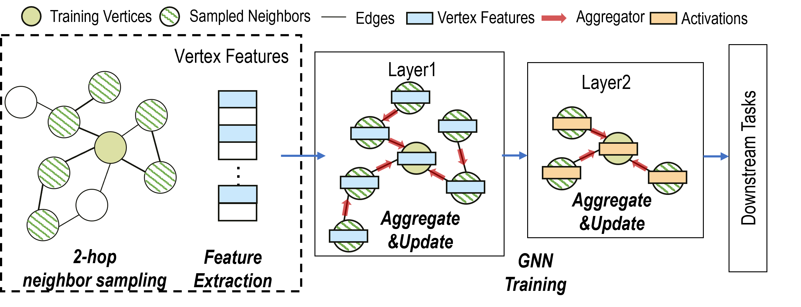
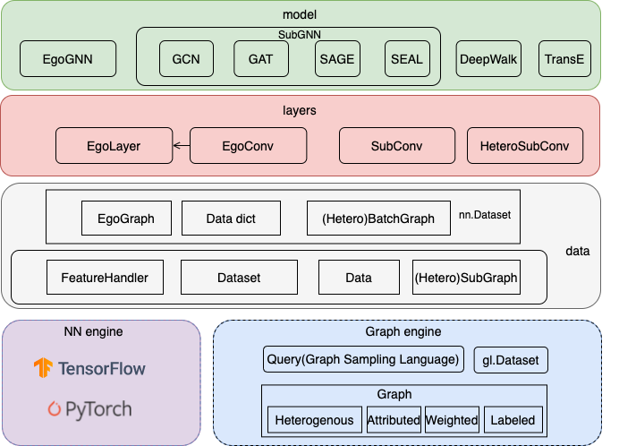

# Graph Learning Workloads

## What is Graph Neural Network
Graph neural networks (GNNs) are a type of neural network designed to work with 
graph data structures, consisting of nodes and edges. GNNs learn to represent 
each node in the graph by aggregating information from its neighboring nodes in 
multiple hops, which allows the model to capture complex relationships between 
nodes in the graph. This involves a process of message passing between nodes, 
where each node receives messages from its neighboring nodes and updates its 
representation based on the aggregated information. By iteratively performing 
this process, GNNs can learn to capture not only the local features of a node 
but also its global position in the graph, making them particularly useful for 
tasks such as node classification, link prediction, and graph classification.

- Node classification is a task (GNNs) where the goal is to predict the label 
of each node in a graph. In other words, given a graph with nodes and edges, 
the task is to assign a category or class to each node based on the features 
of the node and its connections to other nodes. This is an important task in 
many applications such as social network analysis and drug discovery. 
GNNs are particularly suited for node classification as 
they can capture the structural information and relationships between nodes 
in a graph, which can be used to improve the accuracy of the classification.

- Link prediction is a key task in GNNs that aims to predict the existence 
or likelihood of a link between two nodes in a graph. This task is important 
in various applications, such as recommendation systems and biology network analysis, where 
predicting the relationships between nodes can provide valuable insights. 
GNNs can effectively capture the structural information and features of the 
nodes to improve the accuracy of link prediction. The task is typically framed 
as a binary classification problem where the model predicts the probability 
of a link existing between two nodes.

- Graph classification is another GNN task that aims to classify an entire 
graph into one or more classes based on its structure and features. This task is 
used in various domains, such as bioinformatics, social network analysis, and 
chemical structure analysis. The task is typically framed as a multi-class 
classification problem where the model predicts the probability of the graph 
belonging to each class. GNNs have shown promising results in graph classification 
tasks and have outperformed traditional machine learning models.

The learning engine in GraphScope (GLE) is driven by 
[Graph-Learn](https://github.com/alibaba/graph-learn), 
a distributed framework designed for development and training 
of large-scale graph neural networks (GNNs). 
GLE provides a programming interface carefully designed for 
the development of graph neural network models,
and has been widely applied in many scenarios within Alibaba, 
such as search recommendation, network security and knowledge graphs.

<!-- Next, we will briefly rewind the basic concept of GNN, 
introduce the model paradigms of **GLE**, 
and walk through a quick-start tutorial on how to build 
a user-defined GNN model using **GLE**. -->

## Typical GNN Models
First, let's briefly rewind the concept of GNN.
Given a graph $G = (V,E)$, where each vertex is associated with a vector 
of data as its feature. Graph Neural Networks(GNNs) learn a low-dimensional 
embedding for each target vertex by stacking multiple GNNs layers $L$. 
For each layer, every vertex updates its activation by aggregating features 
or hidden activations of its neighbors $N(v),v \in V$.

There are several types of GNN models used for various tasks, such as 
node classification, link prediction, and graph classification. Here are some 
of the most common types of GNN models:

- Graph Convolutional Networks (GCN): GCN is a popular GNN model used for 
node classification and graph classification tasks. It applies a series of 
convolutional operations to the graph structure, allowing the model to 
learn representations of nodes and their neighborhoods.

- Graph Attention Networks (GAT): GAT is another popular GNN model that 
uses attention mechanisms to weigh the importance of neighboring nodes when 
computing node representations. It has been shown to outperform GCN on 
several benchmark datasets.

- GraphSAGE: GraphSAGE is a variant of GCN that uses a neighborhood aggregation 
strategy to generate node embeddings. It allows the model to capture high-order 
neighborhood information and scalable to large graphs.

There are also many other types of GNN models, such as Graph Isomorphism 
Networks (GIN), Relational Graph Convolutional Network (R-GCN), and many more. 
The choice of GNN model depends on the specific task and the characteristics 
of the input graph data.

## Paradigm of Model Training

In general, there are two ways to train a GNN model: (1) whole graph 
training and (2) mini-batch training. Whole graph training is to compute 
based on the whole graph directly. The GCN and GAT are originally proposed 
using this approach, directly computing on the entire adjacency matrix. 
However, this approach will consume huge amount of memory on large-scale 
graphs, limiting its applicability. Mini-batch training is a practical 
solution for scaling GNN training on very large graphs. Neighbor sampling 
is used to generate mini-batches, allowing sampling-based GNN models to 
handle unseen vertices. GraphSAGE is a typical example of mini-batch 
training. The following figure illustrates the workflow of 2-hop GraphSAGE training.

### Steps of Model Training
The process of training a GNN involves several steps, which are described below.

- Data Preparation: The first step in training a GNN is to prepare the input data. 
This involves creating a graph representation of the data, where nodes represent 
entities and edges represent the relationships between them. The graph can be 
represented using an adjacency matrix or an edge list. The features of the 
original graph data may be complex and cannot be directly accessed for model 
training. For example, the node features “id=123456, age=28, city=Beijing” 
and other plain texts need to be processed into continuous features by embedding lookup. 
The type, value space, and dimension of each feature after vectorization should 
be clearly described when adding vertex or edge data sources. 

- Model Initialization: After the data is prepared, the next step is to 
initialize the GNN model. This involves selecting an appropriate architecture 
for the model and setting the initial values of the model parameters.

- Forward and Backward Pass: During the forward pass, the GNN model takes the 
input graph(sampled subgraphs in mini-batch training) and propagates 
information through the graph, updating the embedding 
of each node based on the embedding of its neighbors. The difference between 
the predicted output and the ground truth is measured by the loss 
function. In the backward pass, the gradients of the loss function with 
respect to the model parameters are computed, and are used to update the model 
parameters.

- Iteration: Step 3 is repeated iteratively until the model converges to a 
satisfactory level of performance. During each iteration, the model parameters 
are updated based on the gradients of the loss function, and the quality of the 
model prediction is evaluated using a validation set.

- Evaluation: After the model is trained, it is evaluated using a test set of 
data to measure its performance on unseen data. Various evaluation metrics such 
as accuracy, precision, recall, and F1 score can be used to assess the 
performance of the model.

### Subgraph Sampling

In practical industrial applications, the size of 
the graph is often relatively large and the features on the nodes and edges of the graph 
are complex (there may be both discrete and continuous features). Thus it is not possible 
to perform message passing/neighbor aggregation directly on the original graph. A feasible 
and efficient approach is based on the idea of graph sampling, where a subgraph is first 
sampled from the original graph and then the computation is based on the subgraph. 
According to the difference of neighbor sampling operator in subgraph sampling and 
NN operator in message passing, we organize the subgraph into ``EgoGraph`` or ``SubGraph`` 
format. EgoGraph consists of the central object ego and its fixed-size neighbors, which 
is a dense organization format. SubGraph is a more general subgraph organization format, 
consisting of nodes, edges features and edge index (a two-dimensional array consisting 
of row index and column index of edges), generally using full neighbor. The conv layer 
based on SubGraph generally uses the sparse NN operator. The examples of EgoGraph and 
SubGraph are shown in the following figure.

## Challenges of Applying GNNs on Large Graphs
Based on our experience, applying GNN to industrial-scale large graphs requires 
addressing the following challenges:

- Data irregularity: One of the challenges of GNN is to handle various forms of 
unstructured data, such as sparse, directed, undirected, homogeneous, and 
heterogeneous data, as well as node and edge attributes. These data types may 
require different graph processing methods and algorithms.

- Scalability: In industrial scenarios, graph data is usually very large, 
containing a large number of nodes and edges. This leads to problems with 
computation and storage, as well as the problem of exponential data expansion 
through sampling.

- Computational complexity: GNN has a very high computational complexity because 
it requires the execution of multiple operators, including graph convolution, 
pooling, activation, etc. These operators require efficient algorithms and 
hardware support to enable GNN to run quickly on large-scale graphs.

- Dynamic graph: In industrial scenarios, the graph structure and 
attributes may undergo real-time changes, which may cause GNN models to fail to 
perceive and adapt to these changes in time.

Overall, the application of GNN in industrial scenarios has many challenges and 
requires research and optimization of algorithms, computation, storage, and 
data, etc., in order to better meet practical application needs.

## What can GraphScope Do 

In GraphScope, Graph Learning Engine (GLE) addresses the aforementioned 
challenges in the following ways:

- **Managing graph data in a distributed way**

    In GraphScope, graph data is represented as property graph model. To support 
    large-scale graph, GraphScope automatically partitions the whole graph into 
    several subgraphs (fragments) distributed into multiple machines in a cluster. 
    Meanwhile, GraphScope provides user-friendly interfaces for loading graphs 
    to allow users to manage graph data easily. More detials about how to manage 
    large-scale graphs can refer to [this](https://graphscope.io/docs/latest/graph_formats.html).
    GLE performs graph-related computations, such as distributed graph sampling and feature 
    collection, on this distributed graph storage.

- **Built-in GNN models and PyG compatible**

    GLE comes with a rich set of built-in [GNN models](https://github.com/alibaba/graph-learn/tree/master/graphlearn/examples/tf), like GCN, GAT, GraphSAGE, and SEAL, and provides a set of paradigms and processes to ease the development of customized models. GLE is compatible with [PyG](https://github.com/pyg-team/pytorch_geometric), e.g., this [example](https://github.com/alibaba/graph-learn/tree/master/graphlearn/examples/pytorch/gcn) shows that a PyG model can be trained using GLE with very minor modifications. Users can flexibly choose [TensorFlow](https://github.com/tensorflow/tensorflow) or [PyTorch](https://github.com/pytorch/pytorch) as the training backend.

    <!-- The following figure shows an overview of the algorithm framework in GLE. -->

    <!--  -->

- **Inference on dynamic graph**

    To support online inference on dynamic graphs, we propose Dynamic
     Graph Service ([DGS](https://graph-learn.readthedocs.io/en/latest/en/dgs/intro.html)) 
     in GLE to facilitate real-time sampling on dynamic graphs. 
     The sampled subgraph can be fed into the serving modules 
     (e.g., [TensorFlow Serving](https://github.com/tensorflow/serving)) to 
     obtain the inference results. 
     This [document](https://graph-learn.readthedocs.io/en/latest/en/dgs/tutorial.html#prepare-data) 
     is organized to provide a detailed, step-by-step tutorial specifically 
     demonstrating the use of GLE for offline training and online inference.

