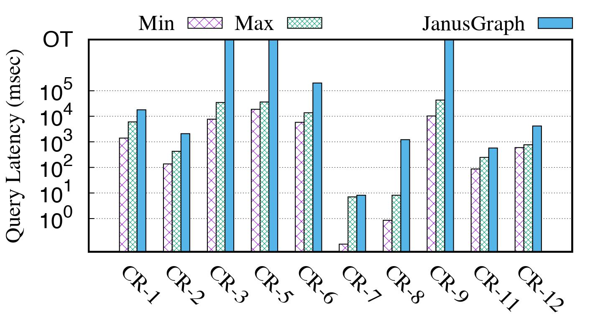

# Performance and Benchmark

## GIE Performance
We evaluated the performance of **GraphScope Interactive Engine (GIE)** with [LDBC Social Network Benchmark](https://ldbcouncil.org/benchmarks/snb/), based on the Interactive Workload (interactive transactional queries). We compare GIE with the state-of-the-art systems and find that GIE achieves high performance on most cases.

**Configurations.** We compare **GIE** with the state-of-the-art systems. The experiments were conducted a cluster of up to 16 machines, and each machine configures one 24-core Itel(R) Xeon(R) Platinum 8163 CPUs at 2.5GHz and 512GB memory. The servers are connected through 25Gbps network.

All the queries have been implemented with correctness cross-verified. We allow each query to run for at most 1 hour, and mark an _OT_ if a query can not terminate in time. We manually configure the degree of parallelism (DOP) while running each query in **GIE**. In the following, we denote DOP = $[x] \times [y]$ for running $y$ threads in $x$ machines.

We compared **GIE** with the [TinkerGraph](https://tinkerpop.apache.org/) (3.4.1), [Neo4j-Community](https://neo4j.com/) (3.5.8), [OrientDB](https://orientdb.com/) (tp3-3.0.15), and [JanusGraph](http://janusgraph.org/) (0.4.0-hadoop2). 

### Experimental Settings

**Datasets.** We generate 5 graph datasets as shown in the table below for experiments using [LDBC SND Hadoop-based Datagen](https://github.com/ldbc/ldbc_snb_datagen_hadoop/), where Gx  denotes that the graph is generated with scale=x. We use G300 as the default dataset if not otherwise specified. 

 Name     | # vertices | # edges  | # Agg. Mem 
 -------- | --------:  | --------:| --------: 
G1      | 3M         | 17M      | 4GB  
G30     | 89M        | 541M     | 40GB    
G100    | 283M       | 1,754M   | 156GB  
G300    | 817M       | 5,269M   | 597GB   
G1000   | 2,687M     | 17,789M  | 1,960GB   

**Queries.** We choose 10 out of 14 _**complex read queries**_ (denoted as CR-1...14) from LDBC's Interactive Workload, while the remaining queries are either too simple (such as simple point-lookup queries) or rely on user-defined logic (such as CR-4, 10, 13, 14), which would be supported in the furture.
We run each of the queries 20 times from a set of randomly selected parameters. Average query latency is reported.

### Scalability
In this experiment, we study the scalability of **GIE** while running all LDBC queries. We divide these queries into two groups based on their runtime to better present the result: (1) large queries CR-3, 5, 6 and 9; (2) small queries CR-1, 2, 7, 8, 11, 12.

 Scale-out: large queries.")  Scale-out: small queries.") 
 Scale-up: large queries.")  Scale-up: small queries.") 
 Data-scale: large queries.")  Data-scale: small queries.") 

#### Scale Out
To study the scale-out performance, we fix $y$ to 4 while varying $x$ as 2, 4, 8, 16, and report the latency of each case in Fig 1.(a) and Fig 1.(b). 

**Large queries** traverse large amount of data and run relatively longer, while they scale well with up to $6\times$ performance gain from 2 machine to 16 machines. Fig 1.(a) shows that in general, **GIE** is able to support automatic parallelism for complex Gremlin queries in distribution.

For **small queries**, due to either effective filtering or small range of traversal, the small queries only touch a small amount of data and thus are not computation-intensive. We expect that their performance may not be improved with more parallelism, while CR-2 and CR-12 still run consistently faster as shown in Fig 1.(b).   
#### Scale Up
We then fix $x$ to 4, and vary $y$ as 2, 4, 8, 16, and report the result in Fig 1.(c) and Fig 1.(d). Similar to the scale-out cases, the large queries scale consistently, while small queries do not gain speedup, as more parallelism is used. 

#### Data Scale
Finally, we fix the DOP as $[16] \times [4]$, and run the queries over the datasets of $G_{30}$, $G_{100}$, $G_{300}$ and $G_{1000}$. Note that the sizes of these graphs are roughly linear to their \emph{scale} factors. The result is in Fig 1.(e) and Fig 1.(f). For the large queries, GIE scales quite well with the growing of the data. For the small queries, the performance stays roughly stable, as these queries only touch a small amount of data.

### Comparison with State-of-the-art Systems
In this experiment, We compare **GIE** with the state-of-the-art systems to show the performace. 
#### Small-Scale DB
.") 

Although **GIE** is designed to scale, we show that **GIE** demonstrates efficiency while compared to graph databases on one single machine. Specifically, we use the small graph G1  so that all the systems can load and process queries in reasonable time; and for each LDBC query, we choose the best query performance among the 4 systems (TinkerGraph, Neo4j, OrientDB and JanusGraph) as the _**BSTI**_ for the query; then we vary the DOP of **GIE**, and report the relative performance of **GIE** to **BSTI** in Fig 2.

Fig 2 shows that **GIE** performs comparably to the BSTI in most cases except for queries CR-$3$ (up to $7\times$ worse) and CR-$12$. Neo4j performs better than any other systems on these queries. Further investigation shows that, instead of faithfully traversing the graph, Neo4j applies a _join_ on some partial result to generate the output, which turns out to be more efficient in these cases. As a whole, **GIE** has an average relative performance of just around $1.8$ using single thread, and of $0.73$ using 16 threads, among all LDBC queries.

#### Large-Scale DB

 

We use $G_{100}$ in this experiment to run all LDBC queries. Note that we only compare **JanusGraph**, as it is the only system that can store graph at this scale. **JanusGraph** cannot process query in parallel, and we run **GIE** in one machine for fair comparison. The graphs are stored in 8 machines for **JanusGraph**, and one single machine for **GIE**. We run each query on **GIE** with DOP varying from 1 to 16, and report its max and min latency for each query. As shown Fig.3, **JanusGraph** fails to answer many queries (CR-$3,5,9$) due to _TO_, while **GIE** outperforms **JanusGraph** in all cases. Although **GIE** is designed to scale in a cluster, it can further benefit from multi-core parallelism in a single machine to improve query performance, especially for large queries, as can be seen in Fig.3.