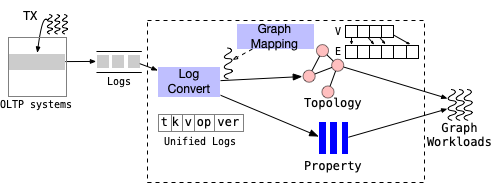

GART: Bridging the Gap between Relational OLTP and Graph Workloads
======================================

GART is a loosely-coupled framework that can be deployed to bridge an existing relational OLTP system (e.g., MySQL) with the graph-specific system GraphScope. 
In a nutshell, GART exploits the high availability mechanism of modern OLTP systems, and leverages write-ahead logs (WALs) of OLTP systems to extract graphs on which to perform graph-related workloads over execution engines of GraphScope. 
Instead of offline data migration, GART reuses WALs to replay graph data online with multi-version support.

Architecture and Workflow
------------------

The following figure shows an overview of GART’s architecture, which reuses existing execution engines from both OLTP-specific system (e.g., MySQL) and GAP-specific system (GraphScope). 
Transactions are submitted and processed in the OLTP engine and update the data in relational storage. 
During transaction committing, it also generates logs to record updates for high availability.
GART leverages the logs to convert relational data into graph data and stores the updates in dynamic graph storage. After that, GraphScope can process graph workloads over the dynamic graph storage.

:::{figure-md}



Architecture of GART. 
:::

Defining Graph Mapping in GART
------------------

Users need to define rules for converting relational data into a property graph first. 
Specifically, in GART, each vertex/edge type corresponds to one table in OLTP systems, and each property of vertices/edges corresponds to one attribute (column) in the table. 
To define the graph mapping in GART, users need to provide a JSON file as configuration, which should look like the following.

Loading Logs to GART Storage
--------------------------

Considering the diversity of log formats in different OLTP systems, GART proposes a unified log format. 
Logs from OLTP systems need to be converted into the unified log format before they can be used. 
If you are using MySQL as your OLTP system, you can use [Maxwell](https://maxwells-daemon.io/config/#file-producer) to convert binlogs into JSON format. 
Then, GART provides a tool to further convert the JSON format into the unified format. 
When the conversion tool receives logs, it will extract both data and metadata updates from relational data sources in order to generate unified logs that are compatible with different log formats.

By default, GART reads unified logs from Kafka and applies the logs to graph-related operations such as adding, deleting or updating a vertex/edge in dynamic graph storage, according to the rules for converting relational data into a property graph. 
The graph storage allows GART and the execution engines of GraphScope to write and read graph data simultaneously. 
The dynamic graph storage provides a consistent and fresh view of the graph data, which means the graph data is a stable snapshot derived from relational data.


Using Loaded Graphs from GraphScope
-------------------

After being loaded into GART, the schema information of the graph is written into etcd. Then, the execution engines of GraphScope can read the graph schema information to build a GART fragment. To achieve this, you need to assign an etcd endpoint to both GART and GraphScope. To build a GART fragment, you need to provide an etcd endpoint which stores the schema information, as well as a version number that you want to read.

```cpp
void* BuildGartFragment(std::string etcd_endpoint, int version) {
  using GraphType = gart::GartFragment<uint64_t, uint64_t>;
  auto fragment = 
      new gart::GartFragment<uint64_t, uint64_t>());
  std::shared_ptr<etcd::Client> etcd_client =
        std::make_shared<etcd::Client>(etcd_endpoint);
  grape::CommSpec comm_spec;
  comm_spec.Init(MPI_COMM_WORLD);
  std::string schema_key = "gart_schema_p" + std::to_string(comm_spec.fid());
  etcd::Response response = etcd_client->get(schema_key).get();
  std::string edge_config_str = response.value().as_string();
  schema_key = "gart_blob_m" + std::to_string(0) + "_p" +
               std::to_string(comm_spec.fid()) + "_e" +
               std::to_string(version);
  response = etcd_client->get(schema_key).get();
  std::string config_str = response.value().as_string();
  json config = json::parse(config_str);
  json edge_config = json::parse(edge_config_str);

  fragment->Init(config, edge_config);
  return fragment;
}
```

After the GART fragment is built, you can access the graph topology as well as vertex/edge properties.

```cpp
void Traverse(void* frag, size_t frag_id) {
  using GraphType = gart::GartFragment<uint64_t, uint64_t>;
  auto fragment = static_cast<GraphType>(frag);
  auto vertex_label_num = fragment->vertex_label_num();
  auto edge_label_num = fragment->edge_label_num();

  for (auto v_label = 0; v_label < vertex_label_num; v_label++) {
    auto inner_vertices_iter = fragment->InnerVertices(v_label);
    while (inner_vertices_iter.valid()) {
      auto src = inner_vertices_iter.vertex();
      for (auto elabel = 0; elabel < edge_label_num; elabel++) {
        auto edge_iter = fragment->GetOutgoingAdjList(src, elabel);
        while (edge_iter.valid()) {
          auto dst = edge_iter.neighbor();
          edge_iter.next();
        }
      }
      inner_vertices_iter.next();
    }
  }
}
```


