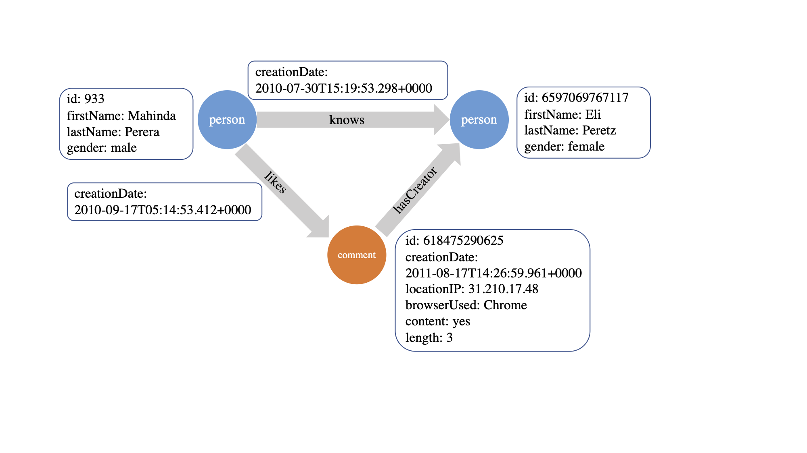
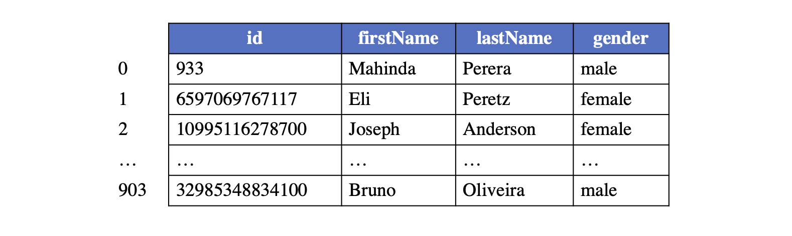
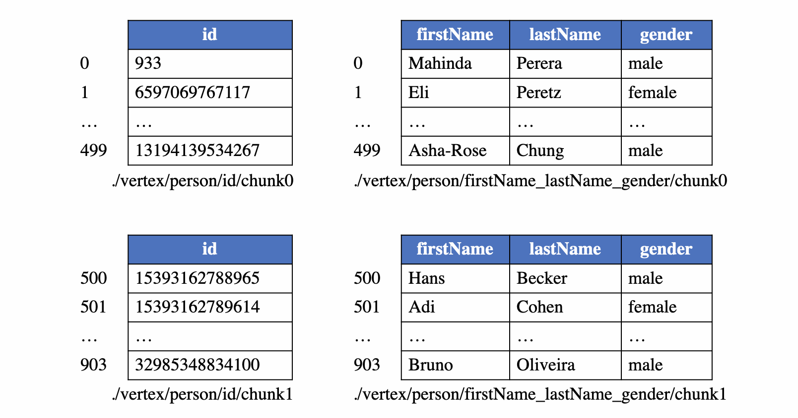
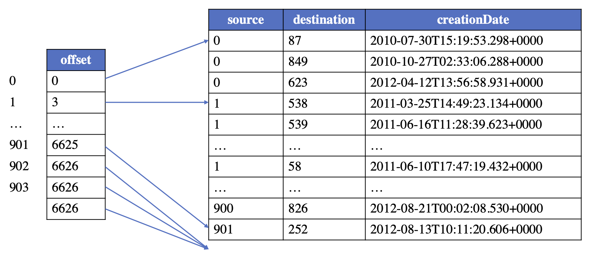
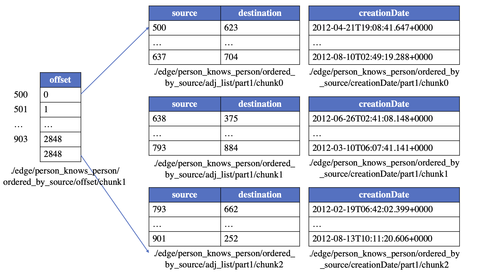

# GraphAr: Standard Graph Data File Format

GraphAr is a project that aims to make it easier for diverse applications and systems (in-memory and out-of-core storages, databases, graph computing systems, and interactive graph query frameworks) to build and access graph data conveniently and efficiently.
It can be used for importing/exporting and persistent storage of graph data, thereby reducing the burden on systems when working together. Additionally, it can serve as a direct data source for graph processing applications.

To achieve this, GraphAr provides:

- The Graph Archive(GAR) file format: a standardized system-independent file format for storing graph data
- Libraries: a set of libraries for reading, writing and transforming GAR files

GraphAr can be utilized to:

- Store and persist your graph data in a system-independent way with the GAR file format
- Easily access, generate and transform GAR files with the libraries

Currently, GraphAr has been integrated into GraphScope for building and writing the graph data of GraphScope. Visit [GraphAr](https://github.com/alibaba/GraphAr) to get the latest version and learn more about it through the [GraphAr Documentation](https://alibaba.github.io/GraphAr/).


## The GraphAr File Format

### Features

As a standardized graph data file format, the features of GraphAr include:

- It supports the property graphs and different representations for the graph structure (COO, CSR and CSC).
- It is compatible with existing widely-used file types including CSV, ORC and Parquet.
- Apache Spark can be utilized to generate, load and transform the GAR files.
- It is convenient to be used by a variety of single-machine/distributed graph processing systems, databases, and other downstream computing tasks.
- It enables to modify the topology structure or the properties of the graph, or to construct a new graph with a set of selected vertices/edges.

### The Property Graph Model

The GAR file format is designed for storing property graphs. It uses metadata to
record all the necessary information of a graph, and maintains the actual data in
a chunked way.

A property graph consists of vertices and edges, with each vertex contains:

- A unique identifier (called vertex id or vertex index).
- A text label that describes the vertex type.
- A collection of properties, with each property can be represented by a key-value pair.

And each edge contains:

- A unique identifier (called edge id or edge index).
- The outgoing vertex (source).
- The incoming vertex (destination).
- A text label that describes the relationship between the two vertices.
- A collection of properties.

The following is an example property graph containing two types of vertices ("person" and "comment") and three types of edges.

:::{figure-md}



The property graph in GraphAr. 
:::

### Vertices in GraphAr

#### Logical table of vertices

Each type of vertices (with the same label) constructs a logical vertex table, with each vertex assigned with a global index (vertex id) starting from 0, corresponding to the row number of the vertex in the logical vertex table. An example layout for a logical table of vertices under the label "person" is provided for reference.

Given a vertex id and the vertex label, a vertex is uniquely identifiable and its respective properties can be accessed from this table. The vertex id is further used to identify the source and destination vertices when maintaining the topology of the graph.

:::{figure-md}



The vertex logical table in GraphAr. 
:::

#### Physical table of vertices

The logical vertex table will be partitioned into multiple continuous vertex chunks for enhancing the reading/writing efficiency. To maintain the ability of random access, the size of vertex chunks for the same label is fixed. To support to access required properties avoiding reading all properties from the files, and to add properties for vertices without modifying the existing files, the columns of the logical table will be divided into several column groups.

Take the "person" vertex table as an example, if the chunk size is set to be 500, the logical table will be separated into sub-logical-tables of 500 rows with the exception of the last one, which may have less than 500 rows. The columns for maintaining properties will also be divided into distinct groups (e.g., 2 for our example). As a result, a total of 4 physical vertex tables are created for storing the example logical table, which can be seen from the following figure.

:::{figure-md}



The vertex physical table in GraphAr. 
:::

### Edges in GraphAr

#### Logical table of edges

For maintaining a type of edges (that with the same triplet of the source label, edge label, and destination label), a logical edge table is established.  And in order to support quickly creating a graph from the graph storage file, the logical edge table could maintain the topology information in a way similar to CSR/CSC, that is, the edges are ordered by the vertex id of either source or destination. In this way, an offset table is required to store the start offset for each vertex's edges, and the edges with the same source/destination will be stored continuously in the logical table.

Take the logical table for "person likes person" edges as an example, the logical edge table looks like:

:::{figure-md}



The edge logical table in GraphAr. 
:::

#### Physical table of edges

According to the partition strategy and the order of the edges, edges can be one of the four types: *ordered_by_source*, *ordered_by_dest*, *unordered_by_source* or *unordered_by_dest*. A logical edge table could contain physical tables of three categories:

- The adjList table (which contains only two columns: the vertex id of the source and the destination).
- The edge property tables (if there are properties on edges).
- The offset table (optional, only required for ordered edges).

Since the vertex table are partitioned into multiple chunks, the logical edge table is also partitioned into some sub-logical-tables, with each sub-logical-table contains edges that the source (if the type is *ordered_by_source* or *unordered_by_source*) or destination (if the type is *ordered_by_dest* or *unordered_by_dest*) vertices are in the same vertex chunk. After that, a sub-logical-table is further divided into edge chunks of a predefined, fixed number of rows (referred to as edge chunk size). Finally, an edge chunk is separated into an adjList table and 0 or more property tables.

Additionally, the partition of the offset table should be in alignment with the partition of the corresponding vertex table. The first row of each offset chunk is always 0, indicating the starting point for the corresponding sub-logical-table for edges.

Take the "person knows person" edges to illustrate. Suppose the vertex chunk size is set to 500 and the edge chunk size is 1024, the edges will be saved in the following physical tables:

:::{figure-md}




The edge physical table in GraphAr. 
:::

### File Format

#### Information files
GraphAr uses two kinds of files to store a graph: a group of Yaml files to describe meta information; and data files to store actual data for vertices and edges.  
A graph information file which named "<name>.graph.yml" describes the meta information for a graph whose name is <name>. The content of this file includes:

- the graph name;
- the root directory path of the data files;
- the vertex information and edge information files included;
- the version of GraphAr.

A vertex information file which named "<label>.vertex.yml" defines a single group of vertices with the same vertex label <label>, and all vertices in this group have the same schema.

An edge information file which named "<source label>_<edge label>_<destination label>.edge.yml" defines a single group of edges with specific label for source vertex, destination vertex and the edge. It describes the meta information for these edges.

Please note that GraphAr supports the storage of multiple types of adjLists for a given group of edges, e.g., a group of edges could be accessed in both CSR and CSC way when two copies (one is *ordered_by_source* and the other is *ordered_by_dest*) of the relevant data are present in GraphAr.

#### Data files
As previously mentioned, each logical vertex/edge table is divided into multiple physical tables stored in one of the following file formats:

- [Apache ORC](https://orc.apache.org/)
- [Apache Parquet](https://parquet.apache.org/)  
- CSV

Both of Apache ORC and Apache Parquet are column-oriented data storage formats. In practice of graph processing, it is common to only query a subset of columns of the properties. Thus, the column-oriented formats are more efficient, which eliminate the need to read columns that are not relevant. They are also used by a large number of data processing frameworks like [Apache Spark](https://spark.apache.org/), [Apache Hive](https://hive.apache.org/), [Apache Flink](https://flink.apache.org/), and [Apache Hadoop](https://hadoop.apache.org/). 

See [Gar Information Files](https://alibaba.github.io/GraphAr/user-guide/getting-started.html#gar-information-files) and [Gar Data Files](https://alibaba.github.io/GraphAr/user-guide/getting-started.html#gar-data-files) for an example.

#### Built-in data types
GraphAr provides a set of built-in data types that are common in real use cases and supported by most file types (CSV, ORC, Parquet), includes:

- bool
- int32
- int64
- float
- double
- string

More built-in data types will be added in GraphAr, and self-defined data types will be supported.

## Building and Installing the GraphAr Libraries

Libraries are provided for reading, writing and transforming files in GraphAr, now the C++ library and the Spark library are available. And libraries for more programming languages will be provided later.

### The C++ Library

#### System setup

GraphAr C++ uses CMake as a build configuration system. We recommend building out-of-source.
If you are not familiar with this terminology:

* **In-source build**: ``cmake`` is invoked directly from the ``cpp``
  directory. This can be inflexible when you wish to maintain multiple build
  environments (e.g. one for debug builds and another for release builds)
* **Out-of-source build**: ``cmake`` is invoked from another directory,
  creating an isolated build environment that does not interact with any other
  build environment. For example, you could create ``cpp/build-debug`` and
  invoke ``cmake $CMAKE_ARGS ..`` from this directory

Building requires:

* A C++17-enabled compiler. On Linux, gcc 7.1 and higher should be
  sufficient. For MacOS, at least clang 5 is required
* CMake 3.5 or higher
* On Linux and macOS, ``make`` build utilities

#### Building

All the instructions below assume that you have cloned the GraphAr git
repository and navigated to the ``cpp`` subdirectory:

```bash
git clone https://github.com/alibaba/GraphAr.git
git submodule update --init
cd GraphAr/cpp
```

Release build:

```bash
mkdir build-release
cd build-release
cmake ..
make -j8    # if you have 8 CPU cores, otherwise adjust
```

Build with a custom namespace:

The ``namespace`` is configurable. By default,
it is defined in ``namespace GraphArchive``; however this can be toggled by
setting ``NAMESPACE`` option with cmake:

```bash
mkdir build
cd build
cmake .. -DNAMESPACE=MyNamespace
make -j8    # if you have 8 CPU cores, otherwise adjust
```

#### Install

After the building, you can install the GraphAr C++ library with:

```bash
sudo make install
```

#### How to use

Please refer to the [GraphAr C++ Library Documentation](https://alibaba.github.io/GraphAr/reference/api-reference-cpp.html).

### The Spark Library

The GraphAr Spark library is provided for generating, loading and transforming GAR files with Apache Spark easy. 

#### System setup

GraphAr Spark uses maven as a package build system.

Building requires:

* JDK 8 or higher
* Maven 3.2.0 or higher

#### Building

All the instructions below assume that you have cloned the GraphAr git
repository and navigated to the ``spark`` subdirectory:

```bash
git clone https://github.com/alibaba/GraphAr.git
git submodule update --init
cd GraphAr/spark
```

Build the package:

```bash
mvn clean package -DskipTests
```

After compilation, the package file graphar-x.x.x-SNAPSHOT-shaded.jar is generated in the directory ``spark/target/``.

#### How to use

Please refer to the [GraphAr Spark Library Documentation](https://alibaba.github.io/GraphAr/reference/spark-api/index.html).

## Using GraphAr in GraphScope
TODO
