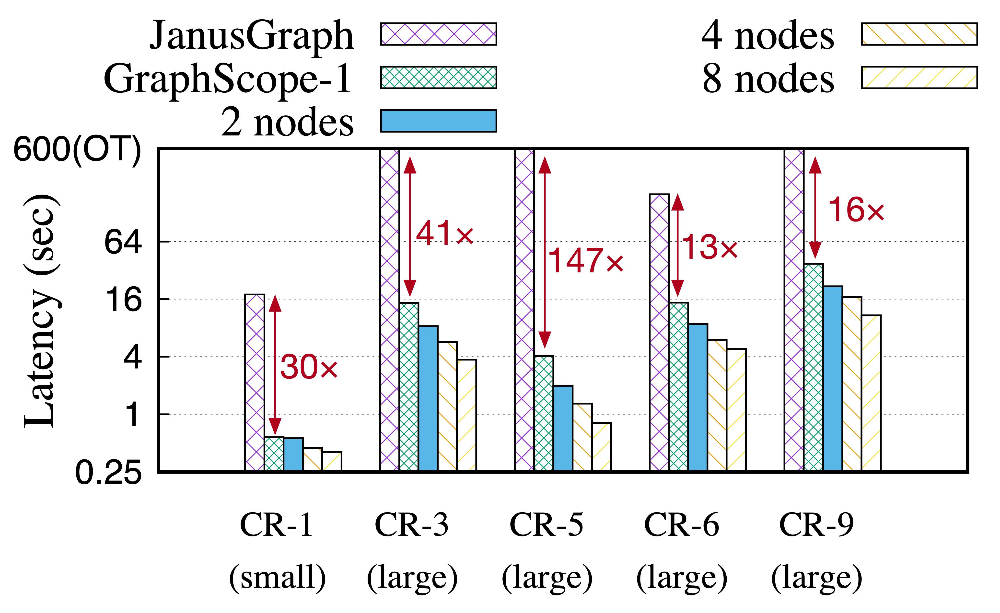
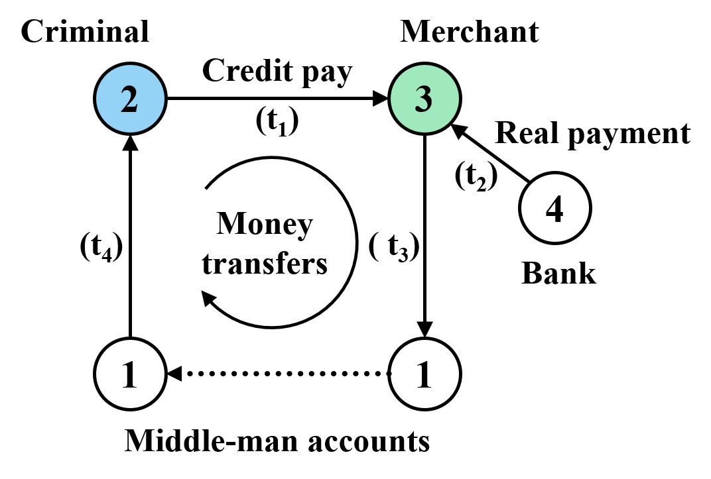

# GraphScope Interactive Engine

[](README-zh.md)

GraphScope Interactive Engine (GIE) is a distributed system designed specifically to make it easy for a variety of users to analyze large and complex graph structures in an *exploratory* manner.  It exploits [Gremlin](http://tinkerpop.apache.org/) to provide a high-level language for interactive graph queries, and provides automatic parallel execution.


## Scalable Gremlin

GIE is designed to faithfully preserve the programming model of [Gremlin](http://tinkerpop.apache.org/), which is widely supported by popular graph database vendors such as [Neo4j](https://neo4j.com/), [OrientDB](https://www.orientdb.org/), [JanusGraph](https://janusgraph.org/), [Microsoft Cosmos DB](https://azure.microsoft.com/en-us/services/cosmos-db/), and [Amazon Neptune](https://aws.amazon.com/neptune/).  As a result, it can be used to scale existing Gremlin applications to large compute clusters with minimum modification.

[Read the full documentation](https://graphscope.io/docs/interactive_engine.html) for more information on the current implementation of Gremlin.


## High Performance

GIE achieves high performance for complex Gremlin traversal, using a parallelizing compiler and a corresponding system that can execute distributed dataflow computations efficiently on large clusters.

Here is a comparison between GIE (labeled as GraphScope in the figure) and JanusGraph using the [LDBC Social Network Benchmark](http://ldbcouncil.org/benchmarks/snb) (Interactive Workload):

<div align="center">
    
</div>

We choose five representative queries (one small query plus four large queries) to compare query latency.  **GraphScope runs 13~147x faster than JanusGraph, and can scale those large, complex traversal queries almost linearly across multiple servers in a cluster**.

See [benchmark](benchmark) for a more detailed performance report with explanations.


## Getting Started

There are [Getting Started instructions](https://graphscope.io/docs/interactive_engine.html#connecting-gremlin-within-python) here.


## <a name="background_roadmap"></a>Background and Roadmap

Since about two years ago, we heard an increasing demand from internal data analysts at Alibaba for an easier way to *explore* different types of *patterns* in big graph data, such as cycles and bipartite cliques [2], instead of having users (typically non-technical domain experts) to write specific algorithms (in Java or C++) for each particular task.

<div align="center">
    
</div>

As an example, the graph depicted in the above figure is a simplified version [3] of a real query employed at Alibaba for credit card fraud detection.  By using a fake identifier, the "criminal" may obtain a short-term credit from a bank (vertex 4). He/she tries to illegally cash out money by forging a purchase (edge 2-->3) at time t1 with the help of a merchant (vertex 3).  Once receiving payment (edge 4-->3) from the bank (vertex 4), the merchant tries to send the money back (edges 3-->1 and 1-->2) to the "criminal" via multiple accounts of a middle man (vertex 1) at time t3 and t4, respectively.  This pattern eventually forms a cycle (2-->3-->1...-->2).

In reality, the graph could contain billions of vertices (e.g., users) and hundreds of billions to trillions of edges (e.g., payments), and the entire fraudulent process can involve much more complex chains of transactions, through many entities, with various constraints, which therefore requires complex interactive analysis to identify.

Thus, we started this project to offer a new distributed-system infrastructure for the new class of graph applications.  **This branch contains our first technology preview -- GAIA release**.  It has been in use by a small community of developers at Alibaba for over a year, resulting in tens of large applications and many more small programs.

Feedback from users has generally been very positive.  Even so, with our experience with the system rapidly growing due to wider usage within Alibaba, we have identified important areas for improvement, such as:

* *Memory management*. Graph traversal can produce paths of arbitrary length, leading to the memory usage growing exponentially with the number of hops.  This can result in unbounded memory, especially in interactive environments with limited memory configuration.  For example, a 5-hop traversal from a *single* vertex in a graph with an average degree of 100 (which is normal for graphs we tackle at Alibaba) can produce 10 billion paths.

* *Early termination*. Traversing all candidate paths fully is often unnecessary, especially for interactive queries with dynamic conditions running on diverse input graphs.  For example, in the following query, only the first k results are needed.  For real-world queries on large graph data, such wasted computation can be hidden deeply in nested traversals (e.g., a predicate that can be evaluated early from partial inputs) and significantly impact query performance.  While avoiding such wastage is straightforward in a sequential implementation, it leads to an interesting trade-off between parallelism and wasted computation for a fully-parallel execution.

    ```bash
    g.V(2).repeat(out().simplePath())
     .times(4).path()
     .limit(k)
    ```

We have addressed the above issues for real production deployment at Alibaba as reported in this research paper [1].  The improvements are NOT yet included in the GAIA release, but they will most likely be shipped as the next major update in the first half of 2021.

We welcome community feedback on our plans (including issues, features, etc.).  The best way to give feedback is to open an issue in this repository.


## Publications

1. Zhengping Qian, Chenqiang Min, Longbin Lai, Yong Fang, Gaofeng Li, Youyang Yao, Bingqing Lyu, Zhimin Chen, Jingren Zhou.  GraphScope: A System for Interactive Analysis on Distributed Graphs Using a High-Level Language.  Accepted at NSDI ’21.  The final version of the paper is due on March 2, 2021.

2. Bingqing Lyu, Lu Qin, Xuemin Lin, Ying Zhang, Zhengping Qian, and Jingren Zhou.  Maximum biclique search at billion scale.  Awarded Best Paper Runner-up in VLDB 2020. ([pdf](http://www.vldb.org/pvldb/vol13/p1359-lyu.pdf))

3. Xiafei Qiu, Wubin Cen, Zhengping Qian, You Peng, Ying Zhang, Xuemin Lin, and Jingren Zhou.  Real-time constrained cycle detection in large dynamic graphs.  In VLDB 2018. ([pdf](http://www.vldb.org/pvldb/vol11/p1876-qiu.pdf))
