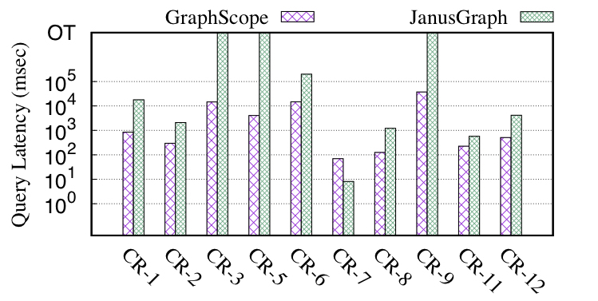
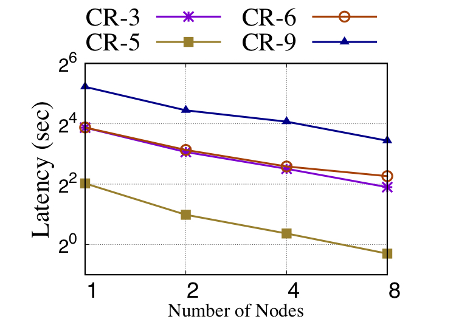
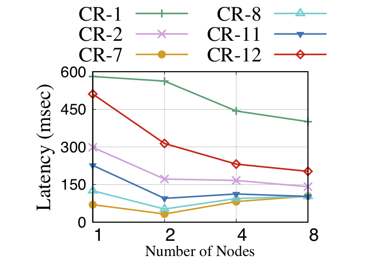

# 性能报告

[](https://github.com/alibaba/GraphScope/tree/main/interactive_engine/benchmark)

下面是根据本目录下的测试程序得到的性能报告。


## 实验设置
**硬件配置：**
* 集群： 8个节点组成的集群
* 单机内存： 755GB
* 网卡： 50Gbps
* 处理器： 两个26核的Intel(R) Xeon(R) Platinum 8269CY 2.50GHz处理器

**数据集：**
我们使用[LDBC官方工具](http://github.com/ldbc/ldbc_snb_datagen) 生成了规模30(scale factor=30)的数据集，该数据集包含8900万的点和54100万的边。

**查询：**
为了方便比较，在本测试中我们采用了[LDBC](http://github.com/ldbc/ldbc_snb_implementations) 测试集中的查询。
我们从LDBC的交互式查询集的14条查询中挑选了10条复杂型查询（表示为CR-1...14）。
_（剩下的查询要么是很简单的单点查询或者是依赖于用户自定义的逻辑，比如CR-4,10,13,14，这些查询在其他流行Tinkerpop系统中也不被支持）_

## 单机性能

由于JanusGraph不能并行化查询，为了公平比较，GraphScope也采用单机运行的形式进行比较。

<div align="center">
    
</div>
 
如上图所示，相比于JanusGraph系统，GraphScope在大多数情况下能取得数量级级别的性能领先。
JanusGraph对于一些查询（CR-3, 5, 9）的处理需要耗费大量时间，导致超时。


## 可扩展性

我们进一步通过增加更多的计算节点来研究GraphScope的可扩展性。

<div align="center">
    
</div>

如上图所示，由于这些查询的处理延迟差别很多，因此我们将它们分成两组来分析GraphScope表现：一组是大查询（CR-3, 5, 6, 9），另外一组是小查询（CR-1, 2, 7, 8, 11）

* 对大查询来说，这些查询会遍历大量的数据，耗时较长，因此GraphScope能够通过扩展计算节点数（1到8）来获得最多5倍的性能提升，表现出优秀的可扩展性；

* 对小查询来说，这些查询只会接触一小部分的子图数据，以及它们不属于计算密集型。我们预测这些查询的性能并不能通过添加计算节点数来获得提升，这是因为添加计算节点会带来额外的通讯开销。然而我们可以看到CR-1, 2, 22仍然能获得一些性能提升。

综上所述，GraphScope能够近似线性的扩展复杂的查询，同时也能保证小查询的稳定性能。


## 测试程序的使用方法

这个目录底下是一个测试程序，该程序可以用来复现上述的测试结果。
这个程序可以用来模拟多个客户端通过gremlin endpoint给gremlin server发送查询请求，然后收集结果和统计数据，最后汇报性能数字，比如延迟，吞吐等等。
该测试程序会读取目录[substitution_parameters](data/substitution_parameters)底下各个查询的参数，并填入目录[queries](queries)底下查询模板（替换掉$开头的查询参数），生成各种混合查询发送给服务器进行处理。
目前采用了轮询的方式来发送每个查询模板（填入对应的查询参数后）。

### 文件结构
```
- config                                
    - interactive-benchmark.properties  // 用来运行测试程序的配置文件，用户使用前需要配置
- data
    - substitution_parameters           // 用来填入查询模板的查询参数
- queries                               // 查询模板，包括：LDBC查询，K-hop查询以及用户自定义查询
- shell
    - benchmark.sh                      // 测试程序运行脚本
- src                                   // 源码
```
_注意：_ 前缀是 _interactive-complex_ 的查询是对LDBC官方交互式读查询的gremlin实现，对应的默认查询参数（factor 30）是通过[LDBC official tools](http://github.com/ldbc/ldbc_snb_datagen) 生成的。

### 编译

可以通过Maven来编译该测试程序：
```bash
mvn clean package
```
运行该命令之后，所有的二进制可执行文件和查询等都会被打包到 _target/benchmark-0.0.1-SNAPSHOT-dist.tar.gz_，然后你可以使用该压缩包部署到任何网络可达gremlin endpoint的地方。

### 运行

```bash
tar -xvf maxgraph-benchmark-0.0.1-SNAPSHOT-dist.tar.gz
cd maxgraph-benchmark-0.0.1-SNAPSHOT
vim conf/interactive-benchmark.properties # 用户需要指定你服务的gremlin endpoint，以及调整一些执行参数
./shell/benchmark.sh                      # 运行测试程序
```

通过以上步骤，测试程序将会运行进行性能测试，并输出汇报类似下面的执行情况：
```
QueryName[LDBC_QUERY_1], Parameter[{firstName=John, personId=17592186223433}], ResultCount[87], ExecuteTimeMS[ 1266 ].
QueryName[LDBC_QUERY_12], Parameter[{tagClassName=Judge, personId=19791209469071}], ResultCount[0], ExecuteTimeMS[ 259 ].
QueryName[LDBC_QUERY_11], Parameter[{workFromYear=2001, personId=32985348901156, countryName=Bolivia}], ResultCount[0], ExecuteTimeMS[ 60 ].
QueryName[LDBC_QUERY_9], Parameter[{personId=10995116420051, maxDate=20121128080000000}], ResultCount[20], ExecuteTimeMS[ 55755 ].
QueryName[LDBC_QUERY_8], Parameter[{personId=67523}], ResultCount[20], ExecuteTimeMS[ 148 ].
QueryName[LDBC_QUERY_7], Parameter[{personId=26388279199350}], ResultCount[0], ExecuteTimeMS[ 10 ].
QueryName[LDBC_QUERY_6], Parameter[{personId=26388279148519, tagName=Vallabhbhai_Patel}], ResultCount[0], ExecuteTimeMS[ 12837 ].
QueryName[LDBC_QUERY_5], Parameter[{minDate=20120814080000000, personId=2199023436754}], ResultCount[0], ExecuteTimeMS[ 11268 ].
QueryName[LDBC_QUERY_3], Parameter[{durationDays=30, endDate=20110701080000000, countryXName=Mongolia, countryYName=Namibia, personId=8796093204429, startDate=20110601080000000}], ResultCount[20]
, ExecuteTimeMS[ 21474 ].
QueryName[LDBC_QUERY_2], Parameter[{personId=28587302394490, maxDate=20121128080000000}], ResultCount[20], ExecuteTimeMS[ 331 ].
query count: 10; execute time(ms): ...; qps: ...
```

## 复现测试报告

1. 通过ldbc官方工具生成对应的数据集以及查询参数（指定 _ldbc.snb.datagen.generator.scaleFactor:snb.interactive.1_ 为30）；

生成数据之后，你可能需要对数据格式进行调整：
  * 进入 _social_network_ 目录，把所有的csv文件从 _dynamic_ 和 _static_ 目录拷贝到一个目录下；
  * 通过下述命令来转换日期格式变成yyyymmddhhmmssmmm格式：
 ```bash
  sed -i "s#|\([0-9][0-9][0-9][0-9]\)-\([0-9][0-9]\)-\([0-9][0-9]\)T\([0-9][0-9]\):\([0-9][0-9]\):\([0-9][0-9]\)\.\([0-9][0-9][0-9]\)+0000#|\1\2\3\4\5\6\7#g" *.csv
 ```

2. 加载LDBC数据到GraphScope，参考[加载文档](../../docs/zh/loading_graph.rst)和[LDBC加载脚本](../../python/graphscope/dataset/ldbc.py);

3. 配置和修改测试程序的配置文件，比如你需要指定gremlin endpoint和发送的查询等；

4. 把数据一同生成的查询参数拷贝到 _./data/substitution_parameters_ 目录；

5. 最后，运行测试程序并获取统计数据（具体见[测试程序的使用方法](#测试程序的使用方法)）。