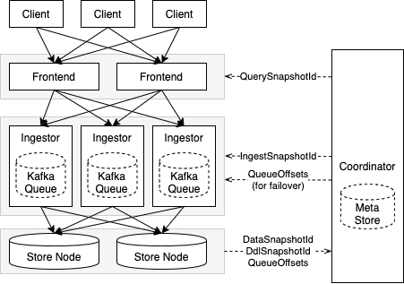

# Groot 写链路

存储实时写入的整体链路如下图所示：

下面分两部分介绍：
- 数据写入链路
- 容错设计

## 1. 数据写入链路

Client 是用户进程，用户通过我们提供的 SDK 与系统交互
- 在开始写入之前，Client 需要向系统申请一个 SessionId，后续该 Client 的写入请求都要带上申请的 SessionId，系统会保证同个 SessionId 的写请求被转发到同一个 Ingestor 上，从而保证 Client 的写入有序。
- Client 将点边数据打包成 batch，通过 SDK 的写入接口发送到 Frontend。

Frontend 接收到 Client 发来的 data batch 后
- 检查是否合法，如果出错直接返回报错
- 检查正常，会根据 SessionId 计算出 Ingestor / Queue ID，然后把 data batch 发送到对应的 Ingestor

Ingestor
- 接收 Coordinator 节点发来的 WriteSnapshotId，更新自身当前缓存
- 把 data batch 标记上当前的 WriteSnapshotId，并持久化到 Kafka Queue 中，成功后通知 Frontend 写入成功，Frontend 完成 Client 写请求
- 把 data batch 按 partition 重新打包，并标记上 Kafka Queue 的 Offsets，然后发送到对应的 store 节点

Store 接收从 Ingestor 发来的数据后：
- 按数据的 QueueId 分别缓存数据，然后按 <WriteSnapshotId, QueueId> 进行排序，写入本地的存储中
- 每隔一定时间，向 Coordinator 汇报写入数据的 SnapshotId 以及对应的 QueueOffsets

Coordinator 负责
- 定期增加 WriteSnapshotId，并广播到所有 Ingestor
- 收集、汇总 Store 发来的 SnapshotId 和 QueueOffsets 信息，计算出当前系统可以查询的 SnapshotId，并广播到 Frontend

## 2. 容错设计

系统对写接口的保证是：如果返回成功则保证数据不会丢失，但是当发生超时或返回失败时不能保证数据写入情况，需要客户端自行判断重试。

Frontend 是无状态的，当 Frontend 挂掉时它正在处理的写请求会失败，Client 可以通过选择其他可用 Frontend 继续写数据。

当 Ingestor 挂掉时，正在处理的写请求会失败，在 failover 完成之前所有对应这个 Ingestor 的 Client 将无法继续写数据。Ingestor 重新拉起后，会
- 从 Coordinator 获取 QueueOffsets 信息，并从对应 QueueId 的 Offset 开始 replay 数据，按 partition 打包并向 Store 发送
- 从 Coordinator 获取 WriteSnapshotId，等到上一步 replay 完成后开始继续处理 Frontend 发来的数据

当 Store 挂掉时，Client 可以正常写数据，但是 Ingestor 无法继续发送。在 Store failover 时，首先从本地恢复数据，然后开始从 Ingestor 接收数据。Ingestor 在 Store failover 后，会从 Queue 中上一次 Store 返回成功的 batch 后面继续发送数据。

当 Coordinator 挂掉时，写链路可以继续写数据，但是新写入的数据均不可见。Coordinator failover 时，首先从 MetaStore 恢复 SnapshotId、QueueOffsets 信息，然后继续接收 Store 汇报的进度、处理并更新 Frontend 的 QuerySnapshotId、更新 Ingestor 的 WriteSnapshotId。

