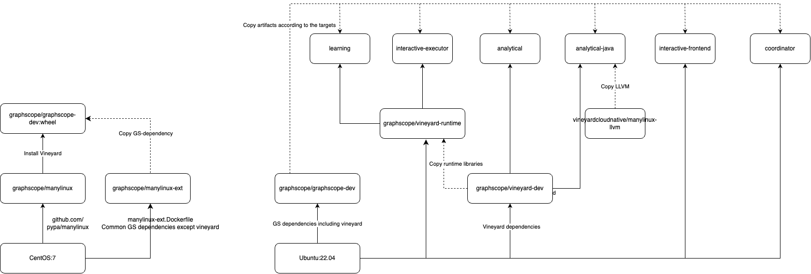

## Description
Scripts for building GraphScope docker images, for ease of deployment and
dependencies management.

This is the overview of all images and its dependencies

:::{figure-md}



Overview of docker images
:::

It could be breaks to 3 parts:

- The images that acts like a builder, contains dependencies of all components and image distribution.
- The image of GraphScope-Store
- The utility images, such as datasets and jupyter.

Here's an simple illustration of what these images are used for and how are they are built.

These are four base images acts for building or as base images.
- graphscope-dev-base: Contains all dependencies for graphscope, except vineyard
- graphscope-dev: It's just graphscope-dev-base plus vineyard. We make it separated from the base is because vineyard maybe upgraded more often than other dependencies.
- vineyard-dev: Contains all dependencies for vineyard, with vineyard itself. Acts as a base image for GAE.
- vineyard-runtime: Base centOS image plus vineyard and its dependent libraries. Acts as a base image for GIE and GLE.

These are the images for each components. They are built from a dev image and the built artifacts are copied to a runtime image.

- coordinator
- analytical
- analytical-java
- interactive-frontend
- interactive-executor
- learning

These are utility images for ease of use.

- dataset: Contains a dataset hosted on Aliyun OSS. 
- jupyter: Contains a jupyter-lab which connects to the graphscope cluster.

This is the image for GraphScope-Store

- graphscope-store

## Build multiarch image

We do our best to deliver [multi-platform images](https://docs.docker.com/build/building/multi-platform)
Most of the images contain variants for linux/amd64 and linux/arm64,
When pulling, Docker would automatically select the image that matches the architecture.

- Build graphscope-dev:latest

     - Use buildx
       `docker buildx build --platform linux/amd64,linux/arm64 -t graphscope/graphscope-dev:latest -f dockerfiles/graphscope-dev.Dockerfile . --push`
     - Use `docker manifest create`
       In x86_64 machine, do: `docker build -t graphscope/graphscope-dev:latest-amd64 -f dockerfiles/graphscope-dev.Dockerfile .`
       In arm machine, do: `docker build -t graphscope/graphscope-dev:latest-arm64 -f dockerfiles/graphscope-dev.Dockerfile .`
       Tag to another registry if necessary, and push.
       Then create and push the manifest list
       `docker manifest create graphscope/graphscope-dev:latest graphscope/graphscope-dev:latest-amd64 graphscope/graphscope-dev:latest-arm64`
       Finally push the manifest list
       `docker push graphscope/graphscope-dev:latest`


### Set up building environment

In case you want to build a multi-platform on your own, here are steps to help you get started.

#### Set up the cross-platform emulator on x84_64 architecture

Use [qemu](https://github.com/multiarch/qemu-user-static)

```bash
docker run --rm --privileged multiarch/qemu-user-static --reset -p yes
docker buildx create --name builder --driver docker-container --bootstrap
docker buildx use builder
```

#### Set up the cross-platform emulator on Apple M1

Just use [docker-desktop](https://www.docker.com/products/docker-desktop/)

```bash
docker buildx create --name builder --driver docker-container --bootstrap
docker buildx use builder
```

#### Verify your setup

Refer to [example](https://docs.docker.com/build/building/multi-platform/#example)

#### Set up on GitHub Actions

Use [setup-qemu-action](https://github.com/docker/setup-qemu-action)

Add this snippets
```yaml
- name: Set up QEMU
  uses: docker/setup-qemu-action@v1
```

### Release new version of images.

1. Bump up version of vineyard, denote as <v6d-version>
  - graphscope-dev:<v6d-version>
  - vineyard-dev:<v6d-version>
  - vineyard-runtime:<v6d-version>
  - graphscope-dev:wheel

2. Bump up version of graphscope, denote as <gs-version>
  - analytical:<gs-version>
  - interactive-frontend:<gs-version>
  - interactive-executor:<gs-version>
  - learning:<gs-version>
  - coordinator:<gs-version>
